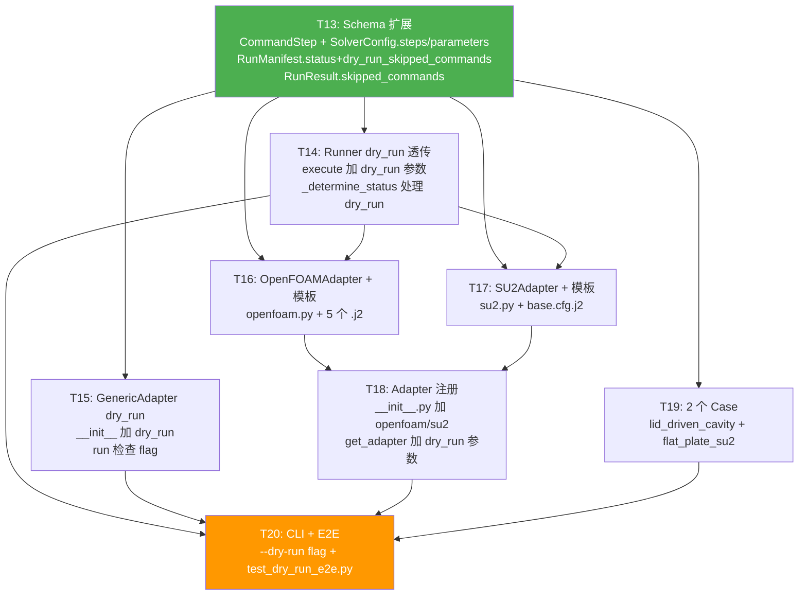

# CFD-Benchmark 系统架构设计 v1.1 — P1-a 增量（dry_run 模式）

| 项 | 内容 |
|---|---|
| 版本 | v1.1（增量） |
| 日期 | 2026-06-16 |
| 作者 | 高见远（Gao）· 架构师 |
| 范围 | **P1-a（dry_run 模式：OpenFOAM + SU2 adapter + dry_run 流水线）** |
| 上游依赖 | `docs/prd/PRD-v1.1-P1a-dryrun.md`（已确认）、`docs/architecture/Architecture-v1.md`（已确认） |
| 基线 | P0 已交付（commit `5c9948e`），112 测试全过，覆盖率 92% |

---

## 1. 概述

P1-a 在 P0 骨架之上引入 **dry_run 模式**：在不安装任何真实 CFD 求解器的前提下，让 `OpenFOAMAdapter` 与 `SU2Adapter` 的 `prepare` 阶段完整执行（渲染 Jinja2 模板 + 生成完整 case 目录结构），而 `run` 阶段跳过 subprocess 调用，仅记录"本应执行但被跳过"的命令列表。这使得 case 配置（YAML + 模板）的正确性可以在 CI 环境中持续验证，且 `manifest.status = "dry_run"` 与真实运行结果明确区分。

本增量严格遵守 PRD-v1.1 §2.3 的四条铁律：（1）不破坏 P0 的 112 个测试；（2）不改 P0 schema 已有字段（只新增 Optional 字段 / 新模型 / 新枚举值）；（3）复用 `SolverAdapter` Protocol，dry_run 通过构造函数注入；（4）dry_run 在无 OpenFOAM/SU2 环境下全部通过。

---

## 2. Schema 增量设计

> 对应 PRD-v1.1 §4。所有变更均在 `src/cfdb/schema.py` 中完成，共 3 处变更 + 1 处辅助类型变更。

### 2.1 新增 `CommandStep` 模型

新增 Pydantic 模型，定义在 `SolverConfig` **之前**（因为 `SolverConfig.steps` 引用它）：

```python
class CommandStep(BaseModel):
    """Single step command in a multi-step sequence.

    Used for solvers that require multiple commands:
    blockMesh → decomposePar → simpleFoam → reconstructPar
    """
    model_config = ConfigDict(extra="forbid")

    name: str
    """Step name (e.g. 'block_mesh', 'solve', 'reconstruct'). Used in logs and manifest."""

    command: str
    """Jinja2 command template. Same variables as SolverConfig.command:
    {{ case_id }}, {{ solver }}, {{ mesh_level }}, {{ case_dir }}, {{ run_dir }}."""

    timeout_sec: int | None = Field(None, gt=0)
    """Timeout for this step in seconds. None = no timeout."""

    critical: bool = True
    """Whether this step is critical.
    True = failure of this step fails the entire run.
    False = failure is logged as warning, subsequent steps continue.
    (In P1-a dry_run mode this field has no behavioral effect — all steps skipped.
    Takes effect in P1-b real execution.)"""
```

### 2.2 `SolverConfig` 增量（新增 2 个 Optional 字段）

P0 已有字段 **完全不变**：`name: str`、`command: str`、`timeout_sec: int | None`。

新增字段：

```python
class SolverConfig(BaseModel):
    model_config = ConfigDict(extra="forbid")

    # === P0 已有字段（不变） ===
    name: str
    command: str
    timeout_sec: int | None = Field(None, gt=0)

    # === P1-a 新增 ===
    steps: list[CommandStep] | None = None
    """Multi-step command sequence.

    - If provided, adapter executes steps in order (real mode) or records them
      to skipped_commands (dry_run mode).
    - If None, adapter falls back to single-command mode (P0 behavior unchanged).
    - OpenFOAM/SU2 adapters use steps; generic_command adapter continues using command.
    """

    parameters: dict[str, Any] | None = None
    """Arbitrary solver-specific parameters injected into Jinja2 template context.
    Used by SU2 adapter for CFG template variables (mach, reynolds, aoa, etc.)
    and can be reused by other adapters.
    Note: `Any` from typing; pyright basic mode compatible."""
```

需要在文件顶部 import 中增加 `from typing import Any`（当前只有 `Literal`）。

**向后兼容说明**：P0 的 4 个 mock case 的 `case.yaml` 不含 `steps` / `parameters` 字段。两个字段默认 `None`，加载行为完全不变。`extra='forbid'` 不拒绝它们（因为它们是已定义字段，非多余字段）。P0 的 112 个测试中所有 `SolverConfig` 构造不传 `steps`/`parameters` 时行为不变。

### 2.3 `RunManifest` 增量（status 枚举扩展 + 新增字段）

```python
class RunManifest(BaseModel):
    model_config = ConfigDict(extra="forbid")

    # === P0 已有字段（不变） ===
    run_id: str
    case_id: str
    solver: str
    backend: Literal["local", "docker", "slurm"] = "local"
    timing: TimingSpec
    host: str | None = None
    artifacts: dict[str, Path] = Field(default_factory=dict)
    git_commit: str | None = None
    container_digest: str | None = None
    error: str | None = None
    cli_args: dict[str, str] | None = None

    # === 变更：status 枚举增加 dry_run ===
    status: Literal["success", "failed", "timeout", "dry_run"]
    """Run status. P1-a adds 'dry_run' enum value."""

    # === P1-a 新增 ===
    dry_run_skipped_commands: list[str] | None = None
    """Commands that would have been executed but were skipped in dry_run mode.
    Each element is the fully-rendered command string.
    None when not in dry_run mode."""
```

**向后兼容说明**：
- `status` 新增 `"dry_run"` 是纯增量扩展（只加枚举值，不删不改名）。P0 所有 status 赋值（`"success"` / `"failed"` / `"timeout"`）在新类型下仍合法。
- `dry_run_skipped_commands` 默认 `None`。P0 manifest 反序列化时此字段缺失 → Pydantic 自动填充 `None`，不受影响。
- 注意：`status` 字段在 `RunManifest` 中不是第一个字段（它在 `backend` 之后），但 Pydantic 不关心字段顺序。变更只需修改类型标注。

### 2.4 辅助类型变更：`RunResult` 增加字段

在 `src/cfdb/adapters/base.py` 中，`RunResult` dataclass 新增 1 个字段（向后兼容，默认 `None`）：

```python
@dataclass
class RunResult:
    """Return value of SolverAdapter.run()."""
    exit_code: int
    stdout: str
    stderr: str
    wall_time_sec: float
    timed_out: bool = False

    # === P1-a 新增 ===
    skipped_commands: list[str] | None = None
    """In dry_run mode: list of rendered command strings that were skipped.
    None in normal mode. Runner reads this to populate manifest."""
```

**向后兼容**：P0 的所有 `RunResult` 构造不传 `skipped_commands` 时默认 `None`，行为不变。

---

## 3. Adapter 增量设计

### 3.1 `SolverAdapter` Protocol 不变（铁律 #3）

`adapters/base.py` 中的 Protocol 定义 **不做任何修改**。dry_run 通过 adapter 构造函数注入，不改变 `prepare` / `run` / `collect_outputs` 签名。

### 3.2 dry_run 注入机制（统一约定）

所有 adapter（含 P0 的 `GenericCommandAdapter`）遵守同一约定：

```python
class SomeAdapter:
    def __init__(self, dry_run: bool = False) -> None:
        self._dry_run = dry_run
```

`get_adapter(name, dry_run=False)` 在实例化时传入此参数。Runner 调用 `get_adapter(solver, dry_run=dry_run)` 将用户意图透传到 adapter。

### 3.3 `GenericCommandAdapter` 增量（minimal change）

**变更点**（仅 2 处，P0 行为不变）：

1. `__init__` 增加 `dry_run: bool = False` 参数：

```python
def __init__(self, dry_run: bool = False) -> None:
    """Initialize with default local backend.
    Args:
        dry_run: If True, run() returns synthetic result without executing subprocess.
    """
    self._dry_run = dry_run
    from cfdb.execution.local import LocalExecutionBackend
    self._backend = LocalExecutionBackend()
```

2. `run()` 开头检查 dry_run flag：

```python
def run(self, case, case_dir, run_dir, resources) -> RunResult:
    if self._dry_run:
        # Render the command (but do not execute) to validate template
        command_template = self._find_solver_config(case)
        mesh_level = "single"
        if case.mesh is not None and len(case.mesh.levels) > 0:
            mesh_level = case.mesh.levels[0]
        context = {
            "case_id": case.id,
            "solver": "generic",
            "mesh_level": mesh_level,
            "case_dir": case_dir.resolve().as_posix(),
            "run_dir": run_dir.resolve().as_posix(),
        }
        rendered = Template(command_template).render(**context)
        logger.info("[dry-run] skipping command: %s", rendered)
        return RunResult(
            exit_code=0,
            stdout="[dry-run] command not executed",
            stderr="",
            wall_time_sec=0.0,
            timed_out=False,
            skipped_commands=[rendered],
        )
    # === 以下为 P0 原有逻辑，不变 ===
    timeout = self._get_timeout(case, resources)
    result = self._backend.execute(...)
    return result
```

**P0 测试不受影响**：P0 测试构造 adapter 时不传 `dry_run`（默认 `False`），走原有 subprocess 路径。

### 3.4 `OpenFOAMAdapter` 新增（`src/cfdb/adapters/openfoam.py`）

```python
class OpenFOAMAdapter:
    """OpenFOAM adapter with dry_run support.

    In dry_run mode: generates complete case directory structure (system/, constant/,
    0/) with Jinja2-rendered config files, but does NOT execute blockMesh/simpleFoam.
    Real execution (P1-b) will call subprocess for each SolverConfig.steps entry.
    """

    name: str = "openfoam"

    def __init__(self, dry_run: bool = False) -> None:
        self._dry_run = dry_run
        self._template_dir = Path(__file__).parent / "templates" / "openfoam"

    def _find_solver_config(self, case: CaseSpec) -> SolverConfig:
        """Find the 'openfoam' solver config in the case."""
        for solver in case.solvers:
            if solver.name == "openfoam":
                return solver
        raise ValueError(f"no 'openfoam' solver config found in case '{case.id}'")

    def _build_context(self, case: CaseSpec, case_dir: Path, run_dir: Path) -> dict[str, Any]:
        """Build Jinja2 template context from case parameters."""
        solver_config = self._find_solver_config(case)
        mesh_level = "single"
        if case.mesh is not None and len(case.mesh.levels) > 0:
            mesh_level = case.mesh.levels[0]
        context: dict[str, Any] = {
            "case_id": case.id,
            "solver": "openfoam",
            "mesh_level": mesh_level,
            "case_dir": case_dir.resolve().as_posix(),
            "run_dir": run_dir.resolve().as_posix(),
            "reynolds": case.conditions.reynolds or 100.0,
        }
        # Compute kinematic viscosity: nu = U_ref * L_ref / Re
        # For cavity tutorial: U_ref=1, L_ref=0.1 → nu = 0.1 / Re
        re = context["reynolds"]
        context["nu"] = 0.1 / re
        # Merge solver parameters (if any)
        if solver_config.parameters:
            context.update(solver_config.parameters)
        return context

    def _render_template(self, template_name: str, context: dict[str, Any]) -> str:
        """Load and render a Jinja2 template from the openfoam template dir."""
        from jinja2 import Template
        template_path = self._template_dir / template_name
        template = Template(template_path.read_text(encoding="utf-8"))
        return template.render(**context)

    def prepare(self, case: CaseSpec, case_dir: Path, run_dir: Path) -> None:
        """Generate OpenFOAM case directory structure.

        Creates run_dir/case/ with:
        - system/controlDict, system/fvSchemes, system/fvSolution
        - constant/transportProperties, constant/turbulenceProperties
        - constant/polyMesh/ (placeholder dir)
        - 0/U, 0/p (placeholder initial fields)
        """
        case_dir_out = run_dir / "case"
        context = self._build_context(case, case_dir, run_dir)

        # Create directory structure
        (case_dir_out / "system").mkdir(parents=True, exist_ok=True)
        (case_dir_out / "constant" / "polyMesh").mkdir(parents=True, exist_ok=True)
        (case_dir_out / "0").mkdir(parents=True, exist_ok=True)

        # Render and write 5 config files
        (case_dir_out / "system" / "controlDict").write_text(
            self._render_template("controlDict.j2", context), encoding="utf-8")
        (case_dir_out / "system" / "fvSchemes").write_text(
            self._render_template("fvSchemes.j2", context), encoding="utf-8")
        (case_dir_out / "system" / "fvSolution").write_text(
            self._render_template("fvSolution.j2", context), encoding="utf-8")
        (case_dir_out / "constant" / "transportProperties").write_text(
            self._render_template("transportProperties.j2", context), encoding="utf-8")
        (case_dir_out / "constant" / "turbulenceProperties").write_text(
            self._render_template("turbulenceProperties.j2", context), encoding="utf-8")

        # Write placeholder initial fields 0/U and 0/p
        (case_dir_out / "0" / "U").write_text(
            'FoamFile\n{\n    version 2.0;\n    format ascii;\n}\n'
            'dimensions [0 1 -1 0 0 0 0];\n'
            'internalField uniform (0 0 0);\n', encoding="utf-8")
        (case_dir_out / "0" / "p").write_text(
            'FoamFile\n{\n    version 2.0;\n    format ascii;\n}\n'
            'dimensions [0 2 -2 0 0 0 0];\n'
            'internalField uniform 0;\n', encoding="utf-8")

    def run(self, case: CaseSpec, case_dir: Path, run_dir: Path,
            resources: ResourceSpec | None) -> RunResult:
        """Execute solver or return synthetic result in dry_run mode."""
        solver_config = self._find_solver_config(case)
        context = self._build_context(case, case_dir, run_dir)

        if self._dry_run:
            skipped: list[str] = []
            if solver_config.steps:
                for step in solver_config.steps:
                    rendered = Template(step.command).render(**context)
                    skipped.append(rendered)
            else:
                rendered = Template(solver_config.command).render(**context)
                skipped.append(rendered)
            logger.info("[dry-run] skipping %d OpenFOAM command(s)", len(skipped))
            return RunResult(
                exit_code=0,
                stdout="[dry-run] commands not executed",
                stderr="",
                wall_time_sec=0.0,
                timed_out=False,
                skipped_commands=skipped,
            )

        # P1-b: real execution
        raise NotImplementedError(
            "OpenFOAMAdapter real execution is not implemented yet (P1-b scope). "
            "Use --dry-run for P1-a."
        )

    def collect_outputs(self, case: CaseSpec, run_dir: Path) -> ArtifactManifest:
        """Scan run_dir/case/ for all generated files."""
        case_dir_out = run_dir / "case"
        files: dict[str, Path] = {}
        if case_dir_out.exists():
            for path in sorted(case_dir_out.rglob("*")):
                if path.is_file():
                    rel = path.relative_to(run_dir)
                    files[str(rel)] = rel
        return ArtifactManifest(files=files, qoi_values=None, curves=None)
```

### 3.5 `SU2Adapter` 新增（`src/cfdb/adapters/su2.py`）

```python
class SU2Adapter:
    """SU2 adapter with dry_run support.

    In dry_run mode: generates SU2 .cfg config file and mesh placeholder,
    but does NOT execute SU2_CFD. Real execution (P1-b) will call SU2_CFD subprocess.
    """

    name: str = "su2"

    def __init__(self, dry_run: bool = False) -> None:
        self._dry_run = dry_run
        self._template_dir = Path(__file__).parent / "templates" / "su2"

    def _find_solver_config(self, case: CaseSpec) -> SolverConfig:
        """Find the 'su2' solver config in the case."""
        for solver in case.solvers:
            if solver.name == "su2":
                return solver
        raise ValueError(f"no 'su2' solver config found in case '{case.id}'")

    def _build_context(self, case: CaseSpec, case_dir: Path, run_dir: Path) -> dict[str, Any]:
        """Build Jinja2 template context."""
        solver_config = self._find_solver_config(case)
        mesh_level = "single"
        if case.mesh is not None and len(case.mesh.levels) > 0:
            mesh_level = case.mesh.levels[0]
        context: dict[str, Any] = {
            "case_id": case.id,
            "solver": "su2",
            "mesh_level": mesh_level,
            "case_dir": case_dir.resolve().as_posix(),
            "run_dir": run_dir.resolve().as_posix(),
            "mach": case.conditions.mach or 0.3,
            "reynolds": case.conditions.reynolds or 1e6,
            "aoa": case.conditions.alpha_deg or 0.0,
        }
        if solver_config.parameters:
            context.update(solver_config.parameters)
        return context

    def _render_template(self, template_name: str, context: dict[str, Any]) -> str:
        from jinja2 import Template
        template_path = self._template_dir / template_name
        template = Template(template_path.read_text(encoding="utf-8"))
        return template.render(**context)

    def prepare(self, case: CaseSpec, case_dir: Path, run_dir: Path) -> None:
        """Generate SU2 case directory with CFG file and mesh placeholder."""
        case_dir_out = run_dir / "case"
        context = self._build_context(case, case_dir, run_dir)

        case_dir_out.mkdir(parents=True, exist_ok=True)

        # Render CFG file → run_dir/case/<case_id>.cfg
        cfg_content = self._render_template("base.cfg.j2", context)
        cfg_path = case_dir_out / f"{case.id}.cfg"
        cfg_path.write_text(cfg_content, encoding="utf-8")

        # Write placeholder mesh file
        mesh_path = case_dir_out / "mesh.su2"
        mesh_path.write_text(
            "% SU2 placeholder mesh file (dry_run)\n"
            "% N_ELEM= 0\n% N_POINTS= 0\n", encoding="utf-8")

    def run(self, case: CaseSpec, case_dir: Path, run_dir: Path,
            resources: ResourceSpec | None) -> RunResult:
        """Execute solver or return synthetic result in dry_run mode."""
        solver_config = self._find_solver_config(case)
        context = self._build_context(case, case_dir, run_dir)

        if self._dry_run:
            skipped: list[str] = []
            if solver_config.steps:
                for step in solver_config.steps:
                    rendered = Template(step.command).render(**context)
                    skipped.append(rendered)
            else:
                rendered = Template(solver_config.command).render(**context)
                skipped.append(rendered)
            logger.info("[dry-run] skipping %d SU2 command(s)", len(skipped))
            return RunResult(
                exit_code=0,
                stdout="[dry-run] commands not executed",
                stderr="",
                wall_time_sec=0.0,
                timed_out=False,
                skipped_commands=skipped,
            )

        raise NotImplementedError(
            "SU2Adapter real execution is not implemented yet (P1-b scope). "
            "Use --dry-run for P1-a."
        )

    def collect_outputs(self, case: CaseSpec, run_dir: Path) -> ArtifactManifest:
        """Scan run_dir/case/ for all generated files."""
        case_dir_out = run_dir / "case"
        files: dict[str, Path] = {}
        if case_dir_out.exists():
            for path in sorted(case_dir_out.rglob("*")):
                if path.is_file():
                    rel = path.relative_to(run_dir)
                    files[str(rel)] = rel
        return ArtifactManifest(files=files, qoi_values=None, curves=None)
```

### 3.6 Adapter 注册（`adapters/__init__.py`）

变更 `get_adapter` 签名 + 注册新 adapter：

```python
from cfdb.adapters.openfoam import OpenFOAMAdapter
from cfdb.adapters.su2 import SU2Adapter

_ADAPTERS: dict[str, type[SolverAdapter]] = {
    "generic": GenericCommandAdapter,
    "openfoam": OpenFOAMAdapter,
    "su2": SU2Adapter,
}

def get_adapter(name: str, dry_run: bool = False) -> SolverAdapter:
    """Get an adapter instance by name.
    Args:
        name: Adapter name (e.g. 'generic', 'openfoam', 'su2').
        dry_run: If True, adapter is constructed in dry_run mode.
    Returns:
        SolverAdapter instance.
    """
    if name not in _ADAPTERS:
        raise KeyError(f"Unknown adapter: '{name}'. Available: {list(_ADAPTERS)}")
    cls = _ADAPTERS[name]
    return cls(dry_run=dry_run)
```

**注意**：`GenericCommandAdapter.__init__` 新增 `dry_run` 参数后，`get_adapter("generic", dry_run=False)` 调用合法。P0 测试中直接 `GenericCommandAdapter()` 构造也合法（默认 `False`）。

---

## 4. Runner 增量设计

### 4.1 `execute()` 签名扩展

```python
def execute(
    self,
    case_id: str,
    solver: str = "generic",
    backend: str = "local",
    generate_report: bool = False,
    cli_args: dict[str, str] | None = None,
    dry_run: bool = False,    # ← P1-a 新增
) -> RunManifest:
```

### 4.2 dry_run 透传路径

在 `execute()` 方法中（对应 `runner.py` 第 76 行附近）：

```python
# P0: adapter = get_adapter(solver)
# P1-a: 传入 dry_run
adapter = get_adapter(solver, dry_run=dry_run)
```

### 4.3 `_determine_status()` 扩展

增加 `dry_run` 参数，在 success/failed/timeout 逻辑之前短路：

```python
def _determine_status(self, run_result, dry_run: bool = False) -> str:
    """Determine run status from RunResult.
    Returns: 'success', 'failed', 'timeout', or 'dry_run'.
    """
    if dry_run:
        return "dry_run"
    if run_result.timed_out:
        return "timeout"
    if run_result.exit_code != 0:
        return "failed"
    return "success"
```

### 4.4 manifest 构建（写入 skipped_commands）

在 `execute()` 构建 `RunManifest` 的位置（对应 `runner.py` 第 101-114 行）：

```python
status = self._determine_status(run_result, dry_run=dry_run)
error_msg = self._build_error_message(run_result, status)

manifest = RunManifest(
    run_id=run_id,
    case_id=case_id,
    solver=solver,
    backend=backend,
    status=status,  # type: ignore[arg-type]
    timing=timing,
    host=platform.node(),
    artifacts={k: v for k, v in artifacts.files.items()},
    git_commit=get_git_commit(),
    container_digest=None,
    error=error_msg,
    cli_args=cli_args,
    dry_run_skipped_commands=run_result.skipped_commands,  # ← P1-a 新增
)
```

**注意**：`_build_error_message` 需要兼容 `status="dry_run"` —— 当 `status == "dry_run"` 时返回 `None`（无错误）。修改 `_build_error_message` 第一个 if 条件：

```python
def _build_error_message(self, run_result, status: str) -> str | None:
    if status in ("success", "dry_run"):
        return None
    # ... 以下 P0 逻辑不变
```

---

## 5. CLI 增量设计

在 `cli.py` 的 `run` 命令中新增 `--dry-run` flag：

```python
@app.command("run")
def run(
    case: Annotated[str, typer.Option("--case", "-c", help="Case ID to run.")],
    solver: Annotated[str, typer.Option("--solver", "-s", help="Solver/adapter name.")] = "generic",
    backend: Annotated[str, typer.Option("--backend", "-b", help="Execution backend name.")] = "local",
    cases_dir: Annotated[Path, typer.Option("--cases-dir", help="Directory containing cases.")] = Path("cases"),
    runs_dir: Annotated[Path, typer.Option("--runs-dir", help="Directory for run outputs.")] = Path("runs"),
    report: Annotated[bool, typer.Option("--report", help="Generate HTML report after run.")] = False,
    dry_run: Annotated[
        bool,
        typer.Option("--dry-run", help="Render templates and generate case dir, but do not execute solver."),
    ] = False,
) -> None:
    """Run a specified case with a given solver and backend."""
    from cfdb.core.runner import Runner

    registry = CaseRegistry(cases_dir)
    repo = JsonManifestRepository(runs_dir)
    runner = Runner(registry, repo, runs_dir)

    cli_args: dict[str, str] = {"case": case, "solver": solver, "backend": backend}
    if dry_run:
        cli_args["dry_run"] = "true"

    manifest = runner.execute(
        case_id=case,
        solver=solver,
        backend=backend,
        generate_report=report,
        cli_args=cli_args,
        dry_run=dry_run,
    )

    # Print summary (same as P0, plus dry_run skipped commands)
    typer.echo("=" * 60)
    typer.echo(f"Run ID:    {manifest.run_id}")
    typer.echo(f"Case:      {manifest.case_id}")
    typer.echo(f"Solver:    {manifest.solver}")
    typer.echo(f"Backend:   {manifest.backend}")
    typer.echo(f"Status:    {manifest.status}")
    typer.echo(f"Wall Time: {manifest.timing.wall_time_sec:.3f}s")
    if manifest.dry_run_skipped_commands:
        typer.echo(f"[DRY-RUN] Skipped {len(manifest.dry_run_skipped_commands)} command(s):")
        for i, cmd in enumerate(manifest.dry_run_skipped_commands, 1):
            typer.echo(f"  [{i}] {cmd}")
    if manifest.error:
        typer.echo(f"Error:     {manifest.error}", err=True)
    typer.echo("=" * 60)

    # Exit code: 0 for success AND dry_run; 1 for failed/timeout
    raise typer.Exit(code=0 if manifest.status in ("success", "dry_run") else 1)
```

**P0 不受影响**：`--dry-run` 默认 `False`，不带该 flag 时行为完全一致。

---

## 6. MetricsEngine 增量

在 `MetricsEngine.compute()` 开头增加 dry_run 短路逻辑：

```python
def compute(self, case, artifacts, run_result, timing=None, case_dir=None) -> MetricsResult:
    notes: list[str] = []

    # P1-a: dry_run mode — skip QoI checks
    if run_result.skipped_commands is not None:
        return MetricsResult(
            qoi_relative_errors={},
            qoi_pass=True,
            overall_status="dry_run",
            notes=["dry-run mode: QoI check skipped"],
        )

    # ... 以下 P0 逻辑不变
```

**判断条件说明**：`run_result.skipped_commands is not None` 作为 dry_run 标志（dry_run 模式下 adapter 返回的 RunResult 的 `skipped_commands` 非 None，正常模式下为 None）。这与 Runner 的 `_determine_status` 使用 `dry_run` 参数的判断是双重保险——Runner 用参数判断 status，MetricsEngine 用 RunResult 字段判断是否跳过 metrics。

---

## 7. 模板设计

> 所有模板均为**完整可用内容**（非伪代码），工程师直接创建文件即可。参考 OpenFOAM tutorials/cavity 与 SU2 test cases。

### 7.1 OpenFOAM 模板（`src/cfdb/adapters/templates/openfoam/`）

#### `controlDict.j2`

```
/*--------------------------------*- C++ -*----------------------------------*\
| =========                 |                                                 |
| \\      /  F ield         | OpenFOAM: The Open Source CFD Toolbox           |
|  \\    /   O peration     | Version:  v2312                                 |
|   \\  /    A nd           | Web:      www.openfoam.com                      |
|    \\/     M anipulation  |                                                 |
\*---------------------------------------------------------------------------*/
FoamFile
{
    version     2.0;
    format      ascii;
    class       dictionary;
    location    "system";
    object      controlDict;
}
// * * * * * * * * * * * * * * * * * * * * * * * * * * * * * * * * * * * * * //

application     icoFoam;

startFrom       startTime;

startTime       0;

stopAt          endTime;

endTime         0.5;

deltaT          0.005;

writeControl    timeStep;

writeInterval   20;

purgeWrite      0;

writeFormat     ascii;

writePrecision  6;

writeCompression off;

timeFormat      general;

timePrecision   6;

runTimeModifiable true;

// Reynolds number: {{ reynolds }}
// Kinematic viscosity: {{ nu }}

// ************************************************************************* //
```

#### `fvSchemes.j2`

```
/*--------------------------------*- C++ -*----------------------------------*\
| =========                 |                                                 |
| \\      /  F ield         | OpenFOAM: The Open Source CFD Toolbox           |
|  \\    /   O peration     | Version:  v2312                                 |
|   \\  /    A nd           | Web:      www.openfoam.com                      |
|    \\/     M anipulation  |                                                 |
\*---------------------------------------------------------------------------*/
FoamFile
{
    version     2.0;
    format      ascii;
    class       dictionary;
    location    "system";
    object      fvSchemes;
}
// * * * * * * * * * * * * * * * * * * * * * * * * * * * * * * * * * * * * * //

ddtSchemes
{
    default         Euler;
}

gradSchemes
{
    default         Gauss linear;
    grad(p)         Gauss linear;
}

divSchemes
{
    default         none;
    div(phi,U)      Gauss linear;
}

laplacianSchemes
{
    default         Gauss linear orthogonal;
}

interpolationSchemes
{
    default         linear;
}

snGradSchemes
{
    default         orthogonal;
}

// ************************************************************************* //
```

#### `fvSolution.j2`

```
/*--------------------------------*- C++ -*----------------------------------*\
| =========                 |                                                 |
| \\      /  F ield         | OpenFOAM: The Open Source CFD Toolbox           |
|  \\    /   O peration     | Version:  v2312                                 |
|   \\  /    A nd           | Web:      www.openfoam.com                      |
|    \\/     M anipulation  |                                                 |
\*---------------------------------------------------------------------------*/
FoamFile
{
    version     2.0;
    format      ascii;
    class       dictionary;
    location    "system";
    object      fvSolution;
}
// * * * * * * * * * * * * * * * * * * * * * * * * * * * * * * * * * * * * * //

solvers
{
    p
    {
        solver          GAMG;
        tolerance       1e-06;
        relTol          0.01;
        smoother        GaussSeidel;
    }

    U
    {
        solver          smoothSolver;
        smoother        symGaussSeidel;
        tolerance       1e-05;
        relTol          0.1;
    }
}

PISO
{
    momentumPredictor yes;
    nOuterCorrectors  1;
    nCorrectors       2;
    nNonOrthogonalCorrectors 0;
    pRefCell          0;
    pRefValue         0;
}

// ************************************************************************* //
```

#### `transportProperties.j2`

```
/*--------------------------------*- C++ -*----------------------------------*\
| =========                 |                                                 |
| \\      /  F ield         | OpenFOAM: The Open Source CFD Toolbox           |
|  \\    /   O peration     | Version:  v2312                                 |
|   \\  /    A nd           | Web:      www.openfoam.com                      |
|    \\/     M anipulation  |                                                 |
\*---------------------------------------------------------------------------*/
FoamFile
{
    version     2.0;
    format      ascii;
    class       dictionary;
    location    "constant";
    object      transportProperties;
}
// * * * * * * * * * * * * * * * * * * * * * * * * * * * * * * * * * * * * * //

nu              [0 2 -1 0 0 0 0] {{ nu }};

// Reynolds number: {{ reynolds }}

// ************************************************************************* //
```

#### `turbulenceProperties.j2`

```
/*--------------------------------*- C++ -*----------------------------------*\
| =========                 |                                                 |
| \\      /  F ield         | OpenFOAM: The Open Source CFD Toolbox           |
|  \\    /   O peration     | Version:  v2312                                 |
|   \\  /    A nd           | Web:      www.openfoam.com                      |
|    \\/     M anipulation  |                                                 |
\*---------------------------------------------------------------------------*/
FoamFile
{
    version     2.0;
    format      ascii;
    class       dictionary;
    location    "constant";
    object      turbulenceProperties;
}
// * * * * * * * * * * * * * * * * * * * * * * * * * * * * * * * * * * * * * //

simulationType  laminar;

// ************************************************************************* //
```

### 7.2 SU2 模板（`src/cfdb/adapters/templates/su2/`）

#### `base.cfg.j2`

```
% =========================================================================
% SU2 configuration file (dry_run placeholder)
% Case: {{ case_id }}
% Mach: {{ mach }}, Reynolds: {{ reynolds }}, AoA: {{ aoa }} deg
% =========================================================================

% -------------------- DIRECT/ADJOINT PROBLEM DEFINITION ------------------%
%
SOLVER= NAVIER_STOKES
KIND_TURB_MODEL= NONE
MATH_PROBLEM= DIRECT
RESTART_SOL= NO

% -------------------- PHYSICAL GEOMETRY DEFINITIONS ----------------------%
%
MESH_FILENAME= mesh.su2
MESH_FORMAT= SU2
MESH_OUT_FILENAME= solution_flow.vtu
TABULAR_FORMAT= CSV

% -------------------- FREESTREAM CONDITIONS -------------------------------%
%
AOA= {{ aoa }}
FREESTREAM_VELOCITY= ( 1.0, 0.0, 0.0 )
FREESTREAM_PRESSURE= 101325.0
FREESTREAM_TEMPERATURE= 288.15

% -------------------- REFERENCE VALUES ------------------------------------%
%
REF_ORIGIN_MOMENT_X = 0.25
REF_ORIGIN_MOMENT_Y = 0.00
REF_ORIGIN_MOMENT_Z = 0.00
REF_LENGTH= 1.0
REF_AREA= 1.0

% -------------------- BOUNDARY CONDITION DEFINITION ----------------------%
%
MARKER_EULER= ( farfield )
MARKER_FAR= ( farfield )
MARKER_SYM= ( symmetry )
MARKER_WALL= ( wall )

% -------------------- NUMERICAL METHOD DEFINITION ------------------------%
%
NUM_METHOD_GRAD= GREEN_GAUSS
CFL_NUMBER= 5.0
CFL_ADAPT= NO
TIME_DISCRE_FLOW= EULER_IMPLICIT

% -------------------- LINEAR SOLVER DEFINITION ---------------------------%
%
LINEAR_SOLVER= FGMRES
LINEAR_SOLVER_PREC= ILU
LINEAR_SOLVER_ERROR= 1E-6
LINEAR_SOLVER_ITER= 10

% -------------------- CONVERGENCE PARAMETERS -----------------------------%
%
CONV_RESIDUE_MINVAL= -8
CONV_STARTITER= 10
CONV_FIELD= RMS_DENSITY

% ------------------------- INPUT/OUTPUT INFORMATION ----------------------%
%
OUTPUT_WRT_FREQ= 250
VOLUME_FILENAME= volume_flow
RESTART_FILENAME= restart_flow.dat

% End of config file
```

---

## 8. Case 设计

### 8.1 `lid_driven_cavity` case（`cases/validation/lid_driven_cavity/case.yaml`）

```yaml
id: lid_driven_cavity
name: Lid-Driven Cavity (Re=100)
category: validation
description: "Classic lid-driven cavity benchmark, OpenFOAM icoFoam, laminar Re=100."
physics:
  flow: incompressible
  turbulence: none
  dimensionality: 2d
  steady: false
conditions:
  reynolds: 100.0
geometry:
  type: internal
  source: null
mesh:
  family: structured_hex
  levels: ["single"]
  target_y_plus: null
solvers:
  - name: openfoam
    command: "icoFoam"
    timeout_sec: null
    steps:
      - name: block_mesh
        command: "blockMesh -case {{ run_dir }}/case"
        timeout_sec: 60
        critical: true
      - name: solve
        command: "icoFoam -case {{ run_dir }}/case"
        timeout_sec: 300
        critical: true
    parameters:
      nu: 0.01
      end_time: 0.5
      delta_t: 0.005
outputs:
  fields: ["U", "p"]
  curves: []
  qoi:
    - centerline_umax
reference:
  type: dns
  qoi_values:
    centerline_umax: 0.375
metrics:
  qoi_relative_tolerance:
    centerline_umax: 0.05
budget:
  max_runtime_sec: 600
  max_cells: null
```

### 8.2 `flat_plate_su2` case（`cases/verification/flat_plate_su2/case.yaml`）

```yaml
id: flat_plate_su2
name: Flat Plate (SU2 Verification)
category: verification
description: "Flat plate verification case for SU2 solver, laminar boundary layer."
physics:
  flow: incompressible
  turbulence: none
  dimensionality: 2d
  steady: true
conditions:
  reynolds: 1000000.0
  mach: 0.3
  alpha_deg: 0.0
geometry:
  type: external
  source: null
mesh:
  family: structured_hex
  levels: ["single"]
  target_y_plus: 1.0
solvers:
  - name: su2
    command: "SU2_CFD {{ run_dir }}/case/{{ case_id }}.cfg"
    timeout_sec: null
    steps:
      - name: solve
        command: "SU2_CFD {{ run_dir }}/case/{{ case_id }}.cfg"
        timeout_sec: 600
        critical: true
    parameters:
      mach: 0.3
      reynolds: 1000000.0
      aoa: 0.0
outputs:
  fields: ["U", "p"]
  curves: []
  qoi:
    - skin_friction_coeff
reference:
  type: analytical
  qoi_values:
    skin_friction_coeff: 0.00133
metrics:
  qoi_relative_tolerance:
    skin_friction_coeff: 0.1
budget:
  max_runtime_sec: 900
  max_cells: null
```

---

## 9. 任务列表（增量 T13-T20，接续 P0 的 T12）

| ID | 标题 | 涉及文件 | 依赖 | 完成定义 |
|---|---|---|---|---|
| **T13** | Schema 扩展 | `src/cfdb/schema.py`（变更）、`src/cfdb/adapters/base.py`（变更：RunResult 加 skipped_commands）、`tests/test_schema.py`（新增测试） | 无 | `CommandStep` 模型 + `SolverConfig.steps/parameters` + `RunManifest.status` 加 `"dry_run"` + `RunManifest.dry_run_skipped_commands` + `RunResult.skipped_commands`；运行 `pytest tests/test_schema.py tests/test_generic_adapter.py` 全绿（P0 回归）；新增字段测试覆盖 `CommandStep` 字段校验、`SolverConfig(steps=[...])` 构造、`RunManifest(status="dry_run")` 合法、`dry_run_skipped_commands` 默认 None |
| **T14** | Runner dry_run 透传 | `src/cfdb/core/runner.py`（变更）、`tests/test_e2e.py`（补 dry_run 用例） | T13 | `execute()` 加 `dry_run: bool = False` 参数；`get_adapter(solver, dry_run=dry_run)` 传参；`_determine_status(run_result, dry_run)` 返回 `"dry_run"`；manifest 写入 `dry_run_skipped_commands`；`_build_error_message` 兼容 `"dry_run"`；`pytest tests/test_e2e.py` 全绿 |
| **T15** | GenericCommandAdapter dry_run | `src/cfdb/adapters/generic_command.py`（变更）、`tests/test_generic_adapter.py`（补 dry_run 用例） | T13 | `__init__` 加 `dry_run: bool = False`；`run()` 检查 `self._dry_run` → 返回合成 RunResult（`skipped_commands=[rendered]`）；`pytest tests/test_generic_adapter.py` 全绿（P0 原有测试不变） |
| **T16** | OpenFOAMAdapter + 模板 | `src/cfdb/adapters/openfoam.py`（新增）、`src/cfdb/adapters/templates/openfoam/controlDict.j2`（新增）、`fvSchemes.j2`（新增）、`fvSolution.j2`（新增）、`transportProperties.j2`（新增）、`turbulenceProperties.j2`（新增）、`tests/test_openfoam_adapter.py`（新增） | T13, T14 | `prepare` 生成 `run_dir/case/system/{controlDict,fvSchemes,fvSolution}` + `constant/{transportProperties,turbulenceProperties}` + `constant/polyMesh/` + `0/U` + `0/p`（共 7 个文件 + 1 个空目录）；`run(dry_run=True)` 跳过 steps 并返回 `skipped_commands`；`collect_outputs` 收集文件清单；`pytest tests/test_openfoam_adapter.py` 全绿 |
| **T17** | SU2Adapter + 模板 | `src/cfdb/adapters/su2.py`（新增）、`src/cfdb/adapters/templates/su2/base.cfg.j2`（新增）、`tests/test_su2_adapter.py`（新增） | T13, T14 | `prepare` 生成 `run_dir/case/{case_id}.cfg` + `run_dir/case/mesh.su2`（占位）；`run(dry_run=True)` 跳过命令返回 `skipped_commands`；`collect_outputs` 收集文件清单；`pytest tests/test_su2_adapter.py` 全绿 |
| **T18** | Adapter 注册 | `src/cfdb/adapters/__init__.py`（变更） | T16, T17 | `_ADAPTERS` 加 `"openfoam": OpenFOAMAdapter` 和 `"su2": SU2Adapter`；`get_adapter(name, dry_run=False)` 支持新参数；验证 `get_adapter("openfoam", dry_run=True)` 返回 dry_run 实例 |
| **T19** | 2 个 Case | `cases/validation/lid_driven_cavity/case.yaml`（新增）、`cases/verification/flat_plate_su2/case.yaml`（新增） | T13 | `cfdb list-cases` 列出 `lid_driven_cavity` + `flat_plate_su2`；`cfdb validate-case cases/validation/lid_driven_cavity/case.yaml` 通过；`cfdb validate-case cases/verification/flat_plate_su2/case.yaml` 通过 |
| **T20** | CLI + E2E | `src/cfdb/cli.py`（变更：加 `--dry-run`）、`tests/test_dry_run_e2e.py`（新增） | T14-T19 | `cfdb run --case lid_driven_cavity --solver openfoam --dry-run` 端到端成功；`manifest.status == "dry_run"`；`manifest.dry_run_skipped_commands` 非空；`cfdb run --case flat_plate_su2 --solver su2 --dry-run` 端到端成功；CLI 退出码 0；`pytest` 总测试 ≥ 130 且全绿；P0 回归全过 |

### 并行可能性

- **T13 是基础**：所有其他任务依赖它（schema 新字段）
- **T14 / T15 可并行**：Runner 与 GenericAdapter 变更互不依赖（均只依赖 T13）
- **T16 / T17 可并行**：OpenFOAM 与 SU2 adapter 是独立文件（均依赖 T13 + T14）
- **T18 必须等 T16 + T17**：注册需要两个 adapter 类都存在
- **T19 依赖 T13**：case.yaml 使用 `steps` / `parameters` 字段
- **T20 是最终集成**：依赖 T14-T19 全部完成

---

## 10. 文件清单（增量 20 个）

| # | 类型 | 文件路径 | 变更说明 |
|---|---|---|---|
| 1 | **变更** | `src/cfdb/schema.py` | 新增 `CommandStep`；`SolverConfig` 加 `steps` + `parameters`；`RunManifest.status` 加 `"dry_run"` + 加 `dry_run_skipped_commands`；import `Any` |
| 2 | **变更** | `src/cfdb/adapters/base.py` | `RunResult` 加 `skipped_commands: list[str] \| None = None` |
| 3 | **变更** | `src/cfdb/core/runner.py` | `execute()` 加 `dry_run` 参数；`_determine_status()` 加 `dry_run`；`_build_error_message()` 兼容 `"dry_run"`；manifest 构建写入 `dry_run_skipped_commands` |
| 4 | **变更** | `src/cfdb/adapters/__init__.py` | `_ADAPTERS` 加 `openfoam`/`su2`；`get_adapter()` 加 `dry_run` 参数 |
| 5 | **变更** | `src/cfdb/adapters/generic_command.py` | `__init__` 加 `dry_run` 参数；`run()` 检查 flag |
| 6 | **变更** | `src/cfdb/cli.py` | `run` 命令加 `--dry-run` flag；打印 skipped commands；退出码兼容 dry_run |
| 7 | **变更** | `src/cfdb/metrics/engine.py` | `compute()` 检测 `skipped_commands is not None` 时短路返回 dry_run |
| 8 | **新增** | `src/cfdb/adapters/openfoam.py` | OpenFOAM adapter 实现 |
| 9 | **新增** | `src/cfdb/adapters/su2.py` | SU2 adapter 实现 |
| 10 | **新增** | `src/cfdb/adapters/templates/__init__.py` | 空文件（使 templates 成为包，确保打包正确） |
| 11 | **新增** | `src/cfdb/adapters/templates/openfoam/controlDict.j2` | OpenFOAM controlDict 模板 |
| 12 | **新增** | `src/cfdb/adapters/templates/openfoam/fvSchemes.j2` | OpenFOAM fvSchemes 模板 |
| 13 | **新增** | `src/cfdb/adapters/templates/openfoam/fvSolution.j2` | OpenFOAM fvSolution 模板 |
| 14 | **新增** | `src/cfdb/adapters/templates/openfoam/transportProperties.j2` | OpenFOAM transportProperties 模板 |
| 15 | **新增** | `src/cfdb/adapters/templates/openfoam/turbulenceProperties.j2` | OpenFOAM turbulenceProperties 模板 |
| 16 | **新增** | `src/cfdb/adapters/templates/su2/base.cfg.j2` | SU2 通用 CFG 模板 |
| 17 | **新增** | `cases/validation/lid_driven_cavity/case.yaml` | lid-driven cavity case 配置 |
| 18 | **新增** | `cases/verification/flat_plate_su2/case.yaml` | flat plate SU2 case 配置 |
| 19 | **新增** | `tests/test_openfoam_adapter.py` | OpenFOAM adapter dry_run 测试 |
| 20 | **新增** | `tests/test_su2_adapter.py` | SU2 adapter dry_run 测试 |
| 21 | **新增** | `tests/test_dry_run_e2e.py` | dry_run 端到端测试（CLI → manifest） |

> **注意 #10 `templates/__init__.py`**：需确认 `pyproject.toml` 的 `[tool.hatch.build.targets.wheel]` 是否包含非 `.py` 文件（`.j2`）。若 hatchling 默认只打包 `.py`，需在 `pyproject.toml` 中增加 `[tool.hatch.build.targets.wheel.force-include]` 或用 `package-data` 确保 `.j2` 文件被打包。**这是工程师需注意的打包细节**（见 §11 共享知识）。

---

## 11. 共享知识增量

以下为 P1-a 新约定，补充在 Architecture-v1 §12（P0 共享知识）之上：

### 11.1 dry_run 模式下的 subprocess 绝对禁止

dry_run 模式下 **完全禁止** 任何 subprocess 调用。不能"尝试执行再 catch 异常"——必须在进入 `subprocess.run` 之前通过 `if self._dry_run:` 短路返回。这保证 CI 环境无 OpenFOAM/SU2 时不会产生 `FileNotFoundError`。

### 11.2 模板渲染失败 → 整个 run 失败

dry_run 模式下 `prepare` 阶段的 Jinja2 模板渲染是核心验证点。若模板渲染失败（变量缺失、模板语法错误等），`prepare` 抛出异常 → Runner `_execute_phases` 捕获 → `RunResult(exit_code=-1)` → `status="failed"`。**不降级为 dry_run**——渲染失败就是真正的失败。

### 11.3 SolverConfig.steps 与 command 字段的关系

- 若 `steps` 非 `None`：adapter 按 `steps` 列表顺序处理（dry_run 记录每个 step 的渲染命令；P1-b 按序执行）
- 若 `steps` 为 `None`：adapter 回退到 `command` 字段（P0 generic adapter 行为不变）
- OpenFOAM/SU2 adapter 在 case.yaml 中使用 `steps`；generic adapter 在 case.yaml 中使用 `command`
- 两者共存：`SolverConfig` 允许同时有 `command` 和 `steps`（`command` 作为 fallback，`steps` 优先）

### 11.4 Jinja2 模板上下文变量（统一）

所有 adapter 的模板上下文（含 OpenFOAM / SU2 / generic）必须包含以下基础变量：

| 变量 | 类型 | 来源 |
|---|---|---|
| `case_id` | `str` | `case.id` |
| `solver` | `str` | adapter name |
| `mesh_level` | `str` | `case.mesh.levels[0]` if mesh else `"single"` |
| `case_dir` | `str` | `case_dir.resolve().as_posix()` |
| `run_dir` | `str` | `run_dir.resolve().as_posix()` |

各 adapter 可在此基础上扩展自定义变量：
- OpenFOAM：`reynolds`, `nu`, 以及 `SolverConfig.parameters` 中的键值对
- SU2：`mach`, `reynolds`, `aoa`, 以及 `SolverConfig.parameters` 中的键值对

### 11.5 模板文件打包

`.j2` 文件位于 `src/cfdb/adapters/templates/` 下。需确保 `pyproject.toml` 的 hatchling 配置包含这些非 `.py` 文件。推荐方案：

```toml
[tool.hatch.build.targets.wheel]
packages = ["src/cfdb"]

[tool.hatch.build.targets.wheel.force-include]
"src/cfdb/adapters/templates" = "cfdb/adapters/templates"
```

或确保 `templates/` 目录下有 `__init__.py`（空文件），使其成为包的一部分，hatchling 会自动包含包内所有文件。

### 11.6 OpenFOAM/SU2 adapter 的 `run_dir/case/` 约定

与 generic adapter 将文件直接写入 `run_dir/` 不同，OpenFOAM/SU2 adapter 将生成的 case 文件放在 `run_dir/case/` 子目录下。这是因为 OpenFOAM 的目录结构（`system/`、`constant/`、`0/`）需要被隔离在一个 case 目录中。`collect_outputs` 扫描 `run_dir/case/` 而非 `run_dir/`。

---

## 12. 待明确事项（需工程师在实现时注意）

### 12.1 `RunResult.skipped_commands` vs Runner 的 `dry_run` 参数——双重判断

dry_run 的判断有两个独立路径：
1. **Runner** 用 `dry_run` 参数判断 → 决定 `manifest.status`
2. **MetricsEngine** 用 `run_result.skipped_commands is not None` 判断 → 决定是否跳过 QoI 检查

这是有意的冗余设计：即使 Runner 的 dry_run 透传出错（如参数遗漏），MetricsEngine 也能通过 RunResult 字段正确跳过 metrics 计算。

### 12.2 `pyproject.toml` 打包 `.j2` 文件

工程师需在 T16 开始前确认 `pip install -e .` 后 `.j2` 文件能被 `importlib.resources` 或 `Path(__file__).parent` 正确定位。若 `src` layout 下 templates 不在 site-packages 中，需调整 hatchling 配置（见 §11.5）。

---

## 13. 任务依赖图



---

## 14. 关键设计决策记录

### 决策 1：dry_run 通过 `__init__` 注入而非 `run()` 参数

**选择**：dry_run 通过 adapter 构造函数注入（`__init__(self, dry_run=False)`），而非 `run()` 方法参数。

**理由**：PRD-v1.1 铁律 #3 要求不改 `SolverAdapter` Protocol 方法签名。通过构造函数注入是最低侵入方案，且 dry_run 是整个 adapter 实例的属性（不是单次调用的参数），语义合理。

### 决策 2：`skipped_commands` 挂在 `RunResult` 上而非实例属性

**选择**：在 `RunResult` dataclass 增加 `skipped_commands` 字段，而非让 adapter 存 `self._skipped_commands` 实例属性供 Runner 读取。

**理由**：dataclass 字段更明确、可测试、Runner 不需要知道 adapter 内部状态。且 `RunResult` 已有默认值机制（`None`），向后兼容。

### 决策 3：OpenFOAM/SU2 用 `run_dir/case/` 子目录

**选择**：OpenFOAM/SU2 adapter 将 case 文件放在 `run_dir/case/` 子目录，而非直接放在 `run_dir/`。

**理由**：OpenFOAM 的 `system/`、`constant/`、`0/` 结构需要被隔离。若直接放在 `run_dir/`，会与 `manifest.json`、`stdout.log` 等运行元数据混在一起，不清晰。

### 决策 4：`dry_run=False` 时 OpenFOAM/SU2 adapter 的 `run()` raise `NotImplementedError`

**选择**：非 dry_run 模式下 OpenFOAM/SU2 adapter 的 `run()` 直接 `raise NotImplementedError`。

**理由**：P1-a 只做 dry_run。真实执行在 P1-b 接 subprocess。`raise NotImplementedError` 比"静默不执行"更安全——防止用户误以为跑通了真实 solver。但此异常在 import 时不触发（只在调用 `run()` 时触发），不会导致模块加载失败。

---

*文档结束。工程师请从 T13 开始按顺序实现。T13 是所有变更的基础。T16/T17 可并行开发。T20 是最终集成验收点。*
