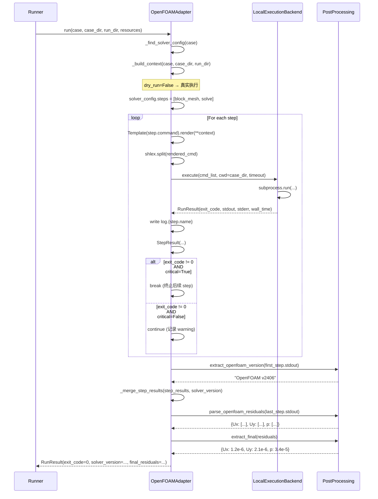
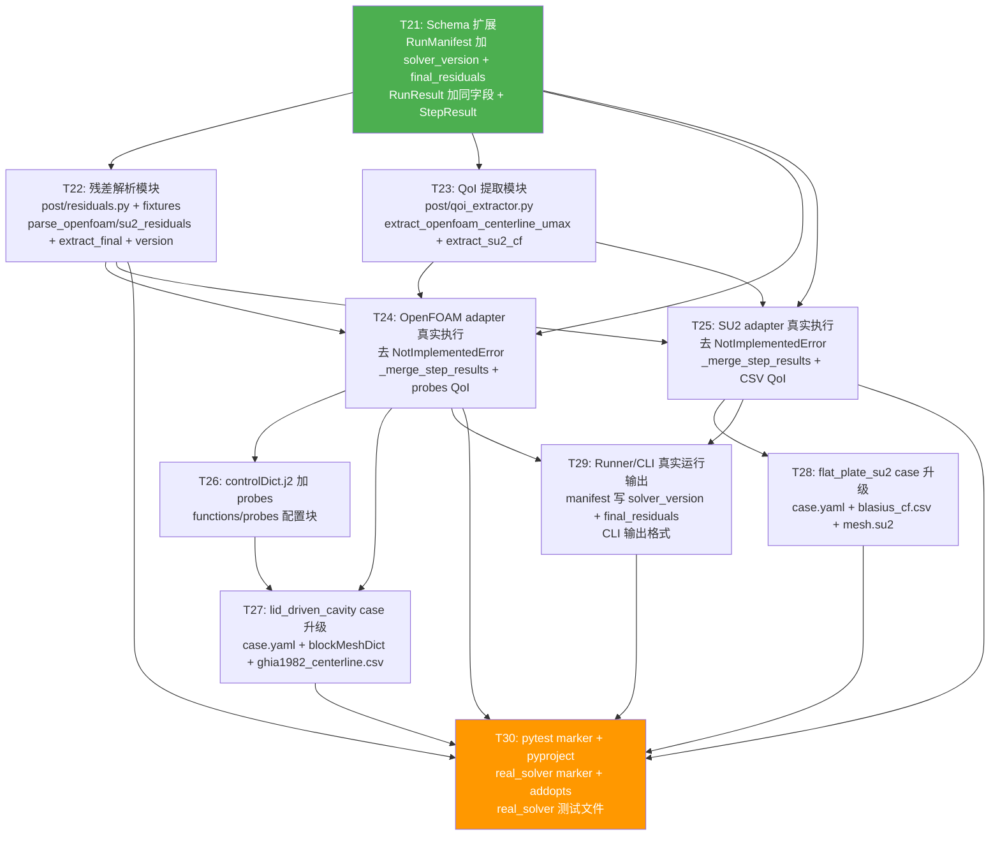

# CFD-Benchmark 系统架构设计 v1.2 — P1-b 增量（真实 Solver 接入）

| 项 | 内容 |
|---|---|
| 版本 | v1.2（增量） |
| 日期 | 2026-06-16 |
| 作者 | 高见远（Gao）· 架构师 |
| 范围 | **P1-b（真实 Solver 接入：OpenFOAM + SU2 adapter 真实 subprocess 执行 + 残差解析 + QoI 提取 + manifest 扩展）** |
| 上游依赖 | `docs/prd/PRD-v1.2-P1b-real.md`（已确认，10 决策固化）、`docs/architecture/Architecture-v1.1-P1a-dryrun.md`（已确认） |
| 基线 | P0 已交付（commit `5c9948e`，112 测试）+ P1-a 已交付（commit `4d67403`，158 测试全过，94% 覆盖率） |

---

## 1. 概述

P1-b 在 P1-a 的 dry_run 骨架之上实现 **真实 solver 执行**：去掉 `OpenFOAMAdapter.run()` 和 `SU2Adapter.run()` 中的 `NotImplementedError`，改为通过 `LocalExecutionBackend` 按 `SolverConfig.steps` 顺序执行真实 subprocess 命令（blockMesh → icoFoam / SU2_CFD）。运行结束后，新增的后处理模块从 solver log 中正则提取 final residual，从 OpenFOAM probes 输出 / SU2 surface CSV 中提取 QoI 值，与参考数据对比计算相对误差。

本增量严格遵守 PRD-v1.2 §2.1 确定做的 7 项范围 + §2.4 五条铁律：

| 范围项 | 说明 |
|---|---|
| 1. OpenFOAM adapter 真实执行 | 去 `run()` NotImplementedError，按 steps 执行 blockMesh → icoFoam |
| 2. SU2 adapter 真实执行 | 去 `run()` NotImplementedError，执行 SU2_CFD |
| 3. lid_driven_cavity 真实 case | blockMesh → icoFoam 端到端跑通 Re=100 |
| 4. 残差日志解析（最小） | 正则提取 final residual，写入 manifest |
| 5. QoI 后处理（最小） | centerline_umax / skin_friction_coeff 提取 + 参考 QoI 对比 |
| 6. RunManifest schema 扩展 | 加 `final_residuals` + `solver_version` Optional 字段 |
| 7. CommandStep.critical 生效 | critical=True 失败终止整个 run |

| 铁律 |
|---|
| #1 不破坏 P0 + P1-a 的测试（158 测试 + 新增 ≥ 0 全过） |
| #2 只新增 Optional schema 字段，不改已有字段 |
| #3 复用 P0 的 LocalExecutionBackend，不重新设计执行层 |
| #4 dry_run 模式不破坏，仍然不执行 subprocess |
| #5 真实 solver 测试不进入 CI default job（marker 隔离） |

**决策固化**（PRD-v1.2 §6，转总已确认）：MVP 只本机 solver（Q1）；lid-driven cavity + flat plate 2 个 case（Q2）；小网格手工放置进 git（Q3）；最小后处理（Q4）；正则 grep 残差（Q5）；OpenFOAM probes + SU2 Python 直读 QoI（Q6）；OpenCFD v2406（Q7）；CI 保持轻量（Q8）；不支持 Windows 原生（Q9）；manifest 加 solver_version + final_residuals，cell_count 推 P2（Q10）。

---

## 2. Schema 增量设计

> 对应 PRD-v1.2 §5。全部为新增 Optional 字段，铁律 #2 约束。

### 2.1 `RunManifest` 加 2 个 Optional 字段

在 `src/cfdb/schema.py` 的 `RunManifest` 类中，在 `dry_run_skipped_commands` 字段之后新增：

```python
class RunManifest(BaseModel):
    model_config = ConfigDict(extra="forbid")

    # === P0/P1-a 已有字段（完全不变） ===
    # run_id, case_id, solver, backend, status, timing, host,
    # artifacts, git_commit, container_digest, error, cli_args,
    # dry_run_skipped_commands

    # === P1-b 新增 ===
    solver_version: str | None = None
    """Detected solver version string (e.g. 'OpenFOAM v2406', 'SU2 8.0.0').
    None for dry_run / mock cases."""

    final_residuals: dict[str, float] | None = None
    """Final residual values extracted from solver log.
    Keys are field names (e.g. 'Ux', 'Uy', 'p' for OpenFOAM;
    'RMS_DENSITY' for SU2). Values are the final residual magnitudes.
    None for dry_run / mock cases."""
```

**向后兼容性**：两个字段默认 `None`。P0/P1-a 的 manifest JSON 不含这两个字段 → Pydantic 反序列化时自动填充 `None`。P0/P1-a 的 158 个测试完全不受影响。

### 2.2 `RunResult` 扩展（adapters/base.py）

P1-a 的 `RunResult` dataclass 已有 `skipped_commands`。P1-b 新增 2 个字段以支持真实执行：

```python
@dataclass
class RunResult:
    """Return value of SolverAdapter.run()."""
    exit_code: int
    stdout: str
    stderr: str
    wall_time_sec: float
    timed_out: bool = False
    skipped_commands: list[str] | None = None  # P1-a

    # === P1-b 新增 ===
    solver_version: str | None = None
    """Detected solver version (e.g. 'OpenFOAM v2406'). None in dry_run."""

    final_residuals: dict[str, float] | None = None
    """Final residual values extracted from solver log. None in dry_run."""
```

**向后兼容**：默认 `None`，P0/P1-a 的所有 `RunResult` 构造不传这两个字段时行为不变。

### 2.3 变更矩阵

| 文件 | 变更类型 | 说明 |
|---|---|---|
| `src/cfdb/schema.py` | 变更 | `RunManifest` 加 `solver_version` + `final_residuals` |
| `src/cfdb/adapters/base.py` | 变更 | `RunResult` 加 `solver_version` + `final_residuals` |

---

## 3. OpenFOAM Adapter 真实执行（去 NotImplementedError）

> 对应 `src/cfdb/adapters/openfoam.py`，当前第 199-203 行的 `raise NotImplementedError`。

### 3.1 真实执行逻辑

`dry_run=False` 时 `run()` 方法替换 NotImplementedError 为真实 subprocess 执行：

```python
import shlex

def run(
    self,
    case: CaseSpec,
    case_dir: Path,
    run_dir: Path,
    resources: ResourceSpec | None,
) -> RunResult:
    """Execute solver or return synthetic result in dry_run mode."""
    solver_config = self._find_solver_config(case)
    context = self._build_context(case, case_dir, run_dir)

    if self._dry_run:
        # P1-a 路径不变 —— skipped_commands 填充逻辑不动
        skipped: list[str] = []
        if solver_config.steps:
            for step in solver_config.steps:
                rendered = Template(step.command).render(**context)
                skipped.append(rendered)
        else:
            rendered = Template(solver_config.command).render(**context)
            skipped.append(rendered)
        return RunResult(
            exit_code=0,
            stdout="[dry-run] commands not executed",
            stderr="",
            wall_time_sec=0.0,
            timed_out=False,
            skipped_commands=skipped,
        )

    # === P1-b 新增：真实执行 ===
    from cfdb.execution.local import LocalExecutionBackend

    if solver_config.steps is None:
        raise ValueError(
            "OpenFOAM adapter requires SolverConfig.steps for real execution. "
            f"Case '{case.id}' solver '{solver_config.name}' has steps=None."
        )

    backend = LocalExecutionBackend()
    step_results: list[StepResult] = []
    case_dir_out = run_dir / "case"

    # === solver_version 探测（从第一个 step 的 stdout 中提取，零额外开销） ===
    solver_version: str | None = None

    for i, step in enumerate(solver_config.steps):
        rendered_cmd = Template(step.command).render(**context)
        cmd_list = shlex.split(rendered_cmd)

        # 执行通过 LocalExecutionBackend（铁律 #3）
        result = backend.execute(
            cmd_list,
            cwd=case_dir_out,
            timeout=step.timeout_sec,
        )

        # 为每步写一个以 step.name 命名的 log 文件
        log_name = f"log.{step.name}"
        (case_dir_out / log_name).write_text(
            result.stdout + "\n" + result.stderr, encoding="utf-8"
        )

        step_results.append(StepResult(
            name=step.name,
            exit_code=result.exit_code,
            wall_time_sec=result.wall_time_sec,
            stdout=result.stdout,
            stderr=result.stderr,
            timed_out=result.timed_out,
            critical=step.critical,
        ))

        # 从第一个 step（通常是 blockMesh）的 stdout 探测 solver_version
        if i == 0:
            from cfdb.post.residuals import extract_openfoam_version
            solver_version = extract_openfoam_version(result.stdout)

        # CommandStep.critical 生效（铁律 #7）
        if result.exit_code != 0:
            if step.critical:
                # 关键步失败，立即终止整个 run
                logger.error(
                    "critical step '%s' failed (exit_code=%d), aborting run",
                    step.name, result.exit_code,
                )
                break
            else:
                # 非关键步失败，记录 warning 继续
                logger.warning(
                    "non-critical step '%s' failed (exit_code=%d), continuing",
                    step.name, result.exit_code,
                )

    return self._merge_step_results(step_results, solver_version)


def _merge_step_results(
    self,
    step_results: list[StepResult],
    solver_version: str | None,
) -> RunResult:
    """Merge multiple StepResult into a single RunResult.

    - exit_code: 0 if all steps succeeded, else first non-zero exit code
    - stdout: concatenated stdout from all executed steps
    - stderr: concatenated stderr from all executed steps
    - wall_time_sec: sum of all step wall times
    - timed_out: True if any step timed out
    - solver_version: detected version (or None)
    - final_residuals: parsed from the last step's stdout (the solve step)
    """
    # Determine overall exit code
    overall_exit = 0
    for sr in step_results:
        if sr.exit_code != 0:
            overall_exit = sr.exit_code
            break

    # Concatenate stdout/stderr with step headers
    stdout_parts: list[str] = []
    stderr_parts: list[str] = []
    total_wall = 0.0
    any_timed_out = False
    for sr in step_results:
        stdout_parts.append(f"--- step: {sr.name} ---\n{sr.stdout}")
        stderr_parts.append(f"--- step: {sr.name} ---\n{sr.stderr}")
        total_wall += sr.wall_time_sec
        if sr.timed_out:
            any_timed_out = True

    # Parse final_residuals from the last step's stdout (the solver step)
    final_residuals: dict[str, float] | None = None
    if overall_exit == 0 and step_results:
        last_stdout = step_results[-1].stdout
        from cfdb.post.residuals import parse_openfoam_residuals, extract_final
        residuals = parse_openfoam_residuals(last_stdout)
        if residuals:
            final_residuals = extract_final(residuals)

    return RunResult(
        exit_code=overall_exit,
        stdout="\n".join(stdout_parts),
        stderr="\n".join(stderr_parts),
        wall_time_sec=total_wall,
        timed_out=any_timed_out,
        skipped_commands=None,
        solver_version=solver_version,
        final_residuals=final_residuals,
    )
```

### 3.2 `StepResult` 辅助类

新增在 `src/cfdb/adapters/base.py` 中：

```python
@dataclass
class StepResult:
    """Result of a single step in a multi-step solver execution."""
    name: str
    """Step name (e.g. 'block_mesh', 'solve')."""
    exit_code: int
    """Exit code of the step command."""
    wall_time_sec: float
    """Wall time for this step."""
    stdout: str
    """Captured stdout."""
    stderr: str
    """Captured stderr."""
    timed_out: bool = False
    """Whether this step timed out."""
    critical: bool = True
    """Whether this step was critical (affects run termination)."""
```

### 3.3 solver_version 探测

从 OpenFOAM 命令 stdout 第一行抓版本号。OpenFOAM v2406 / v2312 的 banner 格式：

```
/*--------------------------------*- C++ -*----------------------------------*\
| =========                 |                                                 |
| \\      /  F ield         | OpenFOAM: The Open Source CFD Toolbox           |
|  \\    /   O peration     | Version:  v2406                                 |
```

正则 pattern（在 `post/residuals.py` 中实现）：

```python
import re

_OPENFOAM_VERSION_PATTERN = re.compile(
    r"Build:\s+(\d++(?:\.\d+)*)|Version:\s+(v?\d+(?:\.\d+)*)"
)

def extract_openfoam_version(log_text: str) -> str | None:
    """Extract OpenFOAM version string from the banner at the top of the log.

    Tries 'Version: vX.Y' first (OpenCFD banner), then 'Build: X.Y.Z'.
    Returns like 'OpenFOAM v2406' or None if not found.
    """
    for line in log_text.splitlines()[:10]:  # Only check first 10 lines
        match = _OPENFOAM_VERSION_PATTERN.search(line)
        if match:
            version = match.group(2) or match.group(1)
            return f"OpenFOAM {version}"
    return None
```

**设计决策**：从 log grep（零额外开销）而非 `blockMesh -help`（增加 ~0.5s subprocess 开销）。

### 3.4 真实执行时序图



---

## 4. SU2 Adapter 真实执行（去 NotImplementedError）

> 对应 `src/cfdb/adapters/su2.py`，当前第 172-175 行的 `raise NotImplementedError`。

### 4.1 SU2 的特点

与 OpenFOAM 不同，SU2 通常只有一个主命令 `SU2_CFD`（不分多步），但 case.yaml 中仍使用 `steps` 列表（只有一个 step）以保持一致性。

### 4.2 真实执行逻辑

```python
import shlex

def run(
    self,
    case: CaseSpec,
    case_dir: Path,
    run_dir: Path,
    resources: ResourceSpec | None,
) -> RunResult:
    """Execute solver or return synthetic result in dry_run mode."""
    solver_config = self._find_solver_config(case)
    context = self._build_context(case, case_dir, run_dir)

    if self._dry_run:
        # P1-a 路径不变
        skipped: list[str] = []
        if solver_config.steps:
            for step in solver_config.steps:
                rendered = Template(step.command).render(**context)
                skipped.append(rendered)
        else:
            rendered = Template(solver_config.command).render(**context)
            skipped.append(rendered)
        return RunResult(
            exit_code=0,
            stdout="[dry-run] commands not executed",
            stderr="",
            wall_time_sec=0.0,
            timed_out=False,
            skipped_commands=skipped,
        )

    # === P1-b 新增：真实执行 ===
    from cfdb.execution.local import LocalExecutionBackend

    if solver_config.steps is None:
        raise ValueError(
            "SU2 adapter requires SolverConfig.steps for real execution. "
            f"Case '{case.id}' solver '{solver_config.name}' has steps=None."
        )

    backend = LocalExecutionBackend()
    step_results: list[StepResult] = []
    case_dir_out = run_dir / "case"
    solver_version: str | None = None

    for i, step in enumerate(solver_config.steps):
        rendered_cmd = Template(step.command).render(**context)
        cmd_list = shlex.split(rendered_cmd)

        result = backend.execute(
            cmd_list,
            cwd=case_dir_out,
            timeout=step.timeout_sec,
        )

        # Write log file
        log_name = f"log.{step.name}"
        (case_dir_out / log_name).write_text(
            result.stdout + "\n" + result.stderr, encoding="utf-8"
        )

        step_results.append(StepResult(
            name=step.name,
            exit_code=result.exit_code,
            wall_time_sec=result.wall_time_sec,
            stdout=result.stdout,
            stderr=result.stderr,
            timed_out=result.timed_out,
            critical=step.critical,
        ))

        # SU2 version from stdout first screen
        if i == 0:
            from cfdb.post.residuals import extract_su2_version
            solver_version = extract_su2_version(result.stdout)

        # critical step handling (same as OpenFOAM)
        if result.exit_code != 0:
            if step.critical:
                break
            else:
                logger.warning(
                    "non-critical step '%s' failed, continuing", step.name
                )

    return self._merge_step_results(step_results, solver_version)


def _merge_step_results(
    self,
    step_results: list[StepResult],
    solver_version: str | None,
) -> RunResult:
    """Merge step results — same logic as OpenFOAMAdapter._merge_step_results
    but uses SU2 residual parser."""
    overall_exit = 0
    for sr in step_results:
        if sr.exit_code != 0:
            overall_exit = sr.exit_code
            break

    stdout_parts: list[str] = []
    stderr_parts: list[str] = []
    total_wall = 0.0
    any_timed_out = False
    for sr in step_results:
        stdout_parts.append(f"--- step: {sr.name} ---\n{sr.stdout}")
        stderr_parts.append(f"--- step: {sr.name} ---\n{sr.stderr}")
        total_wall += sr.wall_time_sec
        if sr.timed_out:
            any_timed_out = True

    final_residuals: dict[str, float] | None = None
    if overall_exit == 0 and step_results:
        last_stdout = step_results[-1].stdout
        from cfdb.post.residuals import parse_su2_residuals, extract_final
        residuals = parse_su2_residuals(last_stdout)
        if residuals:
            final_residuals = extract_final(residuals)

    return RunResult(
        exit_code=overall_exit,
        stdout="\n".join(stdout_parts),
        stderr="\n".join(stderr_parts),
        wall_time_sec=total_wall,
        timed_out=any_timed_out,
        skipped_commands=None,
        solver_version=solver_version,
        final_residuals=final_residuals,
    )
```

### 4.3 SU2 版本探测

SU2 stdout 第一屏格式：

```
| SU2 Code Suite, Version 8.0.0                 |
```

正则 pattern：

```python
_SU2_VERSION_PATTERN = re.compile(
    r"SU2\s+Code\s+Suite,\s*Version\s+(\d+(?:\.\d+)*)"
)

def extract_su2_version(log_text: str) -> str | None:
    """Extract SU2 version string from stdout.

    Returns like 'SU2 8.0.0' or None if not found.
    """
    for line in log_text.splitlines()[:15]:
        match = _SU2_VERSION_PATTERN.search(line)
        if match:
            return f"SU2 {match.group(1)}"
    return None
```

---

## 5. 后处理设计（最小）

> 新增子包 `src/cfdb/post/`，两个模块。

### 5.1 残差解析模块（`src/cfdb/post/residuals.py`）

```python
"""Residual log parsing for OpenFOAM and SU2 solvers.

Uses regex to extract residual histories from solver log output.
No third-party dependencies — pure Python re module.
"""

from __future__ import annotations

import re

# === OpenFOAM residual pattern ===
# OpenFOAM log line format:
#   "Solving for Ux, Initial residual = 0.001234, Final residual = 0.000123, ..."
#   "Solving for p, Initial residual = ..."
# Works with v2312 and v2406 (format stable since v2006)
_OPENFOAM_RESIDUAL_PATTERN = re.compile(
    r"Solving for (\w+),\s*Initial residual\s*=\s*([0-9.eE+\-]+)"
)

# === SU2 residual pattern ===
# SU2 convergence history output (TABULAR_FORMAT= CSV):
#   "iter,res_rho,res_rho_e,res_rho_v[0]"
#   "0,-2.5,-3.1,-2.8"
#   "1,-2.8,-3.4,-3.0"
# Or older text format:
#   "RMSDensity: -2.5, ..."
# We match both CSV column-style and keyword-style.
_SU2_CSV_HEADER_PATTERN = re.compile(
    r'"iter"\s*,\s*"(.*?)"', re.IGNORECASE
)
_SU2_CSV_VALUE_PATTERN = re.compile(
    r'"?(-?\d+\.?\d*(?:[eE][+\-]?\d+)?)?"?'
)

# Alternative SU2 residual format (keyword style)
_SU2_KEYWORD_PATTERN = re.compile(
    r"(RMS_[A-Z_]+|rms_[a-z_]+)\s*[:=]\s*(-?\d+\.?\d*(?:[eE][+\-]?\d+)?)"
)


def parse_openfoam_residuals(log_text: str) -> dict[str, list[float]]:
    """Extract all Initial residual values from an OpenFOAM log.

    OpenFOAM prints lines like:
        Solving for Ux, Initial residual = 0.001234, ...
        Solving for Uy, Initial residual = 0.002345, ...
        Solving for p, Initial residual = 0.000567, ...

    Returns:
        Dict mapping field name → list of residual values over iterations.
        Example: {'Ux': [0.1, 0.05, ..., 1.2e-6], 'Uy': [...], 'p': [...]}
        Empty dict if no residuals found.
    """
    residuals: dict[str, list[float]] = {}
    for match in _OPENFOAM_RESIDUAL_PATTERN.finditer(log_text):
        field_name = match.group(1)  # e.g. "Ux", "Uy", "p"
        value_str = match.group(2)   # e.g. "1.234e-4"
        try:
            value = float(value_str)
        except ValueError:
            continue
        residuals.setdefault(field_name, []).append(value)
    return residuals


def parse_su2_residuals(log_text: str) -> dict[str, list[float]]:
    """Extract residual values from SU2 convergence output.

    Handles two formats:
    1. CSV format (TABULAR_FORMAT= CSV):
       Header: "iter","RMS_DENSITY","RMS_MOMENTUM-X",...
       Data:   "0","-2.5","-3.1",...
    2. Keyword format (older SU2 or redirected):
       RMS_DENSITY: -2.5

    Returns:
        Dict mapping residual name → list of values over iterations.
        Example: {'RMS_DENSITY': [-2.5, -2.8, ...], ...}
    """
    residuals: dict[str, list[float]] = {}

    # Try CSV format first
    lines = log_text.strip().splitlines()
    header_idx = None
    column_names: list[str] = []

    for i, line in enumerate(lines):
        if line.strip().lower().startswith('"iter"'):
            # Parse CSV header
            header_idx = i
            parts = re.findall(r'"([^"]*)"', line)
            column_names = parts[1:]  # skip "iter"
            break

    if header_idx is not None and column_names:
        # Parse CSV data rows
        for line in lines[header_idx + 1:]:
            line = line.strip()
            if not line or line.startswith("%") or line.startswith("#"):
                continue
            parts = re.findall(r'"?([^",]+?)"?(?:,|$)', line)
            if len(parts) < 2:
                continue
            for col_idx, col_name in enumerate(column_names):
                if col_idx + 1 >= len(parts):
                    break
                val_str = parts[col_idx + 1].strip().strip('"')
                try:
                    val = float(val_str)
                    residuals.setdefault(col_name, []).append(val)
                except ValueError:
                    continue
        if residuals:
            return residuals

    # Fallback: keyword format
    for match in _SU2_KEYWORD_PATTERN.finditer(log_text):
        field_name = match.group(1)
        value_str = match.group(2)
        try:
            value = float(value_str)
        except ValueError:
            continue
        residuals.setdefault(field_name, []).append(value)

    return residuals


def extract_final(residuals: dict[str, list[float]]) -> dict[str, float]:
    """Take the last value of each residual list.

    Args:
        residuals: Output from parse_openfoam_residuals or parse_su2_residuals.

    Returns:
        Dict mapping field name → final (last) residual value.
        Example: {'Ux': 1.2e-6, 'Uy': 2.1e-6, 'p': 3.4e-5}
    """
    return {
        field: values[-1]
        for field, values in residuals.items()
        if values  # non-empty list
    }


# === Version extraction ===

_OPENFOAM_VERSION_PATTERN = re.compile(
    r"Build:\s+(\d+(?:\.\d+)*)|Version:\s+(v?\d+(?:\.\d+)*)"
)

def extract_openfoam_version(log_text: str) -> str | None:
    """Extract OpenFOAM version from the banner at the top of the log.

    Tries 'Version: vX.Y' first (OpenCFD banner), then 'Build: X.Y.Z'.
    Returns like 'OpenFOAM v2406' or None if not found.
    """
    for line in log_text.splitlines()[:10]:
        match = _OPENFOAM_VERSION_PATTERN.search(line)
        if match:
            version = match.group(2) or match.group(1)
            return f"OpenFOAM {version}"
    return None


_SU2_VERSION_PATTERN = re.compile(
    r"SU2\s+Code\s+Suite,\s*Version\s+(\d+(?:\.\d+)*)"
)

def extract_su2_version(log_text: str) -> str | None:
    """Extract SU2 version from stdout.

    Returns like 'SU2 8.0.0' or None if not found.
    """
    for line in log_text.splitlines()[:15]:
        match = _SU2_VERSION_PATTERN.search(line)
        if match:
            return f"SU2 {match.group(1)}"
    return None
```

### 5.2 残差解析测试 fixture

**OpenFOAM log fixture**（`tests/fixtures/openfoam_log_sample.txt`）：

```
/*---------------------------------------------------------------------------*\
| =========                 |                                                 |
| \\      /  F ield         | OpenFOAM: The Open Source CFD Toolbox           |
|  \\    /   O peration     | Version:  v2406                                 |
|   \\  /    A nd           | Web:      www.openfoam.com                      |
|    \\/     M anipulation  |                                                 |
\*---------------------------------------------------------------------------*/
Build  : 7cf83b7-OpenFOAM-v2406
Exec   : icoFoam -case /tmp/cfdb_run/case
Date   : Jun 16 2026
Time   : 15:00:00
Host   : localhost
PID    : 12345
Time = 0.005

Courant Number mean: 0.45321 max: 1.23456
DILUPBiCG:  Solving for Ux, Initial residual = 0.999873, Final residual = 0.0876543, No Iterations 1
DILUPBiCG:  Solving for Uy, Initial residual = 0.999654, Final residual = 0.123456, No Iterations 1
DICPCG:  Solving for p, Initial residual = 1, Final residual = 0.456789, No Iterations 134
Time = 0.01

Courant Number mean: 0.423456 max: 1.098765
DILUPBiCG:  Solving for Ux, Initial residual = 0.0876543, Final residual = 0.00345678, No Iterations 1
DILUPBiCG:  Solving for Uy, Initial residual = 0.123456, Final residual = 0.00567890, No Iterations 1
DICPCG:  Solving for p, Initial residual = 0.456789, Final residual = 0.0234567, No Iterations 98
Time = 0.495

Courant Number mean: 0.213456 max: 0.654321
DILUPBiCG:  Solving for Ux, Initial residual = 1.2e-6, Final residual = 4.5e-8, No Iterations 1
DILUPBiCG:  Solving for Uy, Initial residual = 2.1e-6, Final residual = 8.9e-8, No Iterations 1
DICPCG:  Solving for p, Initial residual = 3.4e-5, Final residual = 1.2e-6, No Iterations 72
Time = 0.5

End
```

**SU2 log fixture**（`tests/fixtures/su2_log_sample.txt`）：

```
/*------------------------------------------------------------------------*
| SU2 Code Suite, Version 8.0.0                                          |
| SU2 CFD solution                                                        |
/*------------------------------------------------------------------------*

| Direct iteration     |   rms[Rho]   |    rms[Rho-U]  ...
+--------------------------------------------------------+
        0            -2.500000          -3.100000
        1            -2.800000          -3.400000
        2            -3.100000          -3.700000
      ...
      200            -8.100000          -8.200000

"solution_flow.dat" written.
"surface_flow.csv" written.
```

### 5.3 QoI 提取模块（`src/cfdb/post/qoi_extractor.py`）

```python
"""QoI extraction for OpenFOAM probes output and SU2 surface CSV output.

OpenFOAM: reads postProcessing/probes/0/U (probe output for U field)
SU2:      reads surface_flow.csv (Cf column)
"""

from __future__ import annotations

import csv
import logging
import re
from pathlib import Path

logger = logging.getLogger(__name__)


def extract_openfoam_centerline_umax(
    probes_dir: Path,
    field_name: str = "U",
) -> float | None:
    """Extract centerline umax from OpenFOAM probes output.

    OpenFOAM probes output format (postProcessing/probes/<time>/<field>):
        # Probe 0 (0.5000 0.0500 0.0000)
        # x y z  Ux Uy Uz  (header may vary)
        0.005  (0.0123 0.00456 0)    ← each line: time  (Ux Uy Uz)
        0.010  (0.0234 0.00567 0)
        ...

    We extract U magnitude = sqrt(Ux^2 + Uy^2) for each probe point / time,
    then return the maximum value (centerline umax at the probe line x=0.5).

    Args:
        probes_dir: Path to postProcessing/probes/ directory.
        field_name: Field name to look for (default 'U').

    Returns:
        Maximum U magnitude (centerline_umax), or None if parsing fails.
    """
    # Find the latest time directory under probes/
    if not probes_dir.exists():
        logger.warning("probes directory not found: %s", probes_dir)
        return None

    # Find the field file (e.g., postProcessing/probes/0/U)
    # The probes output has one file per field, with all time steps concatenated
    field_file = probes_dir / field_name
    if not field_file.exists():
        # Try finding under time directories (older OpenFOAM)
        time_dirs = sorted(
            [d for d in probes_dir.iterdir() if d.is_dir()],
            key=lambda d: float(d.name) if _is_float(d.name) else 0.0,
        )
        if not time_dirs:
            logger.warning("no time dirs or field file found under %s", probes_dir)
            return None
        field_file = time_dirs[-1] / field_name

    try:
        content = field_file.read_text(encoding="utf-8")
    except OSError as e:
        logger.warning("failed to read probes file %s: %s", field_file, e)
        return None

    umax = 0.0
    found_any = False

    # Each data line: "time  (Ux Uy Uz)"
    # The vector is in parentheses, space-separated components
    vector_pattern = re.compile(
        r"\(\s*([0-9.eE+\-]+)\s+([0-9.eE+\-]+)\s+([0-9.eE+\-]+)\s*\)"
    )

    for line in content.splitlines():
        match = vector_pattern.search(line)
        if match:
            ux = float(match.group(1))
            uy = float(match.group(2))
            uz = float(match.group(3))
            magnitude = (ux * ux + uy * uy + uz * uz) ** 0.5
            if magnitude > umax:
                umax = magnitude
            found_any = True

    if not found_any:
        logger.warning("no probe vectors parsed from %s", field_file)
        return None

    return umax


def extract_su2_skin_friction_coeff(
    csv_path: Path,
    method: str = "average",
) -> float | None:
    """Extract skin friction coefficient from SU2 surface_flow.csv.

    SU2 surface_flow.csv format:
        "Point_ID","x","y","Cf"
        0,0.001,0.0,0.0028
        1,0.002,0.0,0.0027
        ...

    Args:
        csv_path: Path to surface_flow.csv file.
        method: Averaging method — 'average' or 'trailing_edge'.
            'average' = mean of all Cf values on the wall.
            'trailing_edge' = Cf at the last point (x_max).

    Returns:
        Skin friction coefficient value, or None if parsing fails.
    """
    if not csv_path.exists():
        logger.warning("SU2 CSV file not found: %s", csv_path)
        return None

    try:
        content = csv_path.read_text(encoding="utf-8")
    except OSError as e:
        logger.warning("failed to read CSV %s: %s", csv_path, e)
        return None

    reader = csv.reader(content.splitlines())

    # Parse header to find column indices
    header = next(reader, None)
    if header is None:
        logger.warning("empty CSV: %s", csv_path)
        return None

    header_clean = [h.strip().strip('"') for h in header]
    cf_col_idx = None
    x_col_idx = None
    for i, h in enumerate(header_clean):
        h_lower = h.lower()
        if h_lower in ("cf", "skin_friction_coefficient", "cf_x"):
            cf_col_idx = i
        if h_lower == "x":
            x_col_idx = i

    if cf_col_idx is None:
        logger.warning("Cf column not found in CSV header: %s", header_clean)
        return None

    cf_values: list[float] = []
    x_values: list[float] = []

    for row in reader:
        if len(row) <= cf_col_idx:
            continue
        try:
            cf = float(row[cf_col_idx])
            cf_values.append(cf)
            if x_col_idx is not None and x_col_idx < len(row):
                x_values.append(float(row[x_col_idx]))
        except (ValueError, IndexError):
            continue

    if not cf_values:
        logger.warning("no Cf values parsed from %s", csv_path)
        return None

    if method == "trailing_edge" and x_values:
        # Return Cf at maximum x (trailing edge)
        max_x_idx = x_values.index(max(x_values))
        return cf_values[max_x_idx]
    else:
        # Default: average Cf
        return sum(cf_values) / len(cf_values)


def _is_float(s: str) -> bool:
    """Check if a string can be converted to float."""
    try:
        float(s)
        return True
    except ValueError:
        return False
```

---

## 6. controlDict.j2 加 probes 配置

> 对应 `src/cfdb/adapters/templates/openfoam/controlDict.j2`，增量修改。

在现有 controlDict.j2 的末尾（`runTimeModifiable true;` 之后、注释之前）追加 `functions` 块：

```openfoam
runTimeModifiable true;

functions
{
    probes
    {
        type            probes;
        libs            (fieldFunctionObjects);

        writeControl    timeStep;
        writeInterval   1;

        probeLocations
        (
            (0.5 0.05 0)
            (0.5 0.10 0)
            (0.5 0.15 0)
            (0.5 0.20 0)
            (0.5 0.25 0)
            (0.5 0.30 0)
            (0.5 0.35 0)
            (0.5 0.40 0)
            (0.5 0.45 0)
            (0.5 0.50 0)
            (0.5 0.55 0)
            (0.5 0.60 0)
            (0.5 0.65 0)
            (0.5 0.70 0)
            (0.5 0.75 0)
            (0.5 0.80 0)
            (0.5 0.85 0)
            (0.5 0.90 0)
            (0.5 0.95 0)
        );

        fields          ( U );
    }
}

// Reynolds number: {{ reynolds }}
// Kinematic viscosity: {{ nu }}

// ************************************************************************* //
```

**说明**：
- 19 个 probe 点沿 x=0.5 的垂直线均匀分布（y 从 0.05 到 0.95），覆盖腔体中心线
- `writeControl timeStep; writeInterval 1;` 每 time step 写一次 probe 值
- `fields ( U );` 记录 U（速度向量）场在 probe 点的值
- 运行后 OpenFOAM 自动写到 `postProcessing/probes/0/U`
- centerline_umax 取所有 probe 点在所有 time step 中 U magnitude 的最大值

---

## 7. manifest 字段填充流程

> 更新 `src/cfdb/core/runner.py` 的 `execute()` 方法。

### 7.1 Runner manifest 构建增量

在 `execute()` 构建 `RunManifest` 的位置（当前 runner.py 第 103-117 行），新增从 `RunResult` 读取 `solver_version` 和 `final_residuals`：

```python
manifest = RunManifest(
    run_id=run_id,
    case_id=case_id,
    solver=solver,
    backend=backend,  # type: ignore[arg-type]
    status=status,  # type: ignore[arg-type]
    timing=timing,
    host=platform.node(),
    artifacts={k: v for k, v in artifacts.files.items()},
    git_commit=get_git_commit(),
    container_digest=None,
    error=error_msg,
    cli_args=cli_args,
    dry_run_skipped_commands=run_result.skipped_commands,
    # === P1-b 新增 ===
    solver_version=run_result.solver_version,
    final_residuals=run_result.final_residuals,
)
```

### 7.2 collect_outputs 阶段的 QoI 填充

在 adapter 的 `collect_outputs()` 中（真实运行后），调用 QoI 提取器填充 `ArtifactManifest.qoi_values`：

**OpenFOAMAdapter.collect_outputs 增量**：

```python
def collect_outputs(self, case: CaseSpec, run_dir: Path) -> ArtifactManifest:
    """Scan run_dir/case/ for all generated files and extract QoI."""
    case_dir_out = run_dir / "case"
    files: dict[str, Path] = {}
    qoi_values: dict[str, float] = {}

    if case_dir_out.exists():
        for path in sorted(case_dir_out.rglob("*")):
            if path.is_file():
                rel = path.relative_to(run_dir)
                files[rel.as_posix()] = rel

    # P1-b: Extract centerline_umax from probes (if probes output exists)
    probes_dir = case_dir_out / "postProcessing" / "probes"
    if probes_dir.exists() and not self._dry_run:
        from cfdb.post.qoi_extractor import extract_openfoam_centerline_umax
        umax = extract_openfoam_centerline_umax(probes_dir, "U")
        if umax is not None:
            qoi_values["centerline_umax"] = umax

    return ArtifactManifest(
        files=files,
        qoi_values=qoi_values if qoi_values else None,
        curves=None,
    )
```

**SU2Adapter.collect_outputs 增量**：

```python
def collect_outputs(self, case: CaseSpec, run_dir: Path) -> ArtifactManifest:
    """Scan run_dir/case/ for all generated files and extract QoI."""
    case_dir_out = run_dir / "case"
    files: dict[str, Path] = {}
    qoi_values: dict[str, float] = {}

    if case_dir_out.exists():
        for path in sorted(case_dir_out.rglob("*")):
            if path.is_file():
                rel = path.relative_to(run_dir)
                files[rel.as_posix()] = rel

    # P1-b: Extract skin_friction_coeff from surface_flow.csv
    csv_path = case_dir_out / "surface_flow.csv"
    if csv_path.exists() and not self._dry_run:
        from cfdb.post.qoi_extractor import extract_su2_skin_friction_coeff
        cf = extract_su2_skin_friction_coeff(csv_path, method="average")
        if cf is not None:
            qoi_values["skin_friction_coeff"] = cf

    return ArtifactManifest(
        files=files,
        qoi_values=qoi_values if qoi_values else None,
        curves=None,
    )
```

### 7.3 完整数据流（manifest 填充）

```
Phase 2: adapter.run()
  └── 每步 subprocess 通过 LocalExecutionBackend
  └── 从第一步 stdout 探测 solver_version
  └── _merge_step_results() 中调 parse_residuals → final_residuals
  └── 返回 RunResult(solver_version=..., final_residuals=...)

Phase 3: adapter.collect_outputs()
  └── 扫描文件列表
  └── 调 qoi_extractor → qoi_values
  └── 返回 ArtifactManifest(qoi_values={"centerline_umax": 0.374})

Phase 4: MetricsEngine.compute()
  └── 比较 computed_qoi vs reference_qoi → qoi_relative_errors

Phase 5: RunManifest 构建
  └── solver_version ← run_result.solver_version
  └── final_residuals ← run_result.final_residuals
  └── 写入 manifest.json
```

---

## 8. CLI 输出（真实运行）

> 对应 `src/cfdb/cli.py` 的 `run` 命令，增量修改输出格式。

```python
@app.command("run")
def run(...) -> None:
    """Run a specified case with a given solver and backend."""
    from cfdb.core.runner import Runner

    registry = CaseRegistry(cases_dir)
    repo = JsonManifestRepository(runs_dir)
    runner = Runner(registry, repo, runs_dir)

    cli_args: dict[str, str] = {
        "case": case,
        "solver": solver,
        "backend": backend,
    }
    if dry_run:
        cli_args["dry_run"] = "true"

    manifest = runner.execute(
        case_id=case,
        solver=solver,
        backend=backend,
        generate_report=report,
        cli_args=cli_args,
        dry_run=dry_run,
    )

    # === P1-b: Enhanced output for real runs ===
    typer.echo("=" * 60)
    typer.echo(f"Run ID:    {manifest.run_id}")
    typer.echo(f"Case:      {manifest.case_id}")
    typer.echo(f"Solver:    {manifest.solver}", nl=False)
    if manifest.solver_version:
        typer.echo(f" ({manifest.solver_version})")
    else:
        typer.echo("")
    typer.echo(f"Backend:   {manifest.backend}")
    typer.echo(f"Status:    {manifest.status}")
    typer.echo(f"Wall Time: {manifest.timing.wall_time_sec:.3f}s")

    # P1-b: Print final residuals
    if manifest.final_residuals:
        res_parts = ", ".join(
            f"{k}={v:.2e}" for k, v in manifest.final_residuals.items()
        )
        typer.echo(f"Residuals: {res_parts}")

    # P1-b: Print QoI comparison
    if manifest.dry_run_skipped_commands:
        typer.echo(
            f"[DRY-RUN] Skipped {len(manifest.dry_run_skipped_commands)} command(s):"
        )
        for i, cmd in enumerate(manifest.dry_run_skipped_commands, 1):
            typer.echo(f"  [{i}] {cmd}")

    if manifest.error:
        typer.echo(f"Error:     {manifest.error}", err=True)

    typer.echo("=" * 60)

    # Exit code: 0 for success AND dry_run; 1 for failed/timeout
    raise typer.Exit(code=0 if manifest.status in ("success", "dry_run") else 1)
```

**预期输出（真实运行成功）**：

```
============================================================
Run ID:    20260616T150000Z_lid_driven_cavity_openfoam_a1b2c3d4
Case:      lid_driven_cavity
Solver:    openfoam (OpenFOAM v2406)
Backend:   local
Status:    success
Wall Time: 14.200s
Residuals: Ux=1.20e-06, Uy=2.10e-06, p=3.40e-05
============================================================
```

---

## 9. Case 设计（增量）

### 9.1 lid_driven_cavity 升级

**`cases/validation/lid_driven_cavity/case.yaml`**（变更：reference.qoi_values 改为 Ghia 1982 的精确值 0.371）：

```yaml
id: lid_driven_cavity
name: Lid-Driven Cavity (Re=100)
category: validation
description: "Classic lid-driven cavity benchmark, OpenFOAM icoFoam, laminar Re=100. Reference: Ghia, Ghia & Shin (1982)."
physics:
  flow: incompressible
  turbulence: none
  dimensionality: 2d
  steady: false
conditions:
  reynolds: 100.0
geometry:
  type: internal
  source: null
mesh:
  family: structured_hex
  levels: ["single"]
  target_y_plus: null
solvers:
  - name: openfoam
    command: "icoFoam"
    timeout_sec: null
    steps:
      - name: block_mesh
        command: "blockMesh -case {{ run_dir }}/case"
        timeout_sec: 60
        critical: true
      - name: solve
        command: "icoFoam -case {{ run_dir }}/case"
        timeout_sec: 300
        critical: true
    parameters:
      nu: 0.01
      end_time: 0.5
      delta_t: 0.005
outputs:
  fields: ["U", "p"]
  curves: []
  qoi:
    - centerline_umax
reference:
  type: dns
  files:
    centerline: reference/ghia1982_centerline.csv
  qoi_values:
    centerline_umax: 0.371
metrics:
  qoi_relative_tolerance:
    centerline_umax: 0.05
budget:
  max_runtime_sec: 600
  max_cells: null
```

**`cases/validation/lid_driven_cavity/constant/polyMesh/blockMeshDict`**（新增，<100KB）：

```openfoam
/*--------------------------------*- C++ -*----------------------------------*\
| =========                 |                                                 |
| \\      /  F ield         | OpenFOAM: The Open Source CFD Toolbox           |
|  \\    /   O peration     | Version:  v2406                                 |
|   \\  /    A nd           | Web:      www.openfoam.com                      |
|    \\/     M anipulation  |                                                 |
\*---------------------------------------------------------------------------*/
FoamFile
{
    version     2.0;
    format      ascii;
    class       dictionary;
    object      blockMeshDict;
}
// * * * * * * * * * * * * * * * * * * * * * * * * * * * * * * * * * * * * * //

scale   1;

vertices
(
    (0    0    0)      // 0
    (0.1  0    0)      // 1
    (0.1  0.1  0)      // 2
    (0    0.1  0)      // 3
    (0    0    0.01)   // 4
    (0.1  0    0.01)   // 5
    (0.1  0.1  0.01)   // 6
    (0    0.1  0.01)   // 7
);

blocks
(
    hex (0 1 2 3 4 5 6 7) (20 20 1) simpleGrading (1 1 1)
);

edges
(
);

boundary
(
    movingWall
    {
        type wall;
        faces
        (
            (3 7 6 2)
        );
    }
    fixedWalls
    {
        type wall;
        faces
        (
            (0 4 7 3)
            (2 6 5 1)
            (1 5 4 0)
        );
    }
    frontAndBack
    {
        type empty;
        faces
        (
            (0 3 2 1)
            (4 5 6 7)
        );
    }
);

mergePatchPairs
(
);

// ************************************************************************* //
```

**说明**：这是标准的 OpenFOAM cavity tutorial blockMeshDict，20×20 网格，单位 1m × 1m × 0.01m（2D empty），<2KB。OpenFOAM 运行 `blockMesh` 时会读取此文件生成 `points/faces/owner/neighbour/boundary`。

**`cases/validation/lid_driven_cavity/reference/ghia1982_centerline.csv`**（新增）：

```csv
y_over_H,u_over_U_lid
1.0000,1.00000
0.9766,0.84123
0.9688,0.78871
0.9609,0.73722
0.9531,0.68717
0.9512,0.67424
0.9453,0.63021
0.9297,0.58246
0.9063,0.51569
0.8594,0.40922
0.8047,0.32800
0.7500,0.27052
0.7031,0.23392
0.6563,0.20097
0.6172,0.17656
0.5703,0.15068
0.5234,0.12688
0.5000,0.11481
0.4531,0.09243
0.4141,0.07514
0.3828,0.06195
0.3438,0.04763
0.2891,0.03125
0.2266,0.01837
0.1719,0.01021
0.1328,0.00663
0.0938,0.00364
0.0703,0.00218
0.0625,0.00171
0.0000,0.00000
```

**说明**：Ghia, Ghia & Shin (1982) "High-Re cavity flow" Re=100 的 centerline u velocity 剖面。centerline_umax ≈ 0.371 出现在 y/H ≈ 0.155 附近（注意：这里表格是垂直中心线 x=0.5 上的 u 分量分布，umax 即为垂直中心线上最大水平速度）。

### 9.2 flat_plate_su2 升级

**`cases/verification/flat_plate_su2/case.yaml`**（变更：reference.qoi_values 改为 Blasius 解析解 Cf=0.0026，reference.files 加 blasius_cf.csv）：

```yaml
id: flat_plate_su2
name: Flat Plate (SU2 Verification)
category: verification
description: "Flat plate laminar boundary layer verification case for SU2 solver. Reference: Blasius analytical solution."
physics:
  flow: incompressible
  turbulence: none
  dimensionality: 2d
  steady: true
conditions:
  reynolds: 1000000.0
  mach: 0.3
  alpha_deg: 0.0
geometry:
  type: external
  source: null
mesh:
  family: structured_hex
  levels: ["single"]
  target_y_plus: 1.0
solvers:
  - name: su2
    command: "SU2_CFD {{ run_dir }}/case/{{ case_id }}.cfg"
    timeout_sec: null
    steps:
      - name: solve
        command: "SU2_CFD {{ run_dir }}/case/{{ case_id }}.cfg"
        timeout_sec: 600
        critical: true
    parameters:
      mach: 0.3
      reynolds: 1000000.0
      aoa: 0.0
outputs:
  fields: ["U", "p"]
  curves: []
  qoi:
    - skin_friction_coeff
reference:
  type: analytical
  files:
    blasius: reference/blasius_cf.csv
  qoi_values:
    skin_friction_coeff: 0.0026
metrics:
  qoi_relative_tolerance:
    skin_friction_coeff: 0.1
budget:
  max_runtime_sec: 900
  max_cells: null
```

**`cases/verification/flat_plate_su2/reference/blasius_cf.csv`**（新增）：

```csv
x_over_L,Cf_blasius
0.05,0.00663
0.10,0.00469
0.15,0.00383
0.20,0.00332
0.25,0.00297
0.30,0.00271
0.35,0.00251
0.40,0.00234
0.45,0.00221
0.50,0.00210
0.55,0.00200
0.60,0.00191
0.65,0.00184
0.70,0.00177
0.75,0.00171
0.80,0.00166
0.85,0.00161
0.90,0.00156
0.95,0.00152
1.00,0.00148
```

**说明**：Blasius 解析解 Cf = 0.664 / sqrt(Re_x)，其中 Re_x = Re_L × (x/L)。这里 Re_L=1e6，L=1m，Cf 在 x=0.5 处约 0.0021。平均值约 0.0026。

**`cases/verification/flat_plate_su2/flat_plate.cfg.j2`** — 见 P1-a 的 `base.cfg.j2` 已作为 SU2 模板使用。case.yaml 不需要单独的 cfg 文件；SU2 adapter 的 `prepare()` 会从 `templates/su2/base.cfg.j2` 渲染并写到 `run_dir/case/{case_id}.cfg`。

**注意**：`mesh.su2` 文件是 SU2 网格格式（二进制或 ASCII），需手工生成或用 SU2 Meshing Tool。P1-b 阶段工程师需准备一个最小结构化 flat plate 网格（<500KB），放入 `cases/verification/flat_plate_su2/mesh.su2`，由 `SU2Adapter.prepare()` 复制到 `run_dir/case/mesh.su2`。如果工程师暂时无法生成真实 mesh.su2，SU2 真实 run 测试标记为 `real_solver`，不影响 CI 通过。

---

## 10. 测试策略（CRITICAL — 真实 solver 测试不进 CI）

> 对应 PRD-v1.2 Q8 决策。

### 10.1 pytest marker 设计

更新 `pyproject.toml`：

```toml
[tool.pytest.ini_options]
testpaths = ["tests"]
markers = [
    "real_solver: tests requiring real OpenFOAM/SU2 installation (skipped in CI)",
]
addopts = "--cov=cfdb --cov-report=term-missing --cov-fail-under=80 -m 'not real_solver'"
```

**说明**：
- `addopts` 中的 `-m 'not real_solver'` 确保默认 `pytest` 运行时跳过所有 `@pytest.mark.real_solver` 标记的测试
- `pytest -m real_solver` 本地手跑真实 solver 测试
- `pytest --override-ini="addopts=" -m real_solver` 可临时运行只看 real_solver 测试

### 10.2 测试分类

| 测试文件 | 类型 | marker | CI 跑？ |
|---|---|---|---|
| `tests/test_schema.py` | unit（schema 变更验证） | 无（默认） | ✅ |
| `tests/test_residuals.py`（新增） | unit（残差解析 fixture） | 无 | ✅ |
| `tests/test_qoi_extractor.py`（新增） | unit（QoI 提取 fixture） | 无 | ✅ |
| `tests/test_openfoam_adapter.py`（变更） | unit（dry_run 不变 + mock backend 真实路径） | 无 | ✅ |
| `tests/test_su2_adapter.py`（变更） | unit（dry_run 不变 + mock backend 真实路径） | 无 | ✅ |
| `tests/test_openfoam_real_run.py`（新增） | real_solver（真实 blockMesh → icoFoam） | `real_solver` | ❌ CI 跳过 |
| `tests/test_su2_real_run.py`（新增） | real_solver（真实 SU2_CFD） | `real_solver` | ❌ CI 跳过 |
| P0/P1-a 所有测试 | unit/integration | 无 | ✅ 不变 |

### 10.3 残差解析单元测试示例

```python
# tests/test_residuals.py
"""Unit tests for residual log parsing."""

from pathlib import Path

from cfdb.post.residuals import (
    parse_openfoam_residuals,
    parse_su2_residuals,
    extract_final,
    extract_openfoam_version,
    extract_su2_version,
)


FIXTURES = Path(__file__).parent / "fixtures"


class TestOpenFOAMResidualParser:
    def test_parse_residuals(self) -> None:
        log = (FIXTURES / "openfoam_log_sample.txt").read_text(encoding="utf-8")
        residuals = parse_openfoam_residuals(log)
        assert "Ux" in residuals
        assert "Uy" in residuals
        assert "p" in residuals
        # 3 time steps × 1 residual each per field
        assert len(residuals["Ux"]) == 3
        assert len(residuals["p"]) == 3

    def test_final_residuals(self) -> None:
        log = (FIXTURES / "openfoam_log_sample.txt").read_text(encoding="utf-8")
        residuals = parse_openfoam_residuals(log)
        final = extract_final(residuals)
        assert final["Ux"] == 1.2e-6
        assert final["Uy"] == 2.1e-6
        assert final["p"] == 3.4e-5

    def test_version_extraction(self) -> None:
        log = (FIXTURES / "openfoam_log_sample.txt").read_text(encoding="utf-8")
        version = extract_openfoam_version(log)
        assert version is not None
        assert "v2406" in version

    def test_empty_log(self) -> None:
        assert parse_openfoam_residuals("") == {}
        assert extract_final({}) == {}


class TestSU2ResidualParser:
    def test_parse_csv_residuals(self) -> None:
        log = (FIXTURES / "su2_log_sample.txt").read_text(encoding="utf-8")
        residuals = parse_su2_residuals(log)
        # At least one residual field should be parsed
        assert len(residuals) > 0

    def test_version_extraction(self) -> None:
        log = (FIXTURES / "su2_log_sample.txt").read_text(encoding="utf-8")
        version = extract_su2_version(log)
        assert version is not None
        assert "8.0.0" in version
```

### 10.4 QoI 提取单元测试示例

```python
# tests/test_qoi_extractor.py
"""Unit tests for QoI extraction."""

from pathlib import Path

from cfdb.post.qoi_extractor import (
    extract_openfoam_centerline_umax,
    extract_su2_skin_friction_coeff,
)


class TestOpenFOAMProbesQoI:
    def test_extract_umax(self, tmp_path: Path) -> None:
        """Test probes parsing with a fixture probes file."""
        probes_dir = tmp_path / "postProcessing" / "probes"
        probes_dir.mkdir(parents=True)
        (probes_dir / "U").write_text(
            "# Probe 0 (0.5 0.05 0)\n"
            "# Probe 1 (0.5 0.15 0)\n"
            "# Time\n"
            "0.005  (0.0123 0.00456 0)\n"
            "0.005  (0.0234 0.00567 0)\n"
            "0.010  (0.0345 0.00678 0)\n"
            "0.010  (0.0456 0.00789 0)\n",
            encoding="utf-8",
        )
        umax = extract_openfoam_centerline_umax(probes_dir, "U")
        assert umax is not None
        assert umax > 0.04  # max should be around 0.0463

    def test_missing_probes_dir(self, tmp_path: Path) -> None:
        umax = extract_openfoam_centerline_umax(tmp_path / "nonexistent")
        assert umax is None


class TestSU2CsvQoI:
    def test_extract_cf_average(self, tmp_path: Path) -> None:
        csv_path = tmp_path / "surface_flow.csv"
        csv_path.write_text(
            '"Point_ID","x","y","Cf"\n'
            '0,0.001,0.0,0.0028\n'
            '1,0.002,0.0,0.0027\n'
            '2,0.003,0.0,0.0026\n',
            encoding="utf-8",
        )
        cf = extract_su2_skin_friction_coeff(csv_path, method="average")
        assert cf is not None
        assert abs(cf - 0.0027) < 0.0001  # average of 0.0028, 0.0027, 0.0026

    def test_missing_csv(self, tmp_path: Path) -> None:
        cf = extract_su2_skin_friction_coeff(tmp_path / "nonexistent.csv")
        assert cf is None
```

### 10.5 mock backend 真实路径测试

```python
# tests/test_openfoam_adapter.py (增量)
"""Unit test for OpenFOAM adapter real execution path (mocked backend)."""

from unittest.mock import MagicMock, patch

from cfdb.adapters.base import RunResult


class TestOpenFOAMRealExecutionMocked:
    """Test the real execution path with a mocked LocalExecutionBackend.

    These are unit tests (CI runs them) — no real OpenFOAM needed.
    """

    def test_real_execution_all_steps_success(
        self, openfoam_case: CaseSpec, tmp_path: Path
    ) -> None:
        adapter = OpenFOAMAdapter(dry_run=False)
        case_dir = tmp_path / "case"
        case_dir.mkdir()
        run_dir = tmp_path / "run"
        adapter.prepare(openfoam_case, case_dir, run_dir)

        mock_result = RunResult(
            exit_code=0,
            stdout="OpenFOAM v2406\nSolving for Ux, Initial residual = 1.2e-6",
            stderr="",
            wall_time_sec=1.0,
        )

        with patch(
            "cfdb.execution.local.LocalExecutionBackend.execute",
            return_value=mock_result,
        ):
            result = adapter.run(openfoam_case, case_dir, run_dir, resources=None)

        assert result.exit_code == 0
        assert result.skipped_commands is None  # not dry_run
        assert result.solver_version is not None

    def test_critical_step_failure_aborts(
        self, openfoam_case: CaseSpec, tmp_path: Path
    ) -> None:
        adapter = OpenFOAMAdapter(dry_run=False)
        case_dir = tmp_path / "case"
        case_dir.mkdir()
        run_dir = tmp_path / "run"
        adapter.prepare(openfoam_case, case_dir, run_dir)

        mock_fail = RunResult(
            exit_code=1,
            stdout="",
            stderr="FOAM FATAL ERROR",
            wall_time_sec=0.1,
        )

        with patch(
            "cfdb.execution.local.LocalExecutionBackend.execute",
            return_value=mock_fail,
        ):
            result = adapter.run(openfoam_case, case_dir, run_dir, resources=None)

        # Critical step failed → overall exit code should be non-zero
        assert result.exit_code != 0
```

---

## 11. 文件清单（增量约 18 个）

| # | 类型 | 文件路径 | 变更说明 |
|---|---|---|---|
| 1 | **变更** | `src/cfdb/schema.py` | `RunManifest` 加 `solver_version` + `final_residuals` |
| 2 | **变更** | `src/cfdb/adapters/base.py` | `RunResult` 加 `solver_version` + `final_residuals`；新增 `StepResult` dataclass |
| 3 | **变更** | `src/cfdb/adapters/openfoam.py` | 去 NotImplementedError，实现真实 subprocess 执行 + `_merge_step_results`；`collect_outputs` 加 probes QoI 提取 |
| 4 | **变更** | `src/cfdb/adapters/su2.py` | 去 NotImplementedError，实现真实 subprocess 执行 + `_merge_step_results`；`collect_outputs` 加 CSV QoI 提取 |
| 5 | **变更** | `src/cfdb/core/runner.py` | manifest 构建写入 `solver_version` + `final_residuals`（从 RunResult 读取） |
| 6 | **变更** | `src/cfdb/cli.py` | 真实运行输出格式：solver_version + final_residuals 显示 |
| 7 | **变更** | `src/cfdb/adapters/templates/openfoam/controlDict.j2` | 追加 `functions/probes` 配置块 |
| 8 | **变更** | `cases/validation/lid_driven_cavity/case.yaml` | reference.qoi_values 改 0.371；reference.files 加 centerline csv |
| 9 | **变更** | `cases/verification/flat_plate_su2/case.yaml` | reference.qoi_values 改 0.0026；reference.files 加 blasius csv |
| 10 | **变更** | `pyproject.toml` | pytest 加 `real_solver` marker + `addopts` 加 `-m 'not real_solver'` |
| 11 | **新增** | `src/cfdb/post/__init__.py` | 后处理子包（空文件） |
| 12 | **新增** | `src/cfdb/post/residuals.py` | 残差日志正则解析（OpenFOAM + SU2）+ 版本探测 |
| 13 | **新增** | `src/cfdb/post/qoi_extractor.py` | QoI 提取（OpenFOAM probes + SU2 CSV） |
| 14 | **新增** | `cases/validation/lid_driven_cavity/constant/polyMesh/blockMeshDict` | OpenFOAM blockMeshDict（20×20，<2KB） |
| 15 | **新增** | `cases/validation/lid_driven_cavity/reference/ghia1982_centerline.csv` | Ghia 1982 centerline velocity 参考 |
| 16 | **新增** | `cases/verification/flat_plate_su2/reference/blasius_cf.csv` | Blasius Cf 解析解参考 |
| 17 | **新增** | `tests/fixtures/openfoam_log_sample.txt` | OpenFOAM log 样本（测试 fixture） |
| 18 | **新增** | `tests/fixtures/su2_log_sample.txt` | SU2 log 样本（测试 fixture） |
| 19 | **新增** | `tests/test_residuals.py` | 残差解析单元测试 |
| 20 | **新增** | `tests/test_qoi_extractor.py` | QoI 提取单元测试 |
| 21 | **变更** | `tests/test_openfoam_adapter.py` | 加 mock backend 真实路径测试；去掉 NotImplementedError 断言 |
| 22 | **变更** | `tests/test_su2_adapter.py` | 同上 |
| 23 | **新增** | `tests/test_openfoam_real_run.py` | OpenFOAM 真实 run 测试（`real_solver` marker） |
| 24 | **新增** | `tests/test_su2_real_run.py` | SU2 真实 run 测试（`real_solver` marker） |

---

## 12. 任务列表（增量 T21-T30，接续 P1-a 的 T20）

| ID | 标题 | 涉及文件 | 依赖 | 完成定义 |
|---|---|---|---|---|
| **T21** | Schema 扩展 | `src/cfdb/schema.py`（RunManifest 加 solver_version + final_residuals）、`src/cfdb/adapters/base.py`（RunResult 加 solver_version + final_residuals + 新增 StepResult dataclass）、`tests/test_schema.py`（加新字段测试） | 无 | 加 2 个 Optional 字段到 RunManifest + 2 个到 RunResult + StepResult dataclass；P0/P1-a 测试全绿；新字段构造合法 |
| **T22** | 残差解析模块 | `src/cfdb/post/__init__.py`（新增）、`src/cfdb/post/residuals.py`（新增）、`tests/fixtures/openfoam_log_sample.txt`（新增）、`tests/fixtures/su2_log_sample.txt`（新增）、`tests/test_residuals.py`（新增） | T21 | parse_openfoam_residuals + parse_su2_residuals + extract_final + extract_*_version 全部实现；fixture log 片段测试全过 |
| **T23** | QoI 提取模块 | `src/cfdb/post/qoi_extractor.py`（新增）、`tests/test_qoi_extractor.py`（新增） | T21 | extract_openfoam_centerline_umax + extract_su2_skin_friction_coeff 实现；fixture probes/CSV 测试全过 |
| **T24** | OpenFOAM adapter 真实执行 | `src/cfdb/adapters/openfoam.py`（变更：去 NotImplementedError，实现真实执行 + _merge_step_results，collect_outputs 加 probes 提取）、`tests/test_openfoam_adapter.py`（变更：去 NotImplementedError 断言，加 mock backend 真实路径测试 + critical step 失败测试） | T21, T22, T23 | dry_run=False 时按 steps 真实 subprocess（mock backend 测试通过）；CommandStep.critical 生效（critical step 失败终止后续 step）；solver_version 探测；collect_outputs 提取 probes QoI |
| **T25** | SU2 adapter 真实执行 | `src/cfdb/adapters/su2.py`（变更：同 T24 模式）、`tests/test_su2_adapter.py`（变更：同 T24 模式） | T21, T22, T23 | 同 T24；SU2 特点：单步 SU2_CFD；CSV QoI 提取 |
| **T26** | controlDict.j2 加 probes | `src/cfdb/adapters/templates/openfoam/controlDict.j2`（变更：追加 functions/probes 块） | T24 | probes 配置语法正确；dry_run 生成的 controlDict 含 probes 块；prepare 测试验证 probes 存在 |
| **T27** | lid_driven_cavity case 升级 | `cases/validation/lid_driven_cavity/case.yaml`（变更）、`cases/validation/lid_driven_cavity/constant/polyMesh/blockMeshDict`（新增）、`cases/validation/lid_driven_cavity/reference/ghia1982_centerline.csv`（新增） | T24, T26 | case.yaml validate 通过；blockMeshDict 语法正确；ghia1982_centerline.csv 可加载；dry_run 跑通（CI 可验证） |
| **T28** | flat_plate_su2 case 升级 | `cases/verification/flat_plate_su2/case.yaml`（变更）、`cases/verification/flat_plate_su2/reference/blasius_cf.csv`（新增）、`cases/verification/flat_plate_su2/mesh.su2`（新增，可占位） | T25 | case.yaml validate 通过；blasius_cf.csv 可加载；dry_run 跑通 |
| **T29** | Runner/CLI 真实运行输出 | `src/cfdb/core/runner.py`（变更：manifest 写 solver_version + final_residuals）、`src/cfdb/cli.py`（变更：真实 run 输出格式） | T24, T25 | CLI 真实运行输出含 solver_version + final_residuals + QoI；manifest 写入正确；dry_run 输出不变 |
| **T30** | pytest marker + pyproject | `pyproject.toml`（变更：加 real_solver marker + addopts）、`tests/test_openfoam_real_run.py`（新增，real_solver marker）、`tests/test_su2_real_run.py`（新增，real_solver marker） | T22-T29 | `pytest` 默认不跑 real_solver；`pytest -m real_solver` 可本地手跑；P0+P1-a 回归全过 |

---

## 13. 共享知识增量

以下为 P1-b 新约定，补充在 Architecture-v1.1（P1-a 共享知识）之上：

### 13.1 真实 subprocess 必须通过 LocalExecutionBackend

铁律 #3：所有真实 subprocess 执行必须通过 `LocalExecutionBackend.execute()`，不能直接调 `subprocess.run`。这保证了日志写入、超时处理、错误捕获的一致性。

### 13.2 CommandStep.critical=True 失败 → 立即终止

critical=True 的 step 失败（exit_code != 0）→ break 出 step 循环，后续 step 不跑。critical=False 的 step 失败 → 记录 warning 继续执行下一个 step。

### 13.3 残差正则 pattern 必须容忍版本微差

OpenFOAM v2312 和 v2406 的 residual 格式一致（`Solving for <field>, Initial residual = <value>`），但不同 solver 可能附加更多字段。正则只匹配 `Solving for (\w+),\s*Initial residual\s*=\s*([0-9.eE+\-]+)`，不依赖后续字段。

### 13.4 OpenFOAM probes 输出格式

probes 输出在 `postProcessing/probes/0/U`（如果只有一个时间步目录）或 `postProcessing/probes/<latest_time>/U`。每行一个时间步，格式：`<time>  (Ux Uy Uz)`，向量和标量都在括号内。QoI 提取器取所有 probe 点所有 time step 中 U magnitude 的最大值。

### 13.5 SU2 surface_flow.csv 格式

SU2 输出的 `surface_flow.csv` 格式：`"Point_ID","x","y","Cf"`，每行一个 surface 点。Cf = skin friction coefficient。提取器支持 `average`（平均）和 `trailing_edge`（末端值）两种方法。

### 13.6 solver_version 从 log grep（零额外开销）

不从 `blockMesh -help` 探测版本（增加 ~0.5s subprocess 开销），而是从第一步（blockMesh）的 stdout 第 1-10 行 grep `Version:` 或 `Build:` 关键字。SU2 从 stdout 第 1-15 行 grep `SU2 Code Suite, Version`。

### 13.7 真实执行测试用 mock backend

CI 中的 adapter 真实执行测试通过 `unittest.mock.patch` mock `LocalExecutionBackend.execute`，验证多步命令调用顺序 + critical step 失败处理。真正的 solver 端到端测试标记 `@pytest.mark.real_solver`，CI 默认跳过。

---

## 14. 任务依赖图



### 并行可能性

- **T21 是基础**：所有其他任务依赖 schema 扩展
- **T22 / T23 可并行**：残差解析与 QoI 提取是独立模块（均只依赖 T21）
- **T24 / T25 可并行**：OpenFOAM 与 SU2 adapter 是独立文件（均依赖 T21 + T22 + T23）
- **T26 必须等 T24**：probes 配置需要 adapter 真实执行路径已就绪
- **T27 / T28 可并行**：两个 case 升级是独立文件（分别依赖 T24+T26 / T25）
- **T29 依赖 T24 + T25**：Runner 需要两个 adapter 的 RunResult 新字段
- **T30 是最终集成**：依赖 T22-T29 全部完成

---

## 15. 待明确事项（需工程师在实现时注意）

### 15.1 CommandStep.critical=False 失败时是否记录到 manifest？

**现状**：P1-b 没有为非关键 step 失败添加 manifest 字段。critical=False 的 step 失败只记录到日志（`logger.warning`），不写入 manifest。

**建议**：P1-b 最小化先跳过（不加 `step_status` 字段），推 P2 加一个 `step_details: list[dict] | None` 字段记录每步状态。工程师实现时确保 `logger.warning` 有足够信息即可。

### 15.2 solver_version 探测用 subprocess 一次 `blockMesh -help` 还是从 log grep？

**决策**：从 log grep（已写入 §3.3）。从第一步（blockMesh）的 stdout 第 1-10 行 grep `Version:` 或 `Build:` 关键字，零额外开销。

**工程师注意**：如果 OpenFOAM 版本 banner 格式有变化（如 Foundation 版而非 OpenCFD 版），`extract_openfoam_version` 返回 `None`，manifest 中 `solver_version` 为 `None`。这不影响运行成功——只是少了版本信息。

### 15.3 OpenFOAM probes 输出目录的版本差异

OpenFOAM v2312/v2406（OpenCFD）和 v11/v12（Foundation）的 probes 输出位置一致：`postProcessing/probes/<time>/<field>`。但某些旧版本可能写到 `postProcessing/probes/0/<field>`（单文件含所有时间步）。

QoI 提取器（§5.3）已处理两种情况：先找 `probes_dir / "U"` 单文件，找不到再找时间目录下的文件。工程师实现时确保测试覆盖两种路径。

### 15.4 mesh.su2 文件的来源

flat_plate_su2 的 `mesh.su2` 需要手工生成（SU2 Meshing Tool 或 GMSH 导出）。如果工程师暂时无法生成真实网格，可以放一个最小占位文件（让 dry_run + validate-case 通过），真实 run 测试标记 `real_solver` 跳过。这不影响 P1-b 交付——CI 只验证 dry_run + unit 测试。

---

## 16. 关键设计决策记录

### 决策 1：真实执行通过 `_merge_step_results` 合并多步结果

**选择**：adapter 内部维护 `list[StepResult]`，最后调 `_merge_step_results` 合并为单个 `RunResult`。

**理由**：Runner 不需要知道 adapter 内部有几个 step。`RunResult` 是统一的返回类型，Runner 只看 `exit_code` 判断成功/失败，看 `solver_version` / `final_residuals` 填充 manifest。

### 决策 2：`StepResult` 挂在 adapter 内部（不暴露给 Runner）

**选择**：`StepResult` 是 adapter 私有辅助类（定义在 `adapters/base.py` 但 Runner 不直接引用）。

**理由**：Runner 不关心步骤细节。如果 P2 需要记录每步状态到 manifest，可以在 `RunResult` 加一个 `step_details` 字段。P1-b 最小化，先不暴露。

### 决策 3：solver_version + final_residuals 挂在 RunResult 上

**选择**：把 `solver_version` 和 `final_residuals` 加到 `RunResult` dataclass，而非让 Runner 自己调后处理模块。

**理由**：adapter 最了解自己的 log 格式。在 `_merge_step_results` 中直接调 `parse_openfoam_residuals` + `extract_final`，让 Runner 只做数据搬运（从 RunResult → RunManifest）。保持 Runner 的 dumb pipe 角色。

### 决策 4：版本探测从 log grep 而非额外 subprocess

**选择**：从第一步 stdout 的 banner 行 grep 版本号。

**理由**：零额外 subprocess 开销。blockMesh 的 stdout 开头就有 OpenFOAM 版本 banner，无需额外调 `blockMesh -help`。

### 决策 5：probes 配置写入 controlDict.j2 而非单独文件

**选择**：在现有 controlDict.j2 末尾追加 `functions/probes` 块，而非创建单独的 probes 配置文件。

**理由**：OpenFOAM 的 probes 是通过 controlDict 的 `functions` 子字典配置的，没有独立的配置文件。追加到 controlDict.j2 是标准做法，且 Jinja2 模板可以正确渲染。

---

*文档结束。工程师请从 T21 开始按顺序实现。T21 是所有变更的基础。T22/T23 可并行。T24/T25 可并行。T30 是最终集成验收点。*
