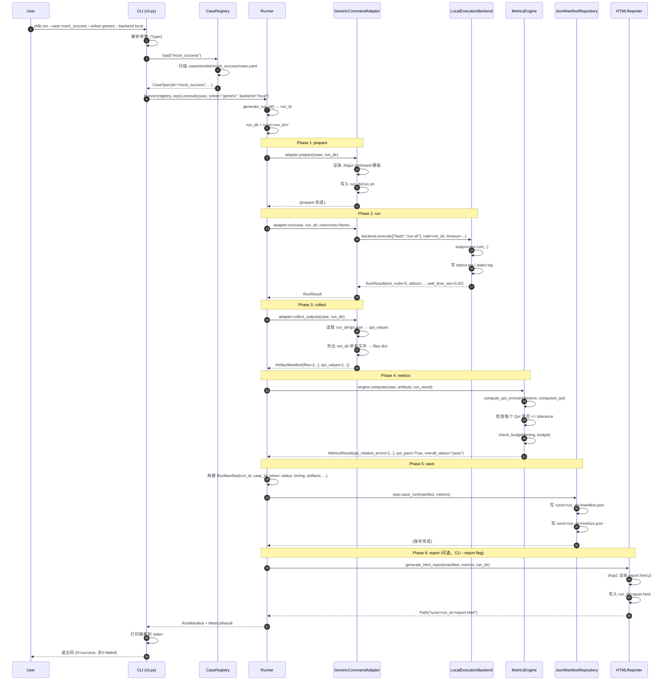
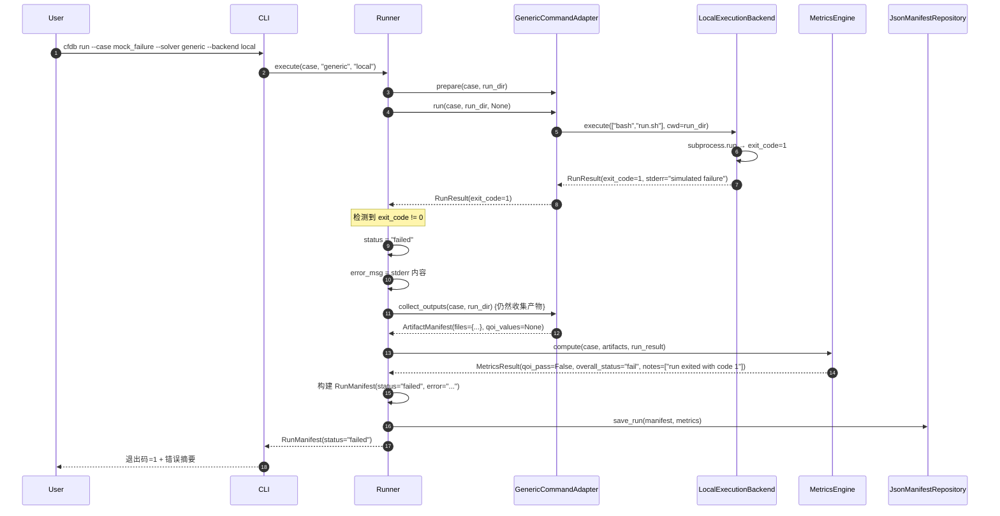
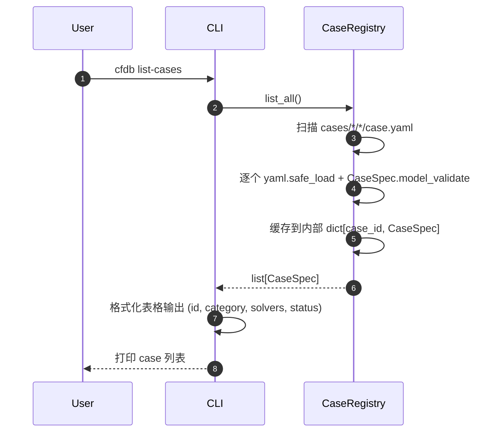
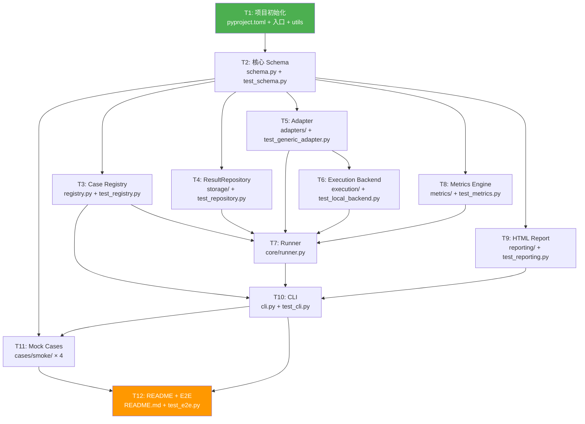
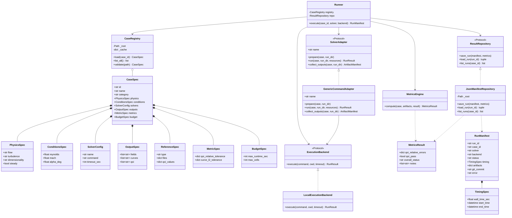

# CFD-Benchmark 系统架构设计 v1（P0）

| 项 | 内容 |
|---|---|
| 版本 | v1.0 |
| 日期 | 2026-06-16 |
| 作者 | 高见远（Gao）· 架构师 |
| 范围 | **P0（Mock Case 闭环）** |
| 上游依赖 | `docs/prd/PRD-v1.md` v1.0（已确认） |

---

## 1. 概述

### 1.1 项目定位

CFD-Benchmark（`cfdb`）是一个开源 CFD 求解器/仿真方案 benchmark 平台，通过标准化的五类 case（smoke / verification / validation / performance / surrogate）+ Solver Adapter 抽象层，让任意 CFD 方案（传统求解器或 ML surrogate）在同一组可复现 case 上被评测、对比与回归追踪。核心价值是 RunManifest 绑定可复现性元数据 + 统一的 run → post-process → metric 流水线。

### 1.2 P0 范围

P0 阶段**不接任何真实 CFD 求解器**，目标是搭建平台骨架并跑通完整流水线：`CaseSpec schema → CaseRegistry → CLI(4 命令) → GenericCommandAdapter → LocalExecutionBackend → MetricsEngine → JsonManifestRepository → HTML Report`。通过 4 个 mock case（success / failure / missing_reference / missing_qoi）验证正常路径与错误路径，覆盖率 ≥ 80%，pyright basic + ruff 全绿，可在无 OpenFOAM/SU2 的干净 CI 环境通过。

---

## 2. 实现方案与框架选型

### 2.1 核心技术挑战（P0）

| 挑战 | 解决方案 |
|---|---|
| Case 配置需要强类型校验（YAML → Python 对象） | Pydantic v2 schema，加载即校验，validator 覆盖枚举/范围/文件存在性 |
| Adapter 需要支持未来扩展（OpenFOAM/SU2/Surrogate） | 定义 `SolverAdapter` Protocol，P0 只实现 `GenericCommandAdapter` |
| 存储层需要 P2 无痛切 SQLite | 定义 `ResultRepository` Protocol，P0 用 JSON 实现，P2 换实现类 |
| CLI 命令参数解析与子命令路由 | Typer（基于 Click，原生类型标注支持） |
| HTML 报告单文件内联、无外部依赖 | Jinja2 模板 + 内联 CSS |
| 测试不依赖真实 solver | mock case + subprocess 隔离 + fixture 覆盖 |

### 2.2 架构模式

采用**分层架构 + Protocol 抽象**：

```
CLI 层 (cli.py)
    ↓ 调用
编排层 (core/runner.py)  ← 编排 adapter + backend + metrics + repository
    ↓ 使用
适配层 (adapters/ base.py)    执行层 (execution/ base.py)
    ↓                               ↓
    └──────────→ subprocess ←──────┘
    ↓
度量层 (metrics/)              存储层 (storage/ base.py)
    ↓                               ↓
报告层 (reporting/)             JSON manifest 落盘
```

关键设计决策：
- **Protocol 而非继承**：Adapter 和 Repository 均用 `typing.Protocol`（structural subtyping），解耦接口与实现，P1/P2 新增实现类无需改动业务代码。
- **Runner 作为唯一编排者**：`core/runner.py` 是流水线的唯一入口，CLI 只是薄层，业务逻辑全部在 Runner。
- **Jinja2 模板渲染命令**：`SolverConfig.command` 是 Jinja2 模板，运行时注入 `case_id`、`solver`、`mesh_level` 等变量，P1 真实 solver 可用同一机制。

### 2.3 框架选型表（P0）

| 库 | 版本约束 | 用途 | 选型理由 |
|---|---|---|---|
| typer | >=0.12,<1.0 | CLI 框架 | 原生 type hint 支持、自动生成 help、Click 生态兼容 |
| pydantic | >=2.5,<3.0 | Schema 校验 | v2 性能 5-50× 提升、validator 装饰器、JSON schema 导出 |
| pyyaml | >=6.0,<7.0 | YAML 加载 | 标准库级别稳定性、CaseSpec 的 case.yaml 解析 |
| jinja2 | >=3.1,<4.0 | 模板引擎 | 同时用于命令模板渲染 + HTML 报告生成，一库两用 |
| numpy | >=1.26,<3.0 | 数值计算 | metrics 的 L2 范数、相对误差向量化计算 |
| pytest | >=8.0 | 测试框架 | 生态成熟、fixture/parametrize 支持完善 |
| pytest-cov | >=5.0 | 覆盖率 | CI gate 80% 阈值，`--cov-fail-under=80` |
| ruff | >=0.5 | Lint + format | 比 flake8+black 快 10-100×，一体化 lint/format |
| pyright | >=1.1.350 | 类型检查 | basic mode 进 CI gate，VS Code 原生集成 |

> ⚠️ P1/P2 才需要的库（dvc、pyvista、fastapi、aiohttp 等）此处不列，在 §12 演进预留点说明。

---

## 3. 文件列表

### 3.1 配置与入口文件

| # | 相对路径 | 职责 | 主要导出 | 估算行数 |
|---|---|---|---|---|
| 1 | `pyproject.toml` | 项目元数据 + 依赖 + ruff/pytest/pyright 配置（单文件集中配置） | — | 80 |
| 2 | `README.md` | 安装步骤 + 4 命令用法 + mock case 示例 | — | 120 |
| 3 | `.gitignore` | Git 忽略规则（`runs/`、`__pycache__/`、`.venv/`、`*.egg-info` 等） | — | 30 |
| 4 | `LICENSE` | MIT 许可证全文 | — | 22 |

### 3.2 源代码（`src/cfdb/`）

| # | 相对路径 | 职责 | 主要导出 | 估算行数 |
|---|---|---|---|---|
| 5 | `src/cfdb/__init__.py` | 包入口，导出 `__version__` | `__version__: str` | 5 |
| 6 | `src/cfdb/version.py` | 版本号定义（单一来源） | `__version__ = "0.1.0"` | 3 |
| 7 | `src/cfdb/__main__.py` | `python -m cfdb` 入口 | `main()` | 10 |
| 8 | `src/cfdb/utils.py` | 公共工具函数 | `generate_run_id(case_id, solver) -> str`、`utc_now_iso() -> str`、`get_git_commit() -> str \| None` | 50 |
| 9 | `src/cfdb/schema.py` | 全部 Pydantic v2 数据模型 | `CaseSpec`、`PhysicsSpec`、`ConditionsSpec`、`GeometrySpec`、`MeshSpec`、`SolverConfig`、`OutputSpec`、`ReferenceSpec`、`MetricSpec`、`BudgetSpec`、`RunManifest`、`TimingSpec`、`MetricsResult` | 200 |
| 10 | `src/cfdb/registry.py` | Case 注册表：扫描 `cases/` 加载 + 缓存 CaseSpec | `CaseRegistry` 类 | 80 |
| 11 | `src/cfdb/core/__init__.py` | core 子包 | — | 2 |
| 12 | `src/cfdb/core/runner.py` | 流水线编排：prepare → run → collect → metrics → save → report | `Runner` 类 | 150 |
| 13 | `src/cfdb/adapters/__init__.py` | adapters 子包，导出 adapter 注册表 | `get_adapter(name: str) -> SolverAdapter` | 15 |
| 14 | `src/cfdb/adapters/base.py` | SolverAdapter Protocol + 辅助类型 | `SolverAdapter`（Protocol）、`RunResult`、`ArtifactManifest`、`ResourceSpec` | 60 |
| 15 | `src/cfdb/adapters/generic_command.py` | GenericCommandAdapter：渲染命令模板 + subprocess 执行 | `GenericCommandAdapter` | 130 |
| 16 | `src/cfdb/execution/__init__.py` | execution 子包，导出 backend 注册表 | `get_backend(name: str) -> ExecutionBackend` | 15 |
| 17 | `src/cfdb/execution/base.py` | ExecutionBackend Protocol | `ExecutionBackend`（Protocol） | 25 |
| 18 | `src/cfdb/execution/local.py` | LocalExecutionBackend：本地 subprocess 执行 | `LocalExecutionBackend` | 60 |
| 19 | `src/cfdb/storage/__init__.py` | storage 子包 | — | 2 |
| 20 | `src/cfdb/storage/base.py` | ResultRepository Protocol | `ResultRepository`（Protocol） | 25 |
| 21 | `src/cfdb/storage/json_repo.py` | JsonManifestRepository：JSON 文件实现 | `JsonManifestRepository` | 90 |
| 22 | `src/cfdb/metrics/__init__.py` | metrics 子包，导出 MetricsEngine | `MetricsEngine` | 5 |
| 23 | `src/cfdb/metrics/qoi.py` | QoI 相对误差计算 | `compute_qoi_errors(reference, computed) -> dict[str, float]` | 50 |
| 24 | `src/cfdb/metrics/curves.py` | 曲线 L2 范数计算 | `compute_curve_l2(reference, computed) -> dict[str, float]` | 50 |
| 25 | `src/cfdb/metrics/performance.py` | 性能指标（wall time 对比 budget） | `check_budget(timing, budget) -> list[str]` | 30 |
| 26 | `src/cfdb/metrics/engine.py` | MetricsEngine：编排 qoi + curves + performance | `MetricsEngine` 类（`compute(case, artifacts) -> MetricsResult`） | 80 |
| 27 | `src/cfdb/reporting/__init__.py` | reporting 子包 | — | 2 |
| 28 | `src/cfdb/reporting/html.py` | HTML 报告生成器（Jinja2 渲染） | `generate_html_report(manifest, metrics, run_dir) -> Path` | 80 |
| 29 | `src/cfdb/reporting/templates/report.html.j2` | Jinja2 HTML 模板（内联 CSS） | — | 150 |

**源代码合计：25 个文件，约 1500 行代码。**

### 3.3 测试文件（`tests/`）

| # | 相对路径 | 职责 | 估算行数 |
|---|---|---|---|
| 30 | `tests/conftest.py` | 共享 fixture（tmp_run_dir、mock_case_factory、sample CaseSpec 等） | 80 |
| 31 | `tests/test_schema.py` | schema 校验：合法/非法 case.yaml、validator 边界、枚举约束 | 120 |
| 32 | `tests/test_registry.py` | Registry 扫描、加载、缓存、not_found 异常 | 80 |
| 33 | `tests/test_repository.py` | JsonManifestRepository CRUD、load 不存在的 run_id、list 过滤 | 90 |
| 34 | `tests/test_generic_adapter.py` | prepare 渲染、run 成功/失败/timeout、collect_outputs | 100 |
| 35 | `tests/test_local_backend.py` | LocalExecutionBackend 执行、超时、退出码捕获 | 70 |
| 36 | `tests/test_metrics.py` | QoI 误差、曲线 L2、budget 检查、missing qoi 字段 | 100 |
| 37 | `tests/test_reporting.py` | HTML 生成、模板渲染、文件存在性、内联 CSS 检查 | 80 |
| 38 | `tests/test_cli.py` | 4 命令 CLI 测试（Typer testing CliRunner） | 120 |
| 39 | `tests/test_e2e.py` | 端到端：完整 run → manifest → metrics → report 流程 | 100 |

### 3.4 Mock Case 数据（`cases/smoke/`）

| # | 相对路径 | 职责 | 估算行数 |
|---|---|---|---|
| 40 | `cases/smoke/mock_success/case.yaml` | 成功路径 case 配置 | 30 |
| 41 | `cases/smoke/mock_success/run.sh` | 模拟求解器（exit 0 + 写 qoi.json） | 10 |
| 42 | `cases/smoke/mock_success/reference/qoi.json` | 参考值数据 | 5 |
| 43 | `cases/smoke/mock_failure/case.yaml` | 失败路径 case 配置 | 25 |
| 44 | `cases/smoke/mock_failure/run.sh` | 模拟求解器（exit 1） | 5 |
| 45 | `cases/smoke/mock_missing_reference/case.yaml` | 引用不存在的参考文件 | 25 |
| 46 | `cases/smoke/mock_missing_reference/run.sh` | 模拟求解器（exit 0） | 5 |
| 47 | `cases/smoke/mock_missing_qoi/case.yaml` | 成功但缺 QoI 字段 | 25 |
| 48 | `cases/smoke/mock_missing_qoi/run.sh` | 模拟求解器（exit 0，不写 qoi.json） | 5 |
| 49 | `cases/smoke/mock_missing_qoi/reference/qoi.json` | 参考值数据 | 5 |

### 3.5 文件统计

| 类别 | 文件数 | 估算行数 |
|---|---|---|
| 配置与入口 | 4 | 252 |
| 源代码 | 25 | ~1500 |
| 测试 | 10 | ~940 |
| Mock case 数据 | 10 | ~140 |
| **合计** | **49** | **~2830** |

> 源代码文件 25 个（含 `__init__.py`），符合 P0 最小集约束。mock case 的 `run.sh` + `reference/qoi.json` 为数据文件不计入源码。

---

## 4. 核心数据结构（Pydantic v2 Schema）

> 以下定义可直接翻译为 Python 代码。所有模型继承 `pydantic.BaseModel`，`model_config = ConfigDict(extra='forbid')`。

### 4.1 `CaseSpec` — Case 完整配置（case.yaml 根模型）

```python
from typing import Literal, Optional
from pathlib import Path
from pydantic import BaseModel, ConfigDict, field_validator

class CaseSpec(BaseModel):
    """单个 case 的完整规范，对应 cases/<category>/<case_id>/case.yaml"""

    model_config = ConfigDict(extra='forbid', frozen=False)

    id: str
    """Case 唯一标识符，如 'mock_success'。必须与目录名一致。"""

    name: str
    """人类可读名称，如 'Mock Success Case'。"""

    category: Literal["smoke", "verification", "validation", "performance", "surrogate"]
    """五类 case 分类，决定 case 在 cases/ 下的子目录。"""

    description: Optional[str] = None
    """Case 详细描述（可选）。"""

    physics: "PhysicsSpec"
    """物理模型描述。"""

    conditions: "ConditionsSpec"
    """流动条件参数。"""

    geometry: Optional["GeometrySpec"] = None
    """几何信息（smoke case 可选）。"""

    mesh: Optional["MeshSpec"] = None
    """网格信息（smoke case 可选）。"""

    solvers: list["SolverConfig"]
    """支持的 solver 配置列表（至少 1 个）。"""

    outputs: "OutputSpec"
    """期望输出的 field / curve / qoi 列表。"""

    reference: Optional["ReferenceSpec"] = None
    """参考数据（validation/performance case 必填，smoke 可选）。"""

    metrics: "MetricSpec"
    """度量容差配置。"""

    budget: "BudgetSpec" = "BudgetSpec"()
    """资源预算（可选，有默认值）。"""

    @field_validator('id')
    @classmethod
    def validate_id(cls, v: str) -> str:
        """id 只允许小写字母、数字、下划线"""
        import re
        if not re.match(r'^[a-z][a-z0-9_]*$', v):
            raise ValueError(f"case id '{v}' must match ^[a-z][a-z0-9_]*$")
        return v

    @field_validator('solvers')
    @classmethod
    def validate_solvers(cls, v: list) -> list:
        """至少配置 1 个 solver"""
        if len(v) == 0:
            raise ValueError("at least one solver config required")
        return v
```

### 4.2 `PhysicsSpec` — 物理模型

```python
class PhysicsSpec(BaseModel):
    model_config = ConfigDict(extra='forbid')

    flow: Literal[
        "incompressible", "compressible", "low_mach",
        "potential", "euler", "rans", "les", "dns", "surrogate"
    ]
    """流动类型枚举。"""

    turbulence: Optional[Literal["none", "rans_sa", "rans_kwsst", "les_smag", "dns"]] = None
    """湍流模型（无湍流则 None）。"""

    dimensionality: Literal["2d", "3d", "axisymmetric"] = "2d"
    """维度。"""

    steady: bool = True
    """是否稳态计算（False = 瞬态）。"""
```

### 4.3 `ConditionsSpec` — 流动条件

```python
class ConditionsSpec(BaseModel):
    model_config = ConfigDict(extra='forbid')

    reynolds: Optional[float] = Field(None, gt=0)
    """雷诺数（必须 > 0 若提供）。"""

    mach: Optional[float] = Field(None, ge=0)
    """马赫数（必须 >= 0 若提供）。"""

    alpha_deg: Optional[float] = Field(None, ge=-90, le=90)
    """攻角（度，范围 [-90, 90]）。"""
```

### 4.4 `GeometrySpec` — 几何信息

```python
class GeometrySpec(BaseModel):
    model_config = ConfigDict(extra='forbid')

    type: Literal["internal", "external", "periodic", "custom"]
    """几何类型。"""

    source: Optional[Path] = None
    """几何文件路径（相对 case.yaml 所在目录）。P0 mock case 通常为 None。"""
```

### 4.5 `MeshSpec` — 网格信息

```python
class MeshSpec(BaseModel):
    model_config = ConfigDict(extra='forbid')

    family: Optional[str] = None
    """网格族名称（如 'structured_hex'）。"""

    levels: list[str] = ["single"]
    """网格细化级别列表。默认 ['single'] 表示单级网格。
    P1 起支持 ['coarse', 'medium', 'fine'] 做 GCI 分析。"""

    target_y_plus: Optional[float] = Field(None, gt=0)
    """目标 y+ 值（壁面网格第一层高度参考）。"""
```

### 4.6 `SolverConfig` — 单个 Solver 配置

```python
class SolverConfig(BaseModel):
    model_config = ConfigDict(extra='forbid')

    name: str
    """Solver 名称，如 'generic'、'openfoam'、'su2'。
    用于在 Adapter 注册表中查找对应实现。"""

    command: str
    """执行命令模板（Jinja2 语法）。
    可用变量：{{ case_id }}、{{ solver }}、{{ mesh_level }}、{{ case_dir }}。
    例: 'bash {{ case_dir }}/run.sh'
    """

    timeout_sec: Optional[int] = Field(None, gt=0)
    """超时时间（秒）。超时后标记 status=timeout。None 表示不超时。"""
```

### 4.7 `OutputSpec` — 期望输出

```python
class OutputSpec(BaseModel):
    model_config = ConfigDict(extra='forbid')

    fields: list[str] = []
    """期望输出的场量名称列表，如 ['U', 'p', 'nut']。
    P0 mock case 为空列表。"""

    curves: list[str] = []
    """期望输出的曲线名称列表，如 ['residual_U', 'cl_alpha']。
    P0 mock case 为空列表。"""

    qoi: list[str] = []
    """关注的 Quantity of Interest 列表，如 ['drag_coeff', 'centerline_umax']。
    MetricsEngine 会检查这些 QoI 是否在输出中存在。"""
```

### 4.8 `ReferenceSpec` — 参考数据

```python
class ReferenceSpec(BaseModel):
    model_config = ConfigDict(extra='forbid')

    type: Literal["experimental", "dns", "analytical", "manufactured", "previous_run"]
    """参考数据来源类型。"""

    files: dict[str, Path] = {}
    """参考文件映射。key = 数据类型（如 'qoi'），value = 文件路径（相对 case.yaml）。
    例: {'qoi': Path('reference/qoi.json')}"""

    qoi_values: Optional[dict[str, float]] = None
    """直接内联的参考 QoI 值（不需要文件时可替代 files 中的 qoi）。
    例: {'drag_coeff': 0.371}"""
```

### 4.9 `MetricSpec` — 度量容差

```python
class MetricSpec(BaseModel):
    model_config = ConfigDict(extra='forbid')

    qoi_relative_tolerance: dict[str, float] = {}
    """每个 QoI 的相对误差容差。key = QoI 名称，value = 最大允许相对误差。
    例: {'drag_coeff': 0.05} 表示 5% 容差。
    MetricsEngine 会判定每个 QoI 的相对误差是否 <= 容差。"""

    curve_l2_tolerance: Optional[dict[str, float]] = None
    """每条曲线的 L2 范数容差（可选）。
    P0 mock case 通常不配此项。"""
```

### 4.10 `BudgetSpec` — 资源预算

```python
class BudgetSpec(BaseModel):
    model_config = ConfigDict(extra='forbid')

    max_runtime_sec: Optional[int] = Field(None, gt=0)
    """最大允许 wall time（秒）。超出在 MetricsResult.notes 中告警（不影响 status）。"""

    max_cells: Optional[int] = Field(None, gt=0)
    """最大允许网格单元数。P0 不校验（无真实网格），P1 起生效。"""
```

### 4.11 `TimingSpec` — 运行时间

```python
class TimingSpec(BaseModel):
    model_config = ConfigDict(extra='forbid')

    wall_time_sec: float = Field(ge=0)
    """实际运行 wall time（秒）。"""

    start_time: datetime
    """运行开始时间（UTC ISO 8601）。"""

    end_time: datetime
    """运行结束时间（UTC ISO 8601）。"""
```

### 4.12 `RunManifest` — 单次运行元数据（可复现性核心）

```python
class RunManifest(BaseModel):
    model_config = ConfigDict(extra='forbid')

    run_id: str
    """运行唯一标识。格式: YYYYMMDDTHHMMSSZ_<case_id>_<solver>_<hash8>"""

    case_id: str
    """关联的 CaseSpec.id。"""

    solver: str
    """使用的 solver 名称。"""

    backend: Literal["local", "docker", "slurm"] = "local"
    """执行后端。P0 只有 'local'。"""

    status: Literal["success", "failed", "timeout"]
    """运行状态。"""

    timing: TimingSpec
    """运行时间信息。"""

    resources: Optional["ResourceSpec"] = None
    """资源使用信息（CPU/内存，P0 可选）。"""

    host: Optional[str] = None
    """执行主机名。"""

    artifacts: dict[str, Path] = {}
    """产物文件映射。key = 类型（如 'stdout'/'stderr'/'qoi'），value = 文件路径。
    路径相对 run_dir。"""

    git_commit: Optional[str] = None
    """Git commit hash（可复现性）。"""

    container_digest: Optional[str] = None
    """容器镜像 digest（Docker backend 才有，P0 固定为 None）。"""

    error: Optional[str] = None
    """失败时的错误信息 / traceback。status != success 时必填。"""

    cli_args: Optional[dict[str, str]] = None
    """调用 CLI 的原始参数（可复现性）。"""
```

### 4.13 `MetricsResult` — 度量结果

```python
class MetricsResult(BaseModel):
    model_config = ConfigDict(extra='forbid')

    qoi_relative_errors: dict[str, float] = {}
    """每个 QoI 的相对误差。key = QoI 名称，value = 相对误差值。
    若 QoI 缺失则不包含在 dict 中（在 notes 中记录）。"""

    qoi_pass: bool = False
    """所有 QoI 是否通过容差检查。
    仅当所有 qoi_relative_errors 都 <= MetricSpec.qoi_relative_tolerance 时为 True。"""

    overall_status: str = "unknown"
    """综合状态: 'pass' / 'fail' / 'incomplete' / 'unknown'。
    - pass: run success + all qoi pass
    - fail: run success but qoi 未通过，或 run failed
    - incomplete: run success 但缺少必要 QoI 数据"""

    notes: list[str] = []
    """附加说明信息列表（如 budget 超时告警、缺失 QoI 提示等）。"""
```

### 4.14 辅助类型（定义在 `adapters/base.py`）

```python
from dataclasses import dataclass

@dataclass
class ResourceSpec:
    """资源请求规格（传给 ExecutionBackend）"""
    cpu_cores: int = 1
    memory_mb: Optional[int] = None
    wall_time_sec: Optional[int] = None

@dataclass
class RunResult:
    """Adapter.run() 的返回值"""
    exit_code: int
    stdout: str
    stderr: str
    wall_time_sec: float
    timed_out: bool = False

@dataclass
class ArtifactManifest:
    """Adapter.collect_outputs() 的返回值"""
    files: dict[str, Path]
    """key = 文件类型标签，value = 文件路径（相对 run_dir）。"""
    qoi_values: Optional[dict[str, float]] = None
    """从 qoi.json 解析出的 QoI 值（若存在）。"""
    curves: Optional[dict[str, list[tuple[float, float]]]] = None
    """曲线数据（P0 通常为 None）。"""
```

---

## 5. Solver Adapter Protocol

### 5.1 Protocol 定义（`adapters/base.py`）

```python
from typing import Protocol, runtime_checkable
from pathlib import Path
from cfdb.schema import CaseSpec
from cfdb.adapters.base import RunResult, ArtifactManifest, ResourceSpec  # 或同文件定义

@runtime_checkable
class SolverAdapter(Protocol):
    """求解器适配层接口。

    每种 solver（generic / openfoam / su2 / surrogate）实现此 Protocol。
    Runner 通过此接口调用 adapter，不关心具体 solver 实现。
    """

    name: str
    """Adapter 唯一标识，与 CaseSpec.solvers[].name 匹配。"""

    def prepare(self, case: CaseSpec, run_dir: Path) -> None:
        """准备运行环境。
        - 创建 run_dir 目录结构
        - 渲染命令模板，生成 run_dir/run.sh（或等效执行脚本）
        - 复制/链接必要的输入文件到 run_dir
        Args:
            case: CaseSpec 完整配置
            run_dir: 本次运行的隔离目录
        Raises:
            FileNotFoundError: 参考文件缺失
            jinja2.TemplateError: 模板渲染失败
        """
        ...

    def run(
        self,
        case: CaseSpec,
        run_dir: Path,
        resources: ResourceSpec | None
    ) -> RunResult:
        """执行求解器。
        - 调用 ExecutionBackend 执行 run_dir 中的命令
        - 捕获 stdout/stderr/exit_code/wall_time
        Args:
            case: CaseSpec 完整配置
            run_dir: 运行目录
            resources: 资源限制（None 使用默认）
        Returns:
            RunResult: 执行结果
        """
        ...

    def collect_outputs(self, case: CaseSpec, run_dir: Path) -> ArtifactManifest:
        """收集运行产物。
        - 读取 run_dir/qoi.json（若存在）
        - 列出 run_dir 下所有文件作为 artifact
        - P1 起增加场数据/曲线文件解析
        Args:
            case: CaseSpec 完整配置（用于确定期望输出）
            run_dir: 运行目录
        Returns:
            ArtifactManifest: 产物清单
        """
        ...
```

### 5.2 GenericCommandAdapter 实现细节（`adapters/generic_command.py`）

```python
class GenericCommandAdapter:
    """通用命令 Adapter —— 包装任意 shell 命令。

    P0 唯一的 adapter 实现。通过 SolverConfig.command 模板渲染后
    交由 ExecutionBackend 执行。
    """

    name: str = "generic"

    def prepare(self, case: CaseSpec, run_dir: Path) -> None:
        """
        1. run_dir.mkdir(parents=True, exist_ok=True)
        2. 查找 case.solvers 中 name == 'generic' 的 SolverConfig
        3. 构造 Jinja2 模板上下文:
             context = {
                 'case_id': case.id,
                 'solver': 'generic',
                 'mesh_level': case.mesh.levels[0] if case.mesh else 'single',
                 'case_dir': <case.yaml 所在目录的绝对路径>,
             }
        4. 渲染 SolverConfig.command → rendered_cmd: str
        5. 写入 run_dir/run.sh:
             #!/usr/bin/env bash
             set -euo pipefail
             <rendered_cmd>
        6. chmod +x run_dir/run.sh
        7. 若 case.reference.files 中有文件，校验其存在性
           （缺失则记录但不在此抛异常 —— 在 run 阶段才会触发错误路径）
        """

    def run(
        self,
        case: CaseSpec,
        run_dir: Path,
        resources: ResourceSpec | None
    ) -> RunResult:
        """
        委托给 ExecutionBackend:
        1. 确定执行脚本路径: run_dir / 'run.sh'
        2. 确定超时: resources.wall_time_sec 或 SolverConfig.timeout_sec
        3. 调用 backend.execute(command, cwd=run_dir, timeout=...)
        4. 返回 RunResult(exit_code, stdout, stderr, wall_time_sec, timed_out)
        注: 实际执行逻辑在 ExecutionBackend 中，adapter 只负责桥接。
        """

    def collect_outputs(self, case: CaseSpec, run_dir: Path) -> ArtifactManifest:
        """
        1. 遍历 run_dir 下所有文件，构建 files dict:
             {'run.sh': ..., 'stdout.log': ..., 'stderr.log': ..., ...}
        2. 若 run_dir/qoi.json 存在:
             - 读取并 JSON 解析 → qoi_values dict
             - 若解析失败 → qoi_values = None，在 notes 记录
        3. curves = None（P0 不解析曲线文件）
        4. 返回 ArtifactManifest(files=..., qoi_values=..., curves=None)
        """
```

### 5.3 Adapter 注册机制（`adapters/__init__.py`）

```python
# P0 使用手工字典注册（简单可靠），P2 可改为 entry_points 插件机制
_ADAPTERS: dict[str, type[SolverAdapter]] = {
    "generic": GenericCommandAdapter,
}

def get_adapter(name: str) -> SolverAdapter:
    """根据名称获取 adapter 实例。"""
    if name not in _ADAPTERS:
        raise KeyError(f"Unknown adapter: '{name}'. Available: {list(_ADAPTERS)}")
    return _ADAPTERS[name]()

def register_adapter(name: str, adapter_cls: type[SolverAdapter]) -> None:
    """注册新 adapter（P1/P2 扩展用）。"""
    _ADAPTERS[name] = adapter_cls
```

---

## 6. ExecutionBackend Protocol

### 6.1 Protocol 定义（`execution/base.py`）

```python
from typing import Protocol, runtime_checkable

@runtime_checkable
class ExecutionBackend(Protocol):
    """执行后端接口。

    屏蔽不同的执行环境（本地 / Docker / Slurm）。
    Adapter 通过此接口执行命令，不关心运行环境细节。
    """

    name: str

    def execute(
        self,
        command: list[str],
        cwd: Path,
        timeout: int | None = None,
        env: dict[str, str] | None = None,
    ) -> RunResult:
        """执行命令并返回结果。

        Args:
            command: 命令及参数列表，如 ['bash', 'run.sh']
            cwd: 工作目录
            timeout: 超时秒数（None = 不限）
            env: 环境变量覆盖
        Returns:
            RunResult: 含 exit_code / stdout / stderr / wall_time_sec / timed_out
        """
        ...
```

### 6.2 LocalExecutionBackend 实现（`execution/local.py`）

```python
class LocalExecutionBackend:
    """本地 subprocess 执行后端。"""

    name: str = "local"

    def execute(
        self,
        command: list[str],
        cwd: Path,
        timeout: int | None = None,
        env: dict[str, str] | None = None,
    ) -> RunResult:
        """
        1. 记录 start_time = datetime.now(timezone.utc)
        2. subprocess.run(command, cwd=cwd, capture_output=True, text=True, timeout=timeout, env=env)
        3. 记录 end_time，计算 wall_time_sec
        4. 捕获 subprocess.TimeoutExpired:
             - return RunResult(exit_code=-1, stdout=..., stderr='Timeout', wall_time_sec=timeout, timed_out=True)
        5. 捕获其他异常 (FileNotFoundError 等):
             - return RunResult(exit_code=-1, stdout='', stderr=str(e), wall_time_sec=..., timed_out=False)
        6. 正常返回 RunResult(exit_code=p.returncode, stdout=p.stdout, stderr=p.stderr, wall_time_sec=..., timed_out=False)
        7. 同时将 stdout/stderr 写入 cwd/stdout.log 和 cwd/stderr.log
        """
```

### 6.3 Backend 注册机制（`execution/__init__.py`）

```python
_BACKENDS: dict[str, type[ExecutionBackend]] = {
    "local": LocalExecutionBackend,
}

def get_backend(name: str) -> ExecutionBackend:
    if name not in _BACKENDS:
        raise KeyError(f"Unknown backend: '{name}'. Available: {list(_BACKENDS)}")
    return _BACKENDS[name]()
```

---

## 7. ResultRepository Protocol

### 7.1 Protocol 定义（`storage/base.py`）

```python
from typing import Protocol, runtime_checkable
from cfdb.schema import RunManifest, MetricsResult

@runtime_checkable
class ResultRepository(Protocol):
    """结果存储抽象层。

    P0: JsonManifestRepository（JSON 文件）
    P2: SqliteRepository（SQLite 数据库）

    切换实现时业务代码零改动。
    """

    def save_run(self, manifest: RunManifest, metrics: MetricsResult) -> None:
        """保存一次运行的 manifest + metrics。"""
        ...

    def load_run(self, run_id: str) -> tuple[RunManifest, MetricsResult]:
        """加载指定 run 的 manifest + metrics。
        Raises:
            KeyError: run_id 不存在
        """
        ...

    def list_runs(self, case_id: str | None = None) -> list[RunManifest]:
        """列出所有 run（可按 case_id 过滤）。
        Args:
            case_id: 若提供，只返回该 case 的 run
        Returns:
            RunManifest 列表，按时间倒序（最新在前）
        """
        ...
```

### 7.2 JsonManifestRepository 实现（`storage/json_repo.py`）

```python
class JsonManifestRepository:
    """JSON 文件实现的 ResultRepository。

    存储结构:
        runs/<run_id>/manifest.json    ← RunManifest 序列化
        runs/<run_id>/metrics.json     ← MetricsResult 序列化

    P2 切 SqliteRepository 时只需新增实现类，Runner / CLI 代码不动。
    """

    def __init__(self, runs_root: Path):
        """
        Args:
            runs_root: runs 目录的根路径（如仓库根的 runs/）
        """
        self._root = runs_root

    def save_run(self, manifest: RunManifest, metrics: MetricsResult) -> None:
        """
        1. run_dir = self._root / manifest.run_id
        2. run_dir.mkdir(parents=True, exist_ok=True)
        3. (run_dir / 'manifest.json').write_text(manifest.model_dump_json(indent=2))
        4. (run_dir / 'metrics.json').write_text(metrics.model_dump_json(indent=2))
        """

    def load_run(self, run_id: str) -> tuple[RunManifest, MetricsResult]:
        """
        1. run_dir = self._root / run_id
        2. 若不存在 → raise KeyError(f"run '{run_id}' not found")
        3. manifest = RunManifest.model_validate_json((run_dir/'manifest.json').read_text())
        4. metrics = MetricsResult.model_validate_json((run_dir/'metrics.json').read_text())
        5. return (manifest, metrics)
        """

    def list_runs(self, case_id: str | None = None) -> list[RunManifest]:
        """
        1. 遍历 self._root 下所有子目录
        2. 每个子目录若有 manifest.json → 加载 RunManifest
        3. 若 case_id 提供则过滤 manifest.case_id == case_id
        4. 按 manifest.timing.start_time 倒序排序
        5. 返回列表
        """
```

---

## 8. 程序调用流程

### 8.1 `cfdb run --case mock_success --solver generic --backend local` 时序图



### 8.2 失败路径时序（`mock_failure`）



### 8.3 `cfdb list-cases` 流程



---

## 9. 任务列表

> 任务按依赖顺序排列，工程师照此逐个实现。每个任务的"完成定义"必须自测通过才能交付。

### T1: 项目初始化

| 项 | 内容 |
|---|---|
| **涉及文件** | `pyproject.toml`、`.gitignore`、`LICENSE`、`README.md`（骨架）、`src/cfdb/__init__.py`、`src/cfdb/version.py`、`src/cfdb/__main__.py`、`src/cfdb/utils.py` |
| **依赖** | 无 |
| **优先级** | P0 |
| **完成定义** | ① `pip install -e ".[dev]"` 成功安装；② `cfdb --version` 输出 `0.1.0`；③ `ruff check .` 无错误；④ `python -m cfdb` 可执行（即使只有 help）；⑤ `.gitignore` 包含 `runs/`、`__pycache__/`、`.venv/`、`*.egg-info`、`.pytest_cache/`；⑥ `LICENSE` 为 MIT 全文 |

**详细说明**：

`pyproject.toml` 关键配置：
```toml
[build-system]
requires = ["hatchling"]
build-backend = "hatchling.build"

[project]
name = "cfd-benchmark"
version = "0.1.0"
description = "Open-source CFD solver benchmark platform"
requires-python = ">=3.11"
license = {text = "MIT"}
dependencies = [
    "typer>=0.12,<1.0",
    "pydantic>=2.5,<3.0",
    "pyyaml>=6.0,<7.0",
    "jinja2>=3.1,<4.0",
    "numpy>=1.26,<3.0",
]

[project.optional-dependencies]
dev = [
    "pytest>=8.0",
    "pytest-cov>=5.0",
    "ruff>=0.5",
    "pyright>=1.1.350",
]

[project.scripts]
cfdb = "cfdb.cli:app"

[tool.hatch.build.targets.wheel]
packages = ["src/cfdb"]

[tool.ruff]
target-version = "py311"
line-length = 100

[tool.ruff.lint]
select = ["E", "F", "W", "I", "UP", "B", "SIM"]

[tool.pytest.ini_options]
testpaths = ["tests"]
addopts = "--cov=cfdb --cov-report=term-missing --cov-fail-under=80"

[tool.coverage.run]
source = ["src/cfdb"]

[tool.pyright]
include = ["src/cfdb"]
typeCheckingMode = "basic"
```

`utils.py` 关键函数：
```python
def generate_run_id(case_id: str, solver: str) -> str:
    """格式: YYYYMMDDTHHMMSSZ_<case_id>_<solver>_<hash8>"""
    timestamp = datetime.now(timezone.utc).strftime("%Y%m%dTH%M%SZ")
    random_hash = secrets.token_hex(4)  # 8 hex chars
    return f"{timestamp}_{case_id}_{solver}_{random_hash}"

def utc_now_iso() -> str:
    """UTC ISO 8601 时间戳"""
    return datetime.now(timezone.utc).isoformat()

def get_git_commit() -> str | None:
    """获取当前 git commit hash（失败返回 None）"""
    # subprocess: git rev-parse HEAD
```

---

### T2: 核心 Schema

| 项 | 内容 |
|---|---|
| **涉及文件** | `src/cfdb/schema.py`、`tests/test_schema.py`、`tests/conftest.py` |
| **依赖** | T1 |
| **优先级** | P0 |
| **完成定义** | ① 所有 13 个 Pydantic 模型按 §4 定义实现；② `tests/test_schema.py` 覆盖：合法 case.yaml 加载成功、非法 id 格式报错、枚举字段越界报错、Optional 字段缺失时使用默认值、`extra='forbid'` 拒绝多余字段；③ `pytest tests/test_schema.py` 全绿；④ `pyright src/cfdb/schema.py` 无错误 |

**`conftest.py` 核心 fixture**：
```python
@pytest.fixture
def sample_case_spec_data() -> dict:
    """最小合法 CaseSpec dict（mock_success 风格）"""
    return {
        "id": "test_case",
        "name": "Test Case",
        "category": "smoke",
        "physics": {"flow": "incompressible", "dimensionality": "2d", "steady": True},
        "conditions": {"reynolds": 100.0},
        "solvers": [{"name": "generic", "command": "bash {{ case_dir }}/run.sh"}],
        "outputs": {"fields": [], "curves": [], "qoi": ["test_qoi"]},
        "metrics": {"qoi_relative_tolerance": {"test_qoi": 0.05}},
    }

@pytest.fixture
def tmp_run_dir(tmp_path: Path) -> Path:
    """隔离的临时运行目录"""
    d = tmp_path / "run_test"
    d.mkdir()
    return d
```

---

### T3: Case Registry

| 项 | 内容 |
|---|---|
| **涉及文件** | `src/cfdb/registry.py`、`tests/test_registry.py` |
| **依赖** | T2 |
| **优先级** | P0 |
| **完成定义** | ① `CaseRegistry` 实现 `load(case_id) -> CaseSpec`、`list_all() -> list[CaseSpec]`、`validate(yaml_path) -> CaseSpec`；② 扫描 `cases/<category>/<case_id>/case.yaml` 结构；③ YAML 解析用 `yaml.safe_load` + `CaseSpec.model_validate`；④ 缓存机制：首次扫描后缓存，避免重复 I/O；⑤ `load("nonexistent")` 抛 `KeyError`；⑥ `pytest tests/test_registry.py` 全绿 |

**类设计**：
```python
class CaseRegistry:
    """Case 注册表：扫描、加载、缓存 CaseSpec。"""

    def __init__(self, cases_root: Path):
        self._root = cases_root
        self._cache: dict[str, CaseSpec] = {}
        self._scanned: bool = False

    def _scan(self) -> None:
        """遍历 cases/<category>/*/case.yaml，加载所有合法 CaseSpec。"""

    def load(self, case_id: str) -> CaseSpec:
        """按 ID 加载单个 CaseSpec。未找到抛 KeyError。"""

    def list_all(self) -> list[CaseSpec]:
        """返回所有已注册的 CaseSpec（按 id 排序）。"""

    def validate(self, yaml_path: Path) -> CaseSpec:
        """校验单个 case.yaml 文件（不缓存）。返回 CaseSpec 或抛 ValidationError。"""
```

---

### T4: ResultRepository 抽象 + JSON 实现

| 项 | 内容 |
|---|---|
| **涉及文件** | `src/cfdb/storage/__init__.py`、`src/cfdb/storage/base.py`、`src/cfdb/storage/json_repo.py`、`tests/test_repository.py` |
| **依赖** | T2 |
| **优先级** | P0 |
| **完成定义** | ① `ResultRepository` Protocol 按 §7.1 定义；② `JsonManifestRepository` 实现 `save_run` / `load_run` / `list_runs`；③ `save_run` 写 `manifest.json` + `metrics.json`；④ `load_run("nonexistent")` 抛 `KeyError`；⑤ `list_runs(case_id)` 正确过滤；⑥ `pytest tests/test_repository.py` 全绿 |

---

### T5: Adapter 抽象 + GenericCommandAdapter

| 项 | 内容 |
|---|---|
| **涉及文件** | `src/cfdb/adapters/__init__.py`、`src/cfdb/adapters/base.py`、`src/cfdb/adapters/generic_command.py`、`tests/test_generic_adapter.py` |
| **依赖** | T2 |
| **优先级** | P0 |
| **完成定义** | ① `SolverAdapter` Protocol 按 §5.1 定义；② `RunResult`、`ArtifactManifest`、`ResourceSpec` 辅助类型定义；③ `GenericCommandAdapter` 实现 `prepare` / `run` / `collect_outputs`；④ `prepare` 正确渲染 Jinja2 模板（注入 case_id / solver / mesh_level / case_dir）；⑤ `collect_outputs` 正确读取 qoi.json；⑥ `pytest tests/test_generic_adapter.py` 全绿（用 tmp_path 临时目录 + 模拟 run.sh） |

---

### T6: Execution Backend 抽象 + LocalExecutionBackend

| 项 | 内容 |
|---|---|
| **涉及文件** | `src/cfdb/execution/__init__.py`、`src/cfdb/execution/base.py`、`src/cfdb/execution/local.py`、`tests/test_local_backend.py` |
| **依赖** | T5（依赖 `RunResult` 类型） |
| **优先级** | P0 |
| **完成定义** | ① `ExecutionBackend` Protocol 按 §6.1 定义；② `LocalExecutionBackend` 实现 `execute`；③ 成功执行返回正确 `exit_code` + `stdout` + `wall_time_sec`；④ 超时返回 `timed_out=True` + `exit_code=-1`；⑤ stdout/stderr 写入 `cwd/stdout.log` 和 `cwd/stderr.log`；⑥ `pytest tests/test_local_backend.py` 全绿 |

---

### T7: Runner（流水线编排）

| 项 | 内容 |
|---|---|
| **涉及文件** | `src/cfdb/core/__init__.py`、`src/cfdb/core/runner.py` |
| **依赖** | T3、T4、T5、T6 |
| **优先级** | P0 |
| **完成定义** | ① `Runner` 类实现 `execute(case_id, solver, backend, report=False) -> RunManifest`；② 编排 prepare → run → collect → metrics → save 六步；③ 成功路径生成完整 `RunManifest` + `MetricsResult`；④ 失败路径（exit_code != 0）正确设置 `status=failed` + `error`；⑤ timeout 路径正确设置 `status=timeout`；⑥ Runner 内部组装 adapter + backend + repository + metrics_engine 的依赖注入 |

**类设计**：
```python
class Runner:
    """流水线编排器：串联 adapter → backend → metrics → repository。"""

    def __init__(
        self,
        registry: CaseRegistry,
        repository: ResultRepository,
        runs_root: Path,
    ):
        self._registry = registry
        self._repo = repository
        self._runs_root = runs_root

    def execute(
        self,
        case_id: str,
        solver: str,
        backend: str = "local",
        generate_report: bool = False,
    ) -> RunManifest:
        """完整执行一次 case run。
        1. registry.load(case_id) → CaseSpec
        2. get_adapter(solver) → SolverAdapter
        3. get_backend(backend) → ExecutionBackend
        4. generate_run_id() → run_id, run_dir
        5. adapter.prepare(case, run_dir)
        6. adapter.run(case, run_dir, None) → RunResult
        7. adapter.collect_outputs(case, run_dir) → ArtifactManifest
        8. MetricsEngine().compute(case, artifacts, run_result) → MetricsResult
        9. 构建 RunManifest
        10. repo.save_run(manifest, metrics)
        11. 若 generate_report: generate_html_report(manifest, metrics, run_dir)
        12. return manifest
        """
```

---

### T8: Metrics Engine

| 项 | 内容 |
|---|---|
| **涉及文件** | `src/cfdb/metrics/__init__.py`、`src/cfdb/metrics/qoi.py`、`src/cfdb/metrics/curves.py`、`src/cfdb/metrics/performance.py`、`src/cfdb/metrics/engine.py`、`tests/test_metrics.py` |
| **依赖** | T2 |
| **优先级** | P0 |
| **完成定义** | ① `compute_qoi_errors(reference, computed) -> dict[str, float]`：对每个 QoI 计算相对误差 `|computed - reference| / |reference|`；② `compute_curve_l2(reference, computed) -> dict[str, float]`：L2 范数（numpy）；③ `check_budget(timing, budget) -> list[str]`：超时告警写入 notes；④ `MetricsEngine.compute(case, artifacts, run_result) -> MetricsResult`：编排上述三者 + 判定 `qoi_pass` + `overall_status`；⑤ 缺少 QoI 字段时记录到 notes 而非崩溃；⑥ `pytest tests/test_metrics.py` 全绿 |

**`MetricsEngine.compute` 逻辑**：
```python
def compute(self, case: CaseSpec, artifacts: ArtifactManifest, run_result: RunResult) -> MetricsResult:
    notes: list[str] = []

    # 1. 若 run 失败，直接返回 fail
    if run_result.exit_code != 0:
        return MetricsResult(qoi_pass=False, overall_status="fail",
                            notes=[f"run exited with code {run_result.exit_code}"])

    # 2. 获取参考 QoI 值
    reference_qoi = self._get_reference_qoi(case)  # 从 ReferenceSpec

    # 3. 获取计算 QoI 值
    computed_qoi = artifacts.qoi_values or {}

    # 4. 计算相对误差
    errors = {}
    for qoi_name in case.outputs.qoi:
        if qoi_name not in computed_qoi:
            notes.append(f"missing computed QoI: {qoi_name}")
            continue
        if qoi_name not in reference_qoi:
            notes.append(f"missing reference QoI: {qoi_name}")
            continue
        errors[qoi_name] = abs(computed_qoi[qoi_name] - reference_qoi[qoi_name]) / abs(reference_qoi[qoi_name])

    # 5. 判定 pass/fail
    tolerances = case.metrics.qoi_relative_tolerance
    qoi_pass = all(errors.get(k, float('inf')) <= tol for k, tol in tolerances.items())

    # 6. budget 检查
    notes.extend(check_budget(run_result.timing, case.budget))

    # 7. overall_status
    if qoi_pass:
        status = "pass"
    elif len(errors) < len(case.outputs.qoi):
        status = "incomplete"
    else:
        status = "fail"

    return MetricsResult(qoi_relative_errors=errors, qoi_pass=qoi_pass, overall_status=status, notes=notes)
```

---

### T9: HTML Report

| 项 | 内容 |
|---|---|
| **涉及文件** | `src/cfdb/reporting/__init__.py`、`src/cfdb/reporting/html.py`、`src/cfdb/reporting/templates/report.html.j2`、`tests/test_reporting.py` |
| **依赖** | T2 |
| **优先级** | P0 |
| **完成定义** | ① `generate_html_report(manifest, metrics, run_dir) -> Path` 生成单文件 HTML；② 模板内联 CSS（无外部 CDN 依赖）；③ 报告包含：run_id、status（带颜色标记）、case/solver/backend、时间信息、环境元数据（git_commit/platform）、QoI 误差表、artifact 列表、页脚版本信息；④ `report.html` 写入 `run_dir/report.html`；⑤ `tests/test_reporting.py` 验证文件生成 + 关键内容存在；⑥ HTML 文件可被浏览器打开（无语法错误） |

---

### T10: CLI（4 命令）

| 项 | 内容 |
|---|---|
| **涉及文件** | `src/cfdb/cli.py`、`tests/test_cli.py` |
| **依赖** | T3、T7、T9 |
| **优先级** | P0 |
| **完成定义** | ① Typer app 定义 4 个子命令：`list-cases`、`validate-case`、`run`、`report`；② `list-cases` 输出表格（id/category/solvers/status）；③ `validate-case <yaml_path>` 校验单个 case.yaml；④ `run --case <id> --solver <name> --backend <name>` 执行并打印摘要；⑤ `report --run-dir <path>` 生成 HTML 报告；⑥ `--version` / `-V` 输出版本；⑦ `--cases-dir` 全局选项覆盖默认 cases 路径；⑧ `run` 命令退出码：0=success，1=failed/timeout；⑨ `tests/test_cli.py` 用 `typer.testing.CliRunner` 测试 4 个命令；⑩ `pytest tests/test_cli.py` 全绿 |

**CLI 骨架**：
```python
import typer
from cfdb.registry import CaseRegistry
from cfdb.core.runner import Runner
from cfdb.storage.json_repo import JsonManifestRepository
from cfdb.reporting.html import generate_html_report

app = typer.Typer(
    name="cfdb",
    help="CFD-Benchmark: 标准化 CFD V&V 与多 solver 对比平台",
    no_args_is_help=True,
)

@app.command("list-cases")
def list_cases(
    cases_dir: Path = typer.Option(Path("cases"), "--cases-dir"),
):
    """列出所有已注册 case"""
    registry = CaseRegistry(cases_dir)
    cases = registry.list_all()
    # 格式化表格输出...

@app.command("validate-case")
def validate_case(
    yaml_path: Path = typer.Argument(..., help="case.yaml 路径"),
):
    """校验单个 case.yaml"""
    registry = CaseRegistry(yaml_path.parent.parent.parent)
    spec = registry.validate(yaml_path)
    typer.echo(f"✓ CaseSpec '{spec.id}' 校验通过")

@app.command("run")
def run(
    case: str = typer.Option(..., "--case", "-c"),
    solver: str = typer.Option("generic", "--solver", "-s"),
    backend: str = typer.Option("local", "--backend", "-b"),
    cases_dir: Path = typer.Option(Path("cases"), "--cases-dir"),
    runs_dir: Path = typer.Option(Path("runs"), "--runs-dir"),
    report: bool = typer.Option(False, "--report", help="运行后自动生成报告"),
):
    """运行指定 case + solver"""
    registry = CaseRegistry(cases_dir)
    repo = JsonManifestRepository(runs_dir)
    runner = Runner(registry, repo, runs_dir)
    manifest = runner.execute(case, solver, backend, generate_report=report)
    # 打印摘要...
    # 退出码: 0 if success else 1
    raise typer.Exit(code=0 if manifest.status == "success" else 1)

@app.command("report")
def report_cmd(
    run_dir: Path = typer.Option(..., "--run-dir", help="run 目录路径"),
):
    """为已完成的 run 生成 HTML 报告"""
    repo = JsonManifestRepository(run_dir.parent)
    run_id = run_dir.name
    manifest, metrics = repo.load_run(run_id)
    html_path = generate_html_report(manifest, metrics, run_dir)
    typer.echo(f"报告已生成 → {html_path}")
```

---

### T11: 4 个 Mock Case

| 项 | 内容 |
|---|---|
| **涉及文件** | `cases/smoke/mock_success/{case.yaml, run.sh, reference/qoi.json}`、`cases/smoke/mock_failure/{case.yaml, run.sh}`、`cases/smoke/mock_missing_reference/{case.yaml, run.sh}`、`cases/smoke/mock_missing_qoi/{case.yaml, run.sh, reference/qoi.json}` |
| **依赖** | T2、T10 |
| **优先级** | P0 |
| **完成定义** | ① 4 个 mock case 的 `case.yaml` 符合 `CaseSpec` schema；② `cfdb list-cases` 列出全部 4 个；③ `cfdb validate-case` 对 4 个 case 全部通过；④ `mock_success` 的 `run.sh` 执行 exit 0 + 生成 qoi.json；⑤ `mock_failure` 的 `run.sh` 执行 exit 1；⑥ `mock_missing_reference` 的 `case.yaml` 引用不存在的 reference 文件；⑦ `mock_missing_qoi` 的 `run.sh` 执行 exit 0 但不生成 qoi.json |

**mock_success/case.yaml 示例**：
```yaml
id: mock_success
name: Mock Success Case
category: smoke
description: "P0 闭环验证 — 成功路径"
physics:
  flow: incompressible
  dimensionality: 2d
  steady: true
conditions:
  reynolds: 100.0
solvers:
  - name: generic
    command: "bash {{ case_dir }}/run.sh"
outputs:
  fields: []
  curves: []
  qoi:
    - centerline_umax
reference:
  type: analytical
  files:
    qoi: reference/qoi.json
metrics:
  qoi_relative_tolerance:
    centerline_umax: 0.05
budget:
  max_runtime_sec: 30
```

**mock_success/run.sh 示例**：
```bash
#!/usr/bin/env bash
set -euo pipefail
# 模拟求解器：写入与参考值接近的 QoI
cat > qoi.json <<'EOF'
{"centerline_umax": 0.373}
EOF
exit 0
```

**mock_success/reference/qoi.json 示例**：
```json
{
  "centerline_umax": 0.371
}
```

**mock_failure/run.sh 示例**：
```bash
#!/usr/bin/env bash
set -euo pipefail
echo "SIMULATED FAILURE: solver crashed" >&2
exit 1
```

**mock_missing_reference/case.yaml** 关键差异：
```yaml
# 与 mock_success 相同，但 reference.files.qoi 指向不存在的文件
reference:
  type: analytical
  files:
    qoi: reference/nonexistent.json
```

**mock_missing_qoi/run.sh 示例**：
```bash
#!/usr/bin/env bash
set -euo pipefail
# 成功退出但不生成 qoi.json
exit 0
```

---

### T12: README 完善 + 集成测试

| 项 | 内容 |
|---|---|
| **涉及文件** | `README.md`（完善）、`tests/test_e2e.py` |
| **依赖** | T1-T11 全部完成 |
| **优先级** | P0 |
| **完成定义** | ① `README.md` 包含：项目简介、安装步骤（`pip install -e ".[dev]"`）、4 命令用法（list-cases / validate-case / run / report）、mock case 示例输出、开发指南（ruff / pytest / pyright 命令）；② `tests/test_e2e.py` 覆盖完整流程：`list-cases` → `validate-case` → `run mock_success` → 验证 manifest.json + metrics.json 存在且内容正确 → `run mock_failure` → 验证 status=failed → `report` → 验证 report.html 存在；③ `pytest --cov=cfdb --cov-fail-under=80` 全绿且覆盖率 ≥ 80%；④ `ruff check .` 无错误；⑤ `pyright src/cfdb` 无错误 |

---

## 10. 任务依赖图



**可并行的工作流**（供团队协作参考）：
- **串行主线**：T1 → T2 → T7 → T10 → T12
- **T2 完成后可并行**：T3 / T4 / T5 / T8 / T9（5 条独立分支）
- **T5 → T6**（backend 依赖 adapter 的类型定义）
- **T7 汇聚点**：依赖 T3 + T4 + T5 + T6 + T8
- **T11 依赖** T2 + T10（需要 schema 定义 + CLI 可运行来验证）

---

## 11. 依赖包列表

### 11.1 运行时依赖（`[project.dependencies]`）

```toml
[project]
dependencies = [
    "typer>=0.12,<1.0",        # CLI 框架
    "pydantic>=2.5,<3.0",      # Schema 校验
    "pyyaml>=6.0,<7.0",        # YAML 解析
    "jinja2>=3.1,<4.0",        # 模板渲染（命令 + HTML 报告）
    "numpy>=1.26,<3.0",        # metrics 数值计算
]
```

### 11.2 开发依赖（`[project.optional-dependencies.dev]`）

```toml
[project.optional-dependencies]
dev = [
    "pytest>=8.0",             # 测试框架
    "pytest-cov>=5.0",         # 覆盖率（CI gate 80%）
    "ruff>=0.5",               # Lint + Format
    "pyright>=1.1.350",        # 类型检查（basic mode）
]
```

### 11.3 版本约束策略

| 依赖 | 下限理由 | 上限理由 |
|---|---|---|
| typer 0.12+ | 0.12 引入 `@app.command` 装饰器改进 | <1.0 防止大版本 breaking change |
| pydantic 2.5+ | v2 性能 + validator API | <3.0 防止大版本 breaking change |
| pyyaml 6.0+ | 6.0 修复安全漏洞 | <7.0 稳定性 |
| jinja2 3.1+ | 3.1 修复安全漏洞 | <4.0 防止大版本 breaking change |
| numpy 1.26+ | 1.26 支持 Python 3.12 | <3.0 防止大版本 breaking change |

---

## 12. 共享知识（跨文件约定）

工程师与 QA 必须遵守以下约定：

### 12.1 路径处理
- **所有路径用 `pathlib.Path`**，禁用 `os.path.join` 字符串拼接
- 文件读写用 `Path.read_text(encoding='utf-8')` / `Path.write_text(content, encoding='utf-8')`
- 相对路径基于**仓库根**或**case.yaml 所在目录**，不硬编码绝对路径

### 12.2 时间处理
- **所有时间戳用 `datetime.now(timezone.utc).isoformat()`**，禁用本地时区
- Pydantic 模型中 `datetime` 字段自动处理 ISO 8601 序列化/反序列化

### 12.3 run_id 格式
- 格式：`YYYYMMDDTHHMMSSZ_<case_id>_<solver>_<hash8>`
- 示例：`20260616T143052Z_mock_success_generic_a1b2c3d4`
- `<hash8>` = `secrets.token_hex(4)`（8 个十六进制字符）
- 保证同秒多次运行不冲突

### 12.4 类型标注
- **所有 public 函数 100% type hints**（参数 + 返回值）
- Optional 字段用 `T | None` 语法（Python 3.11+ union 语法）
- Pydantic 模型字段必须有类型标注

### 12.5 异常处理
- **失败不吞异常**：no bare `except:`、no `pass` on error
- 运行失败写入 `RunManifest.status = "failed"` + `error` 字段（记录 stderr / traceback）
- Adapter / Backend 内部捕获 subprocess 异常，转为 `RunResult(exit_code=-1)` 返回（不向上抛）
- Schema 校验异常由 Pydantic 抛出，CLI 层捕获并友好提示

### 12.6 编码规范
- YAML 文件用 **UTF-8 编码，禁用 BOM**
- `run.sh` 首行 `#!/usr/bin/env bash` + `set -euo pipefail`
- 代码行宽 100 字符（ruff 配置）
- import 排序：ruff `I` 规则自动排序

### 12.7 日志规范
- 使用 `logging` 模块（不用 `print` 调试）
- run_id 贯穿所有日志（`logging.LoggerAdapter` 注入 run_id）
- CLI 层用 `typer.echo` / `typer.echo(err=True)` 输出用户可见信息

### 12.8 测试约定
- 每个测试文件对应一个源模块（`test_schema.py` ↔ `schema.py`）
- 使用 `tmp_path` fixture 隔离文件系统操作
- 不依赖真实 solver 安装
- mock case 的 `run.sh` 必须确定性输出（不依赖随机数 / 网络 / 时间）

---

## 13. 待明确事项（需工程师在实现时决策）

### 13.1 MetricsEngine 是否做成可插拔 plugin 系统？

P0 用硬编码的 `compute_qoi_errors` + `compute_curve_l2` + `check_budget`。若 P2 需要自定义指标（如 GCI、divergence error），是否引入 metric 注册机制（类似 adapter 注册）？

**建议**：P0 保持简单（硬编码），在 `MetricsEngine.compute` 中预留 hook 方法（如 `_compute_custom_metrics`），P2 再决定是否做 plugin。**当前设计已为此预留空间**。

### 13.2 Adapter 注册用 entry_points 还是手工字典？

P0 用手工字典（`adapters/__init__.py` 中的 `_ADAPTERS` dict）。若 P1 需要第三方扩展 adapter（如 Fluent 商业插件），是否改为 `importlib.metadata.entry_points` 机制？

**建议**：P0/P1 用手工字典（3-4 个 adapter 不值得 entry_points 的复杂度），P2 若有第三方插件需求再迁移。**当前 `register_adapter()` 函数已为运行时注册预留接口**。

### 13.3 `collect_outputs` 中 qoi.json 的 schema 约束

P0 假设 `qoi.json` 是 `{"qoi_name": float_value}` 的扁平 dict。是否需要定义严格的 JSON schema（如要求所有 key 必须在 `OutputSpec.qoi` 列表中）？

**建议**：P0 不强制约束 qoi.json 的 key（允许额外字段），MetricsEngine 按 `OutputSpec.qoi` 列表去查找，缺失的记录到 notes。**当前设计已采用此策略**。

### 13.4 Runner 的 `case_dir` 解析策略

`GenericCommandAdapter.prepare` 需要知道 case.yaml 所在目录以渲染 `{{ case_dir }}`。这个路径信息应该存在 `CaseSpec` 中（污染数据模型）还是在 Runner 层传入？

**建议**：不在 `CaseSpec` 中存储路径（保持纯数据模型）。`CaseRegistry.load()` 返回 `(CaseSpec, Path)` 元组（CaseSpec + case.yaml 所在目录路径），Runner 将 `case_dir` 作为额外参数传给 adapter 的 `prepare`。

> **决策**（架构师倾向方案 B）：修改 `SolverAdapter.prepare` 签名为 `prepare(self, case: CaseSpec, case_dir: Path, run_dir: Path) -> None`，增加 `case_dir` 参数。`CaseRegistry` 增加 `get_case_dir(case_id) -> Path` 方法。这样路径信息不污染数据模型，adapter 通过参数获取。

---

## 14. P1 / P2 演进预留点（不展开，仅说明扩展位置）

| 扩展项 | 当前预留位置 | P1/P2 实现方式 |
|---|---|---|
| **新 Solver Adapter**（OpenFOAM / SU2） | `adapters/__init__.py` 的 `_ADAPTERS` 字典 + `register_adapter()` | 新增 `adapters/openfoam.py`、`adapters/su2.py`，实现 `SolverAdapter` Protocol，注册到字典。Runner / CLI 代码零改动。 |
| **Docker Backend** | `execution/__init__.py` 的 `_BACKENDS` 字典 | 新增 `execution/docker.py`，实现 `ExecutionBackend` Protocol。P1 的 `container_digest` 从 Docker 镜像获取。 |
| **Slurm Backend** | 同上 | 新增 `execution/slurm.py`，通过 `sbatch` 提交作业。 |
| **SQLite Repository** | `storage/base.py` 的 `ResultRepository` Protocol | 新增 `storage/sqlite_repo.py`，实现 Protocol。P2 业务代码零改动。 |
| **DVC 大网格数据管理** | `CaseSpec.mesh.source` 字段已预留 Path 类型 | P1 在 case 目录下用 `.dvc` 文件管理网格，`prepare` 阶段 `dvc pull` 拉取。 |
| **dry_run 模式** | `SolverAdapter.run()` 可检查 `dry_run` flag | P1-a 阶段：`run()` 检测到 `dry_run=True` 时跳过 `subprocess.run`，仅生成 manifest + 目录结构。 |
| **真实后处理（场数据/曲线）** | `ArtifactManifest.curves` 已预留 `dict[str, list[tuple[float, float]]]` 类型 | P1 新增 `post/readers.py`（OpenFOAM 场读取）、`post/probes.py`（probe 数据），在 `collect_outputs` 中解析。 |
| **高级指标（GCI / divergence）** | `MetricsResult.notes` + `MetricsEngine._compute_custom_metrics` hook | P2 新增 `metrics/fields.py`、`metrics/convergence.py`、`metrics/scoring.py`。 |
| **Adapter 插件机制** | `register_adapter()` 函数已预留 | P2 迁移到 `entry_points` 机制，支持第三方包注册 adapter。 |
| **PDF / LaTeX 报告** | `reporting/` 目录结构 | P2 新增 `reporting/pdf.py`、`reporting/latex.py`，复用 Jinja2 模板。 |
| **Web Dashboard** | 无（P2 全新模块） | P2 新增 `web/` 子包 + FastAPI 后端，读取 `ResultRepository`。 |

---

## 附录 A: 模块依赖关系图（Mermaid classDiagram）



---

*文档结束。工程师请从 T1 开始按顺序实现，每个任务完成后运行对应测试自测。*
