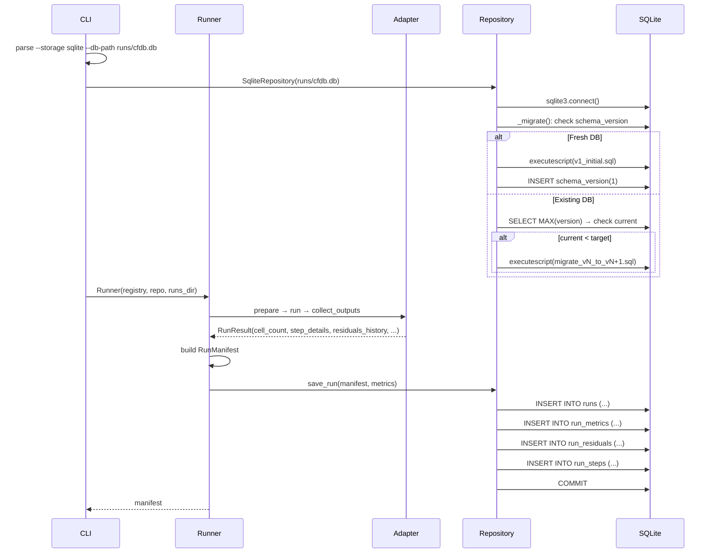
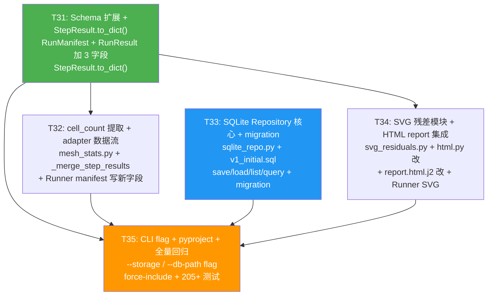

# CFD-Benchmark 系统架构设计 v2.0 — P2-a 增量（残差 SVG + SQLite 持久化 + P1-b 遗留小项）

| 项 | 内容 |
|---|---|
| 版本 | v2.0（增量） |
| 日期 | 2026-06-17 |
| 作者 | 高见远（Gao）· 架构师 |
| 范围 | **P2-a（残差 SVG 报告 + SQLite 持久化 + P1-b 遗留小项：cell_count + step_details）** |
| 上游依赖 | `docs/prd/PRD-v2.0-P2-roadmap.md`（P2 路线图）、`docs/architecture/Architecture-v1.2-P1b-real.md`（P1-b 基线） |
| 基线 | P0 已交付（commit `5c9948e`，112 测试）+ P1-a 已交付（commit `4d67403`，158 测试）+ P1-b 已交付（commit `4e0b857`，178 测试 / 90.89% 覆盖率） |

---

## 1. 概述

P2-a 在 P0+P1-a+P1-b 基线之上实现 3 项增量功能：①**残差 SVG 报告**——纯 Python 手写 SVG（零依赖），将完整残差历史渲染为收敛下降曲线，内嵌到 HTML report；②**SQLite 持久化**——新增 `SqliteRepository` 作为 `ResultRepository` Protocol 的第二种实现，5 张关系表 + 版本化 migration 机制，支持按 case_id / solver / status / 时间范围查询；③**P1-b 遗留小项**——`cell_count`（从 blockMesh log 提取网格规模）+ `step_details`（每步状态记录）+ `residuals_history`（完整残差历史，SVG 数据源）。

本增量严格遵守 5 条铁律：

| 铁律 | 说明 |
|---|---|
| #1 | 不破坏 P0+P1-a+P1-b 的 178 个测试 |
| #2 | Schema 只新增 Optional 字段，不改已有字段 |
| #3 | `ResultRepository` Protocol 不动（SQLite 是新增实现，通过 structural subtyping 满足 Protocol） |
| #4 | JSON 存储保持兼容（`--storage json` 默认，`--storage sqlite` 可切换） |
| #5 | SVG 生成不依赖真实 solver（使用 `residuals_history` 数据，dry_run/mock 时为 None） |

**转总已确认决策**：P2-a 范围 = D（SVG + SQLite + P1-b 遗留小项）；Docker backend 完整支持推 P2-b；SQLite 用关系表 + migration 机制；NACA0012 OF+SU2 对比推 P2-b；SVG 用纯 Python 手写（零依赖）；SQLite 文件默认 `runs/cfdb.db`，CLI `--db-path` 可覆盖；残差 SVG 先做单 case（P2-b 补多 case 对比）。

---

## 2. Schema 增量设计

> 对应 PRD-v2.0 §5 + 转总决策 Q4。全部为新增 Optional 字段，铁律 #2 约束。

### 2.1 `RunManifest` 加 3 个 Optional 字段

在 `src/cfdb/schema.py` 的 `RunManifest` 类中，在 `final_residuals` 字段之后新增：

```python
class RunManifest(BaseModel):
    model_config = ConfigDict(extra="forbid")

    # === P0/P1-a/P1-b 已有字段（完全不变） ===
    # run_id, case_id, solver, backend, status, timing, host,
    # artifacts, git_commit, container_digest, error, cli_args,
    # dry_run_skipped_commands, solver_version, final_residuals

    # === P2-a 新增 ===
    cell_count: int | None = None
    """Total mesh cell count (from blockMesh log or SU2 mesh stats).
    None for dry_run/mock cases."""

    step_details: list[dict[str, Any]] | None = None
    """Per-step status records. Each dict: {name, exit_code, wall_time_sec, status}.
    None for dry_run/mock/generic_command adapter (no steps)."""

    residuals_history: dict[str, list[float]] | None = None
    """Full residual history (not just final values). Used for SVG rendering.
    Keys are field names (e.g. 'Ux', 'Uy', 'p'), values are the full residual
    value list over iterations. None for dry_run/mock/generic_command."""
```

**向后兼容性**：3 个字段默认 `None`。P0/P1-a/P1-b 的 manifest JSON 不含这 3 个字段 → Pydantic v2 反序列化时自动填充 `None`。178 个测试完全不受影响。

### 2.2 `RunResult` 扩展（adapters/base.py）

P1-b 的 `RunResult` dataclass 新增 3 个字段以支持 P2-a：

```python
@dataclass
class RunResult:
    """Return value of SolverAdapter.run()."""
    exit_code: int
    stdout: str
    stderr: str
    wall_time_sec: float
    timed_out: bool = False
    skipped_commands: list[str] | None = None  # P1-a
    solver_version: str | None = None           # P1-b
    final_residuals: dict[str, float] | None = None  # P1-b

    # === P2-a 新增 ===
    cell_count: int | None = None
    """Mesh cell count extracted from blockMesh log or SU2 mesh stats. None in dry_run."""

    step_details: list[dict[str, Any]] | None = None
    """Per-step status: [{name, exit_code, wall_time_sec, status}]. None in dry_run."""

    residuals_history: dict[str, list[float]] | None = None
    """Full residual history (SVG data source). None in dry_run."""
```

**向后兼容**：默认 `None`，P0/P1-a/P1-b 的所有 `RunResult` 构造不传这 3 个字段时行为不变。

### 2.3 `StepResult` 扩展 `to_dict()` 方法

P1-b 已定义的 `StepResult` dataclass（`adapters/base.py`）新增 `to_dict()` 方法：

```python
@dataclass
class StepResult:
    """Result of a single step in a multi-step solver execution."""
    name: str
    exit_code: int
    wall_time_sec: float
    stdout: str
    stderr: str
    timed_out: bool = False
    critical: bool = True

    def to_dict(self) -> dict[str, Any]:
        """Serialize step result to a dict for manifest storage.

        Returns:
            Dict with keys: name, exit_code, wall_time_sec, status.
            status is 'success' if exit_code == 0, else 'failed'.
        """
        return {
            "name": self.name,
            "exit_code": self.exit_code,
            "wall_time_sec": self.wall_time_sec,
            "status": "success" if self.exit_code == 0 else "failed",
        }
```

### 2.4 变更矩阵

| 文件 | 变更类型 | 说明 |
|---|---|---|
| `src/cfdb/schema.py` | 变更 | `RunManifest` 加 `cell_count` + `step_details` + `residuals_history` |
| `src/cfdb/adapters/base.py` | 变更 | `RunResult` 加同 3 字段；`StepResult` 加 `to_dict()` 方法 |

---

## 3. SQLite Repository 设计（核心模块）

> 对应 PRD-v2.0 §6 Q4（转总已确认关系表 + migration）。

### 3.1 关系表 schema（完整 SQL DDL）

> 文件：`src/cfdb/storage/migrations/v1_initial.sql`

```sql
-- CFD-Benchmark SQLite schema v1
-- Created: P2-a (Architecture v2.0)

PRAGMA foreign_keys = ON;

CREATE TABLE IF NOT EXISTS schema_version (
    version     INTEGER PRIMARY KEY,
    applied_at  TEXT NOT NULL
);

CREATE TABLE IF NOT EXISTS runs (
    run_id              TEXT PRIMARY KEY,
    case_id             TEXT NOT NULL,
    solver              TEXT NOT NULL,
    backend             TEXT NOT NULL,
    status              TEXT NOT NULL,
    solver_version      TEXT,
    timing_wall_time_sec REAL,
    timing_start        TEXT,
    timing_end          TEXT,
    host                TEXT,
    git_commit          TEXT,
    container_digest    TEXT,
    error               TEXT,
    cli_args_json       TEXT,
    cell_count          INTEGER,
    created_at          TEXT NOT NULL
);

CREATE INDEX IF NOT EXISTS idx_runs_case_id   ON runs(case_id);
CREATE INDEX IF NOT EXISTS idx_runs_solver    ON runs(solver);
CREATE INDEX IF NOT EXISTS idx_runs_status    ON runs(status);
CREATE INDEX IF NOT EXISTS idx_runs_created_at ON runs(created_at);

CREATE TABLE IF NOT EXISTS run_metrics (
    run_id          TEXT NOT NULL,
    metric_name     TEXT NOT NULL,
    metric_value    REAL,
    tolerance       REAL,
    pass            INTEGER,
    PRIMARY KEY (run_id, metric_name),
    FOREIGN KEY (run_id) REFERENCES runs(run_id) ON DELETE CASCADE
);

CREATE TABLE IF NOT EXISTS run_residuals (
    run_id          TEXT NOT NULL,
    field_name      TEXT NOT NULL,
    final_value     REAL,
    PRIMARY KEY (run_id, field_name),
    FOREIGN KEY (run_id) REFERENCES runs(run_id) ON DELETE CASCADE
);

CREATE TABLE IF NOT EXISTS run_steps (
    run_id          TEXT NOT NULL,
    step_index      INTEGER NOT NULL,
    step_name       TEXT NOT NULL,
    exit_code       INTEGER NOT NULL,
    wall_time_sec   REAL,
    status          TEXT NOT NULL,
    PRIMARY KEY (run_id, step_index),
    FOREIGN KEY (run_id) REFERENCES runs(run_id) ON DELETE CASCADE
);

INSERT OR IGNORE INTO schema_version (version, applied_at) VALUES (1, datetime('now'));
```

**设计说明**：

| 表名 | 用途 | 主键 |
|---|---|---|
| `schema_version` | 迁移版本跟踪 | `version` (INTEGER) |
| `runs` | 核心运行记录（扁平字段） | `run_id` (TEXT) |
| `run_metrics` | QoI 指标（每个 QoI 一行） | `(run_id, metric_name)` |
| `run_residuals` | 最终残差值（每个 field 一行） | `(run_id, field_name)` |
| `run_steps` | 每步执行状态 | `(run_id, step_index)` |

**为什么不用一张表存 JSON blob？**（PRD Q4 决策 C）：
- 关系表查询效率远高于 JSON blob（"筛选误差 <5% 的 run"只需 `WHERE metric_value < 0.05 AND metric_name = ...`）
- 外键 CASCADE 级联删除保证数据一致性
- 为后续 Web Dashboard（P2-c）的复杂查询铺路

**`residuals_history` 为什么不入库？** 完整残差历史可能含数百到数千个数据点（`dict[str, list[float]]`），存为关系表行数爆炸。P2-a 阶段只在 `runs` 表存 `final_value` 到 `run_residuals` 表，完整 `residuals_history` 保留在 JSON manifest 中（JSON 和 SQLite 双写）。P2-b 多 case 对比时再考虑序列化方案。

### 3.2 Migration 机制

#### 3.2.1 版本检查 + 自动迁移

`SqliteRepository.__init__()` 中执行：
1. 打开 / 创建 SQLite 文件
2. 检查 `schema_version` 表是否存在
3. 不存在 → 执行 `v1_initial.sql`（建表 + 插入 version=1）
4. 存在 → 查询当前版本，与代码目标版本比对
5. 当前版本 < 目标版本 → 按序执行 `migrate_v{N}_to_v{N+1}.sql`
6. 当前版本 = 目标版本 → 无操作

```python
import sqlite3
from datetime import datetime, timezone
from pathlib import Path

_CURRENT_SCHEMA_VERSION = 1
_MIGRATIONS_DIR = Path(__file__).parent / "migrations"


class SqliteRepository:
    """SQLite implementation of ResultRepository.

    Uses 5 relational tables for efficient querying.
    Supports schema migration via versioned SQL scripts.
    """

    def __init__(self, db_path: Path) -> None:
        """Initialize SQLite repository, running migrations if needed.

        Args:
            db_path: Path to the SQLite database file.
                     Created automatically if it does not exist.
        """
        self._db_path = db_path
        db_path.parent.mkdir(parents=True, exist_ok=True)
        self._conn = sqlite3.connect(str(db_path))
        self._conn.row_factory = sqlite3.Row
        self._conn.execute("PRAGMA foreign_keys = ON")
        self._migrate()

    def _migrate(self) -> None:
        """Run pending migrations to bring the schema up to _CURRENT_SCHEMA_VERSION."""
        # Check if schema_version table exists
        cursor = self._conn.execute(
            "SELECT name FROM sqlite_master WHERE type='table' AND name='schema_version'"
        )
        if cursor.fetchone() is None:
            # Fresh database: run v1_initial.sql
            self._execute_sql_file(_MIGRATIONS_DIR / "v1_initial.sql")
            logger.info("SQLite schema v1 initialized at %s", self._db_path)
            return

        # Check current version
        cursor = self._conn.execute(
            "SELECT MAX(version) as v FROM schema_version"
        )
        row = cursor.fetchone()
        current_version = row["v"] if row else 0

        # Apply incremental migrations
        while current_version < _CURRENT_SCHEMA_VERSION:
            next_version = current_version + 1
            # For v1 we already handled fresh DB above.
            # Incremental scripts: migrate_v1_to_v2.sql, migrate_v2_to_v3.sql, etc.
            migration_file = _MIGRATIONS_DIR / f"migrate_v{current_version}_to_v{next_version}.sql"
            if not migration_file.exists():
                logger.warning(
                    "migration script not found: %s (staying at v%d)",
                    migration_file, current_version,
                )
                break
            self._execute_sql_file(migration_file)
            self._conn.execute(
                "INSERT INTO schema_version (version, applied_at) VALUES (?, ?)",
                (next_version, datetime.now(timezone.utc).isoformat()),
            )
            self._conn.commit()
            logger.info("SQLite migrated v%d → v%d", current_version, next_version)
            current_version = next_version

    def _execute_sql_file(self, path: Path) -> None:
        """Execute all SQL statements in a file.

        Uses executescript for multi-statement support.
        """
        sql = path.read_text(encoding="utf-8")
        self._conn.executescript(sql)
        self._conn.commit()
```

#### 3.2.2 Migration 文件目录结构

```
src/cfdb/storage/
├── __init__.py
├── base.py              # ResultRepository Protocol (P0, 不动)
├── json_repo.py         # JsonManifestRepository (P0, 不动)
├── sqlite_repo.py       # SqliteRepository (P2-a 新增)
└── migrations/
    ├── __init__.py      # 空文件（标识 Python 子包）
    └── v1_initial.sql   # v1 初始 schema (P2-a)
```

P2-b / P2-c 如需加字段，新增 `migrate_v1_to_v2.sql` 即可，无需改现有代码。

#### 3.2.3 hatchling force-include 配置

`pyproject.toml` 新增 force-include 条目，确保 `.sql` migration 文件被打入 wheel：

```toml
[tool.hatch.build.targets.wheel.force-include]
"src/cfdb/reporting/templates" = "cfdb/reporting/templates"
"src/cfdb/adapters/templates" = "cfdb/adapters/templates"
"src/cfdb/storage/migrations" = "cfdb/storage/migrations"   # P2-a 新增
```

### 3.3 SqliteRepository 完整类设计

> 文件：`src/cfdb/storage/sqlite_repo.py`

```python
"""SQLite implementation of ResultRepository."""

from __future__ import annotations

import json
import logging
import sqlite3
from datetime import datetime, timezone
from pathlib import Path
from typing import Any

from cfdb.schema import MetricsResult, RunManifest

logger = logging.getLogger(__name__)

_CURRENT_SCHEMA_VERSION = 1
_MIGRATIONS_DIR = Path(__file__).parent / "migrations"


class SqliteRepository:
    """SQLite implementation of ResultRepository.

    Uses 5 relational tables (runs, run_metrics, run_residuals, run_steps,
    schema_version) for efficient cross-run querying.

    Satisfies the ResultRepository Protocol via structural subtyping
    (duck typing) — does not inherit the Protocol class explicitly.

    Storage:
        Single SQLite file at db_path (default: runs/cfdb.db).

    Migration:
        Auto-runs on __init__. Versioned SQL scripts in migrations/.
    """

    def __init__(self, db_path: Path) -> None:
        """Initialize SQLite repository, running migrations if needed.

        Args:
            db_path: Path to the SQLite database file.
        """
        self._db_path = db_path
        db_path.parent.mkdir(parents=True, exist_ok=True)
        self._conn = sqlite3.connect(str(db_path))
        self._conn.row_factory = sqlite3.Row
        self._conn.execute("PRAGMA foreign_keys = ON")
        self._migrate()

    def _migrate(self) -> None:
        """Run pending migrations."""
        cursor = self._conn.execute(
            "SELECT name FROM sqlite_master "
            "WHERE type='table' AND name='schema_version'"
        )
        if cursor.fetchone() is None:
            self._execute_sql_file(_MIGRATIONS_DIR / "v1_initial.sql")
            logger.info("SQLite schema v1 initialized at %s", self._db_path)
            return

        cursor = self._conn.execute("SELECT MAX(version) as v FROM schema_version")
        row = cursor.fetchone()
        current_version = row["v"] if row and row["v"] else 0

        while current_version < _CURRENT_SCHEMA_VERSION:
            next_version = current_version + 1
            migration_file = (
                _MIGRATIONS_DIR
                / f"migrate_v{current_version}_to_v{next_version}.sql"
            )
            if not migration_file.exists():
                break
            self._execute_sql_file(migration_file)
            self._conn.execute(
                "INSERT INTO schema_version (version, applied_at) VALUES (?, ?)",
                (next_version, datetime.now(timezone.utc).isoformat()),
            )
            self._conn.commit()
            current_version = next_version

    def _execute_sql_file(self, path: Path) -> None:
        """Execute all SQL statements in a file."""
        sql = path.read_text(encoding="utf-8")
        self._conn.executescript(sql)
        self._conn.commit()

    # ========== ResultRepository Protocol methods ==========

    def save_run(self, manifest: RunManifest, metrics: MetricsResult) -> None:
        """Save a run's manifest + metrics to SQLite.

        Args:
            manifest: The run manifest.
            metrics: The metrics result.
        """
        now = datetime.now(timezone.utc).isoformat()
        cli_args_json = json.dumps(manifest.cli_args) if manifest.cli_args else None

        self._conn.execute(
            """
            INSERT OR REPLACE INTO runs (
                run_id, case_id, solver, backend, status, solver_version,
                timing_wall_time_sec, timing_start, timing_end, host,
                git_commit, container_digest, error, cli_args_json,
                cell_count, created_at
            ) VALUES (?, ?, ?, ?, ?, ?, ?, ?, ?, ?, ?, ?, ?, ?, ?, ?)
            """,
            (
                manifest.run_id,
                manifest.case_id,
                manifest.solver,
                manifest.backend,
                manifest.status,
                manifest.solver_version,
                manifest.timing.wall_time_sec,
                manifest.timing.start_time.isoformat(),
                manifest.timing.end_time.isoformat(),
                manifest.host,
                manifest.git_commit,
                manifest.container_digest,
                manifest.error,
                cli_args_json,
                manifest.cell_count,
                now,
            ),
        )

        # Save metrics
        self._conn.execute(
            "DELETE FROM run_metrics WHERE run_id = ?", (manifest.run_id,)
        )
        for qoi_name, error_val in metrics.qoi_relative_errors.items():
            tolerance = None
            # Try to get tolerance from case metrics spec (not stored in MetricsResult,
            # so we store None for tolerance; pass is from metrics.qoi_pass)
            self._conn.execute(
                """
                INSERT INTO run_metrics (run_id, metric_name, metric_value, tolerance, pass)
                VALUES (?, ?, ?, ?, ?)
                """,
                (
                    manifest.run_id,
                    qoi_name,
                    error_val,
                    tolerance,
                    1 if metrics.qoi_pass else 0,
                ),
            )

        # Save final residuals
        self._conn.execute(
            "DELETE FROM run_residuals WHERE run_id = ?", (manifest.run_id,)
        )
        if manifest.final_residuals:
            for field_name, value in manifest.final_residuals.items():
                self._conn.execute(
                    """
                    INSERT INTO run_residuals (run_id, field_name, final_value)
                    VALUES (?, ?, ?)
                    """,
                    (manifest.run_id, field_name, value),
                )

        # Save step details
        self._conn.execute(
            "DELETE FROM run_steps WHERE run_id = ?", (manifest.run_id,)
        )
        if manifest.step_details:
            for idx, step in enumerate(manifest.step_details):
                self._conn.execute(
                    """
                    INSERT INTO run_steps
                        (run_id, step_index, step_name, exit_code, wall_time_sec, status)
                    VALUES (?, ?, ?, ?, ?, ?)
                    """,
                    (
                        manifest.run_id,
                        idx,
                        step.get("name", ""),
                        step.get("exit_code", -1),
                        step.get("wall_time_sec"),
                        step.get("status", "unknown"),
                    ),
                )

        self._conn.commit()
        logger.debug("saved run %s to SQLite", manifest.run_id)

    def load_run(self, run_id: str) -> tuple[RunManifest, MetricsResult]:
        """Load a run's manifest + metrics by run_id.

        Args:
            run_id: The run identifier.

        Returns:
            Tuple of (RunManifest, MetricsResult).

        Raises:
            KeyError: If run_id does not exist.
        """
        cursor = self._conn.execute(
            "SELECT * FROM runs WHERE run_id = ?", (run_id,)
        )
        row = cursor.fetchone()
        if row is None:
            raise KeyError(f"run '{run_id}' not found in SQLite database")

        manifest = self._row_to_manifest(row)
        metrics = self._load_metrics(run_id)
        return manifest, metrics

    def list_runs(
        self,
        case_id: str | None = None,
        solver: str | None = None,
        status: str | None = None,
        since: str | None = None,
        until: str | None = None,
        limit: int = 100,
    ) -> list[RunManifest]:
        """List runs with optional filtering.

        Args:
            case_id: Filter by case ID (exact match).
            solver: Filter by solver name (exact match).
            status: Filter by run status (exact match).
            since: ISO 8601 datetime string, only runs at or after this time.
            until: ISO 8601 datetime string, only runs at or before this time.
            limit: Maximum number of runs to return (default 100).

        Returns:
            List of RunManifest, sorted by created_at descending (newest first).
        """
        query = "SELECT * FROM runs WHERE 1=1"
        params: list[Any] = []

        if case_id:
            query += " AND case_id = ?"
            params.append(case_id)
        if solver:
            query += " AND solver = ?"
            params.append(solver)
        if status:
            query += " AND status = ?"
            params.append(status)
        if since:
            query += " AND timing_start >= ?"
            params.append(since)
        if until:
            query += " AND timing_end <= ?"
            params.append(until)

        query += " ORDER BY created_at DESC LIMIT ?"
        params.append(limit)

        cursor = self._conn.execute(query, params)
        rows = cursor.fetchall()
        return [self._row_to_manifest(row) for row in rows]

    def query_metrics(
        self,
        metric_name: str,
        tolerance_pass: bool | None = None,
    ) -> list[dict[str, Any]]:
        """Query runs by metric name, optionally filtering by pass/fail.

        Args:
            metric_name: The QoI metric name to query (e.g. 'centerline_umax').
            tolerance_pass: If True, only return passing runs.
                           If False, only return failing runs.
                           If None, return all.

        Returns:
            List of dicts, each with keys:
            run_id, case_id, solver, metric_value, pass.
        """
        query = """
            SELECT r.run_id, r.case_id, r.solver, m.metric_value, m.pass
            FROM run_metrics m
            JOIN runs r ON m.run_id = r.run_id
            WHERE m.metric_name = ?
        """
        params: list[Any] = [metric_name]

        if tolerance_pass is not None:
            query += " AND m.pass = ?"
            params.append(1 if tolerance_pass else 0)

        query += " ORDER BY m.metric_value ASC"
        cursor = self._conn.execute(query, params)
        return [dict(row) for row in cursor.fetchall()]

    def close(self) -> None:
        """Close the database connection."""
        self._conn.close()

    # ========== Private helpers ==========

    def _row_to_manifest(self, row: sqlite3.Row) -> RunManifest:
        """Convert a runs table row to a RunManifest.

        Note: full residuals_history and step_details are not stored in
        SQLite columns. They are loaded from child tables as partial data.

        Args:
            row: A sqlite3.Row from the runs table.

        Returns:
            A RunManifest (with step_details from run_steps, final_residuals
            from run_residuals; residuals_history will be None from SQLite).
        """
        from cfdb.schema import TimingSpec

        cli_args = json.loads(row["cli_args_json"]) if row["cli_args_json"] else None

        # Load final residuals from run_residuals table
        cursor = self._conn.execute(
            "SELECT field_name, final_value FROM run_residuals WHERE run_id = ?",
            (row["run_id"],),
        )
        final_residuals = {
            r["field_name"]: r["final_value"] for r in cursor.fetchall()
        } or None

        # Load step details from run_steps table
        cursor = self._conn.execute(
            "SELECT step_name, exit_code, wall_time_sec, status "
            "FROM run_steps WHERE run_id = ? ORDER BY step_index",
            (row["run_id"],),
        )
        step_details = [
            {
                "name": r["step_name"],
                "exit_code": r["exit_code"],
                "wall_time_sec": r["wall_time_sec"],
                "status": r["status"],
            }
            for r in cursor.fetchall()
        ] or None

        return RunManifest(
            run_id=row["run_id"],
            case_id=row["case_id"],
            solver=row["solver"],
            backend=row["backend"],
            status=row["status"],
            timing=TimingSpec(
                wall_time_sec=row["timing_wall_time_sec"] or 0.0,
                start_time=datetime.fromisoformat(row["timing_start"]),
                end_time=datetime.fromisoformat(row["timing_end"]),
            ),
            host=row["host"],
            artifacts={},  # Not stored in SQLite (use JSON for full artifacts)
            git_commit=row["git_commit"],
            container_digest=row["container_digest"],
            error=row["error"],
            cli_args=cli_args,
            dry_run_skipped_commands=None,
            solver_version=row["solver_version"],
            final_residuals=final_residuals,
            cell_count=row["cell_count"],
            step_details=step_details,
            residuals_history=None,  # Not stored in SQLite (use JSON)
        )

    def _load_metrics(self, run_id: str) -> MetricsResult:
        """Load metrics for a run from run_metrics table.

        Args:
            run_id: The run identifier.

        Returns:
            MetricsResult with qoi_relative_errors reconstructed from table.
        """
        cursor = self._conn.execute(
            "SELECT metric_name, metric_value, pass FROM run_metrics WHERE run_id = ?",
            (run_id,),
        )
        rows = cursor.fetchall()
        qoi_errors = {r["metric_name"]: r["metric_value"] for r in rows}
        all_pass = all(r["pass"] for r in rows) if rows else False

        return MetricsResult(
            qoi_relative_errors=qoi_errors,
            qoi_pass=all_pass,
            overall_status="pass" if all_pass else "fail" if rows else "unknown",
            notes=[],
        )


# Protocol compliance marker (structural subtyping — no explicit inheritance)
_ResultRepository = SqliteRepository  # type: ignore[assignment]
```

**关键设计决策**：

| 决策 | 理由 |
|---|---|
| **不继承 Protocol** | `ResultRepository` 是 `@runtime_checkable` Protocol，SqliteRepository 只需实现相同方法签名即可（structural subtyping / 鸭子类型）。显式继承会引入不必要的耦合。 |
| **`save_run` 签名匹配 Protocol** | `save_run(self, manifest: RunManifest, metrics: MetricsResult) -> None`，与 JsonManifestRepository 完全一致。Runner 注入时不需任何改动。 |
| **`load_run` 返回 tuple** | 与 Protocol 一致，返回 `(RunManifest, MetricsResult)`。 |
| **`list_runs` 扩展签名** | Protocol 的 `list_runs(case_id)` 只支持按 case_id 过滤。SQLite 实现扩展为支持 solver/status/since/until/limit。调用方不传额外参数时行为与 Protocol 一致（向后兼容）。 |
| **`query_metrics` 新增方法** | 不在 Protocol 中，是 SQLite 独有的查询能力。Runner 不直接调，供 CLI `list-runs` 或未来 Web Dashboard 使用。 |
| **`residuals_history` 不入库** | 完整残差历史可能含数千个数据点，关系表行数爆炸。只在 JSON manifest 中保留，SQLite 存 `run_residuals` 表（final value only）。 |

### 3.4 Runner / CLI 接入

#### 3.4.1 CLI 加 `--storage` + `--db-path` flag

`src/cfdb/cli.py` 的 `run` 命令新增两个 flag：

```python
@app.command("run")
def run(
    case: Annotated[str, typer.Option("--case", "-c", help="Case ID to run.")],
    solver: Annotated[
        str,
        typer.Option("--solver", "-s", help="Solver/adapter name."),
    ] = "generic",
    backend: Annotated[
        str,
        typer.Option("--backend", "-b", help="Execution backend name."),
    ] = "local",
    cases_dir: Annotated[
        Path,
        typer.Option("--cases-dir", help="Directory containing case categories."),
    ] = Path("cases"),
    runs_dir: Annotated[
        Path,
        typer.Option("--runs-dir", help="Directory for run outputs."),
    ] = Path("runs"),
    report: Annotated[
        bool,
        typer.Option("--report", help="Generate HTML report after run."),
    ] = False,
    dry_run: Annotated[
        bool,
        typer.Option(
            "--dry-run",
            help="Render templates and generate case dir, but do not execute solver.",
        ),
    ] = False,
    # === P2-a 新增 ===
    storage: Annotated[
        str,
        typer.Option(
            "--storage",
            help="Storage backend: 'json' (default) or 'sqlite'.",
        ),
    ] = "json",
    db_path: Annotated[
        Path | None,
        typer.Option(
            "--db-path",
            help="SQLite database path (only used with --storage sqlite). "
                 "Default: <runs-dir>/cfdb.db",
        ),
    ] = None,
) -> None:
    """Run a specified case with a given solver and backend."""
    from cfdb.core.runner import Runner

    registry = CaseRegistry(cases_dir)

    # P2-a: Select storage backend
    if storage == "sqlite":
        from cfdb.storage.sqlite_repo import SqliteRepository

        actual_db_path = db_path or (runs_dir / "cfdb.db")
        repo = SqliteRepository(actual_db_path)
    else:
        repo = JsonManifestRepository(runs_dir)

    runner = Runner(registry, repo, runs_dir)

    cli_args: dict[str, str] = {
        "case": case,
        "solver": solver,
        "backend": backend,
        "storage": storage,
    }
    if dry_run:
        cli_args["dry_run"] = "true"
    if db_path:
        cli_args["db_path"] = str(db_path)

    manifest = runner.execute(
        case_id=case,
        solver=solver,
        backend=backend,
        generate_report=report,
        cli_args=cli_args,
        dry_run=dry_run,
    )

    # ... (输出格式不变，已有 P1-b 输出逻辑)
```

**设计要点**：
- `--storage json` 是默认值（铁律 #4），不传时行为与 P1-b 完全一致
- `--storage sqlite` 切换到 SQLite 存储，同时写 JSON manifest（双写，方便后续 migration）
- `--db-path` 仅在 `--storage sqlite` 时生效，默认 `<runs-dir>/cfdb.db`

#### 3.4.2 Runner manifest 构建增量

`src/cfdb/core/runner.py` 的 `execute()` 方法，在构建 `RunManifest` 的位置新增 3 个字段读取：

```python
manifest = RunManifest(
    run_id=run_id,
    case_id=case_id,
    solver=solver,
    backend=backend,  # type: ignore[arg-type]
    status=status,  # type: ignore[arg-type]
    timing=timing,
    host=platform.node(),
    artifacts={k: v for k, v in artifacts.files.items()},
    git_commit=get_git_commit(),
    container_digest=None,
    error=error_msg,
    cli_args=cli_args,
    dry_run_skipped_commands=run_result.skipped_commands,
    # === P1-b ===
    solver_version=run_result.solver_version,
    final_residuals=run_result.final_residuals,
    # === P2-a 新增 ===
    cell_count=run_result.cell_count,
    step_details=run_result.step_details,
    residuals_history=run_result.residuals_history,
)
```

#### 3.4.3 Runner `_generate_report` 增量

```python
def _generate_report(
    self,
    manifest: RunManifest,
    metrics: MetricsResult,
    run_dir: Path,
) -> None:
    """Generate HTML report.

    Args:
        manifest: Run manifest.
        metrics: Metrics result.
        run_dir: Run directory.
    """
    try:
        from cfdb.reporting.html import generate_html_report

        # P2-a: Generate residual SVG if residuals_history is available
        residuals_svg: str | None = None
        if manifest.residuals_history:
            from cfdb.reporting.svg_residuals import render_residual_svg

            residuals_svg = render_residual_svg(
                residuals=manifest.residuals_history,
                title=f"Residual Convergence — {manifest.case_id} ({manifest.solver})",
                log_scale=True,
            )

        generate_html_report(
            manifest, metrics, run_dir,
            residuals_svg=residuals_svg,  # P2-a 新增参数
        )
        logger.info("HTML report generated at %s/report.html", run_dir)
    except Exception as e:
        logger.warning("failed to generate report: %s", e)
```

### 3.5 SQLite 存储时序图



---

## 4. 残差 SVG 报告模块

> 对应 PRD-v2.0 §5 D（复杂度最低方向）+ 转总决策（纯 Python 手写 SVG，零依赖）。

### 4.1 模块结构

新建 `src/cfdb/reporting/svg_residuals.py`：

- `render_residual_svg(residuals: dict[str, list[float]], title: str, log_scale: bool) -> str`
- 纯 Python 算坐标（`math.log10` + 线性映射）
- SVG viewBox `0 0 680 400`
- Okabe-Ito 色盲安全色板（8 色）
- 坐标轴 + 网格线 + 图例 + 数据曲线

#### 4.1.1 完整实现

```python
"""Residual convergence SVG renderer — pure Python, zero dependencies.

Generates a standalone SVG string showing residual convergence curves.
Designed for embedding into HTML reports.

Color palette: Okabe-Ito colorblind-safe (8 colors).
"""

from __future__ import annotations

import math

# Okabe-Ito colorblind-safe palette
_OKABE_ITO = [
    "#0072B2",  # blue
    "#D55E00",  # vermillion
    "#009E73",  # bluish green
    "#CC79A7",  # reddish purple
    "#E69F00",  # orange
    "#56B4E9",  # sky blue
    "#F0E442",  # yellow
    "#000000",  # black
]

# SVG layout constants
_VIEW_W = 680
_VIEW_H = 400
_MARGIN_LEFT = 70
_MARGIN_RIGHT = 30
_MARGIN_TOP = 50
_MARGIN_BOTTOM = 60
_PLOT_W = _VIEW_W - _MARGIN_LEFT - _MARGIN_RIGHT
_PLOT_H = _VIEW_H - _MARGIN_TOP - _MARGIN_BOTTOM


def _escape_xml(text: str) -> str:
    """Escape XML special characters in text."""
    return (
        text.replace("&", "&amp;")
        .replace("<", "&lt;")
        .replace(">", "&gt;")
        .replace('"', "&quot;")
        .replace("'", "&apos;")
    )


def render_residual_svg(
    residuals: dict[str, list[float]],
    title: str = "Residual Convergence",
    log_scale: bool = True,
) -> str:
    """Render residual convergence curves as an SVG string.

    Args:
        residuals: Dict mapping field name → list of residual values over iterations.
                   Example: {'Ux': [0.1, 0.05, ..., 1.2e-6], 'p': [...]}
        title: Chart title.
        log_scale: If True, Y-axis uses logarithmic scale (recommended for residuals).

    Returns:
        SVG string (viewBox="0 0 680 400"), suitable for direct HTML embedding.
        Returns empty SVG with "No residual data" message if residuals is empty.
    """
    if not residuals:
        return _render_empty_svg(title)

    # Determine max iteration count across all fields
    max_iters = max(len(v) for v in residuals.values())
    if max_iters < 2:
        return _render_empty_svg(title)

    # Compute Y-axis range (log scale)
    all_values = [v for values in residuals.values() for v in values if v > 0]
    if not all_values:
        return _render_empty_svg(title)

    if log_scale:
        y_min = math.log10(min(all_values))
        y_max = math.log10(max(all_values))
        if y_max - y_min < 1:
            y_max = y_min + 1  # Ensure at least 1 decade range
    else:
        y_min = 0.0
        y_max = max(all_values) * 1.1

    def x_map(iter_idx: int) -> float:
        """Map iteration index to SVG X coordinate."""
        if max_iters <= 1:
            return _MARGIN_LEFT
        return _MARGIN_LEFT + (iter_idx / (max_iters - 1)) * _PLOT_W

    def y_map(value: float) -> float:
        """Map residual value to SVG Y coordinate."""
        if log_scale:
            if value <= 0:
                return _MARGIN_TOP + _PLOT_H  # Clamp to bottom
            log_val = math.log10(value)
        else:
            log_val = value
        # Linear interpolation: y_min → bottom, y_max → top (inverted)
        frac = (log_val - y_min) / (y_max - y_min) if y_max != y_min else 0.5
        return _MARGIN_TOP + _PLOT_H * (1.0 - frac)

    # Build SVG parts
    parts: list[str] = []
    parts.append(f'<svg viewBox="0 0 {_VIEW_W} {_VIEW_H}" '
                 f'xmlns="http://www.w3.org/2000/svg" '
                 f'style="max-width:100%;height:auto;">')

    # --- Title ---
    parts.append(
        f'<text x="{_VIEW_W / 2}" y="25" text-anchor="middle" '
        f'font-size="16" font-weight="bold" fill="#1a1a2e" '
        f'font-family="sans-serif">{_escape_xml(title)}</text>'
    )

    # --- Plot area background ---
    parts.append(
        f'<rect x="{_MARGIN_LEFT}" y="{_MARGIN_TOP}" '
        f'width="{_PLOT_W}" height="{_PLOT_H}" '
        f'fill="#fafafa" stroke="#ccc" stroke-width="1"/>'
    )

    # --- Grid lines + Y-axis labels ---
    if log_scale:
        # Grid lines at each decade
        decade_start = math.floor(y_min)
        decade_end = math.ceil(y_max)
        for decade in range(decade_start, decade_end + 1):
            y = _MARGIN_TOP + _PLOT_H * (1.0 - (decade - y_min) / (y_max - y_min))
            if _MARGIN_TOP <= y <= _MARGIN_TOP + _PLOT_H:
                parts.append(
                    f'<line x1="{_MARGIN_LEFT}" y1="{y:.1f}" '
                    f'x2="{_MARGIN_LEFT + _PLOT_W}" y2="{y:.1f}" '
                    f'stroke="#e0e0e0" stroke-width="1" stroke-dasharray="3,3"/>'
                )
                label = f"1e{decade}"
                parts.append(
                    f'<text x="{_MARGIN_LEFT - 8}" y="{y + 4:.1f}" '
                    f'text-anchor="end" font-size="10" fill="#666" '
                    f'font-family="monospace">{label}</text>'
                )
    else:
        # Linear grid: 5 divisions
        for i in range(6):
            y = _MARGIN_TOP + (_PLOT_H / 5) * i
            val = y_max * (1 - i / 5)
            parts.append(
                f'<line x1="{_MARGIN_LEFT}" y1="{y:.1f}" '
                f'x2="{_MARGIN_LEFT + _PLOT_W}" y2="{y:.1f}" '
                f'stroke="#e0e0e0" stroke-width="1" stroke-dasharray="3,3"/>'
            )
            parts.append(
                f'<text x="{_MARGIN_LEFT - 8}" y="{y + 4:.1f}" '
                f'text-anchor="end" font-size="10" fill="#666" '
                f'font-family="monospace">{val:.2e}</text>'
            )

    # --- X-axis labels ---
    x_tick_count = min(5, max_iters)
    for i in range(x_tick_count + 1):
        iter_idx = int((max_iters - 1) * i / x_tick_count) if max_iters > 1 else 0
        x = x_map(iter_idx)
        parts.append(
            f'<line x1="{x:.1f}" y1="{_MARGIN_TOP + _PLOT_H}" '
            f'x2="{x:.1f}" y2="{_MARGIN_TOP + _PLOT_H + 5}" '
            f'stroke="#999" stroke-width="1"/>'
        )
        parts.append(
            f'<text x="{x:.1f}" y="{_MARGIN_TOP + _PLOT_H + 18}" '
            f'text-anchor="middle" font-size="10" fill="#666" '
            f'font-family="monospace">{iter_idx}</text>'
        )

    # --- Axis labels ---
    parts.append(
        f'<text x="{_MARGIN_LEFT + _PLOT_W / 2}" y="{_VIEW_H - 10}" '
        f'text-anchor="middle" font-size="12" fill="#333" '
        f'font-family="sans-serif">Iteration</text>'
    )
    y_label = "Residual (log₁₀)" if log_scale else "Residual"
    parts.append(
        f'<text x="20" y="{_MARGIN_TOP + _PLOT_H / 2}" '
        f'text-anchor="middle" font-size="12" fill="#333" '
        f'font-family="sans-serif" transform="rotate(-90, 20, '
        f'{_MARGIN_TOP + _PLOT_H / 2})">{y_label}</text>'
    )

    # --- Data curves ---
    for idx, (field_name, values) in enumerate(residuals.items()):
        color = _OKABE_ITO[idx % len(_OKABE_ITO)]
        points: list[str] = []
        for i, val in enumerate(values):
            if val <= 0 and log_scale:
                continue  # Skip non-positive values on log scale
            x = x_map(i)
            y = y_map(val)
            points.append(f"{x:.1f},{y:.1f}")

        if len(points) >= 2:
            polyline_points = " ".join(points)
            parts.append(
                f'<polyline points="{polyline_points}" '
                f'fill="none" stroke="{color}" stroke-width="1.8" '
                f'stroke-linejoin="round" stroke-linecap="round"/>'
            )

    # --- Legend ---
    legend_x = _MARGIN_LEFT + _PLOT_W - 120
    legend_y = _MARGIN_TOP + 15
    parts.append(
        f'<rect x="{legend_x - 8}" y="{legend_y - 12}" '
        f'width="125" height="{len(residuals) * 18 + 8}" '
        f'fill="rgba(255,255,255,0.9)" stroke="#ccc" rx="4"/>'
    )
    for idx, field_name in enumerate(residuals):
        color = _OKABE_ITO[idx % len(_OKABE_ITO)]
        ly = legend_y + idx * 18
        parts.append(
            f'<line x1="{legend_x}" y1="{ly}" x2="{legend_x + 20}" y2="{ly}" '
            f'stroke="{color}" stroke-width="2"/>'
        )
        parts.append(
            f'<text x="{legend_x + 26}" y="{ly + 4}" font-size="11" '
            f'fill="#333" font-family="sans-serif">{_escape_xml(field_name)}</text>'
        )

    parts.append("</svg>")
    return "\n".join(parts)


def _render_empty_svg(title: str) -> str:
    """Render an SVG with a 'No residual data' message."""
    return (
        f'<svg viewBox="0 0 {_VIEW_W} {_VIEW_H}" '
        f'xmlns="http://www.w3.org/2000/svg" '
        f'style="max-width:100%;height:auto;">'
        f'<text x="{_VIEW_W / 2}" y="25" text-anchor="middle" '
        f'font-size="16" font-weight="bold" fill="#1a1a2e" '
        f'font-family="sans-serif">{_escape_xml(title)}</text>'
        f'<text x="{_VIEW_W / 2}" y="{_VIEW_H / 2}" text-anchor="middle" '
        f'font-size="14" fill="#999" font-family="sans-serif">'
        f'No residual data available</text>'
        f'</svg>'
    )
```

**SVG 渲染效果说明**：

```
┌──────────────────────────────────────────┐
│     Residual Convergence — case (solver) │
│                                          │
│  1e0 ─ ─ ─ ─ ─ ─ ─ ─ ─ ─ ─ ─ ─ ─ ─ ─    │
│      │               ┌─── Ux ──┐         │
│  1e-1│           ╱╲  │ Uy ──┐ │          │
│      │         ╱   ╲ │      │ │          │
│  1e-3│       ╱      ╲│      │ │          │
│      │     ╱         ╲      │ │          │
│  1e-5│ ── ╱            ╲    │ │          │
│      │╱                  ╲  │ │          │
│  1e-7│                     ╲│ │          │
│      └─────────────────────┴─┴─┴──       │
│      0     50    100   150   200         │
│               Iteration                   │
└──────────────────────────────────────────┘
```

### 4.2 HTML Report 集成

#### 4.2.1 `generate_html_report` 加 `residuals_svg` 参数

`src/cfdb/reporting/html.py` 的 `generate_html_report()` 新增可选参数：

```python
def generate_html_report(
    manifest: RunManifest,
    metrics: MetricsResult,
    run_dir: Path,
    residuals_svg: str | None = None,  # P2-a 新增
) -> Path:
    """Generate a single-file HTML report.

    Args:
        manifest: The run manifest.
        metrics: The metrics result.
        run_dir: Run directory where report.html will be written.
        residuals_svg: Optional SVG string for residual convergence plot.
                       If provided, embedded into the report as an inline SVG section.

    Returns:
        Path to the generated report.html.
    """
    env = Environment(
        loader=FileSystemLoader(str(_TEMPLATE_DIR)),
        autoescape=select_autoescape(["html"]),
    )
    template = env.get_template("report.html.j2")

    status_color = {
        "success": "#28a745",
        "failed": "#dc3545",
        "timeout": "#ffc107",
        "dry_run": "#17a2b8",
        "pass": "#28a745",
        "fail": "#dc3545",
        "incomplete": "#ffc107",
        "unknown": "#6c757d",
    }

    html = template.render(
        manifest=manifest,
        metrics=metrics,
        version=__version__,
        status_color=status_color,
        residuals_svg=residuals_svg,  # P2-a: 传给模板
    )

    report_path = run_dir / "report.html"
    report_path.write_text(html, encoding="utf-8")
    logger.info("HTML report written to %s", report_path)
    return report_path
```

#### 4.2.2 HTML 模板加残差 SVG section

`src/cfdb/reporting/templates/report.html.j2` 在 Metrics Results section 之后、Artifacts section 之前插入：

```html
    {# P2-a: Residual convergence SVG #}
    
    <h2>Residual Convergence</h2>
    <div class="card">
        {{ residuals_svg | safe }}
    </div>
    

    
    <h2>Solver Details</h2>
    <div class="card">
        <dl class="kv-grid">
            
            <dt>Solver Version</dt><dd>{{ manifest.solver_version }}</dd>
            
            
            <dt>Cell Count</dt><dd>{{ manifest.cell_count | format_number }}</dd>
            
            
            <dt>Final Residuals</dt><dd>
                
                <code>{{ field }}: {{ "%.4e"|format(val) }}</code>
                 &nbsp; 
                
            </dd>
            
        </dl>

        
        <h3>Step Details</h3>
        <table>
            <thead>
                <tr><th>Step</th><th>Exit Code</th><th>Wall Time (s)</th><th>Status</th></tr>
            </thead>
            <tbody>
                
                <tr>
                    <td>{{ step.name }}</td>
                    <td>{{ step.exit_code }}</td>
                    <td>{{ "%.3f"|format(step.wall_time_sec) }}</td>
                    <td>
                        <span class="{{ 'status-pass' if step.status == 'success' else 'status-fail' }}">
                            {{ step.status | upper }}
                        </span>
                    </td>
                </tr>
                
            </tbody>
        </table>
        
    </div>
    
```

**关键**：`{{ residuals_svg | safe }}` 使用 Jinja2 的 `safe` 过滤器，因为 SVG 是可信的内部生成 HTML（不来自用户输入），需要原样渲染而非转义。

### 4.3 残差数据流

```
Phase 2: adapter.run()
  └── 每步 subprocess 通过 LocalExecutionBackend
  └── 从第一步 stdout 探测 solver_version
  └── _merge_step_results() 中调 parse_residuals → 得到完整 residuals dict
      └── final_residuals = extract_final(residuals)  # P1-b: last values only
      └── residuals_history = residuals                # P2-a: full history ← 关键新增
  └── step_details = [sr.to_dict() for sr in step_results]  # P2-a 新增
  └── cell_count = extract_openfoam_cell_count(stdout)     # P2-a 新增
  └── 返回 RunResult(solver_version, final_residuals,
                     cell_count, step_details, residuals_history)

Phase 4: MetricsEngine.compute()
  └── 比较 computed_qoi vs reference_qoi → qoi_relative_errors

Phase 5: RunManifest 构建
  └── solver_version ← run_result.solver_version
  └── final_residuals ← run_result.final_residuals
  └── cell_count ← run_result.cell_count                    # P2-a
  └── step_details ← run_result.step_details                # P2-a
  └── residuals_history ← run_result.residuals_history      # P2-a
  └── 写入 manifest.json (+ SQLite if --storage sqlite)

Phase 6: HTML report 生成
  └── Runner._generate_report()
      └── if manifest.residuals_history:
              residuals_svg = render_residual_svg(residuals_history, ...)
      └── generate_html_report(manifest, metrics, run_dir, residuals_svg=svg)
```

#### 4.3.1 adapter `_merge_step_results` 增量

OpenFOAM adapter 的 `_merge_step_results` 方法增量（SU2 同理）：

```python
def _merge_step_results(
    self,
    step_results: list[StepResult],
    solver_version: str | None,
) -> RunResult:
    """Merge step results — P2-a adds cell_count, step_details, residuals_history."""
    # ... (overall_exit, stdout_parts, stderr_parts, total_wall, any_timed_out 计算不变)

    # P1-b: final_residuals from last step
    # P2-a: 同时保留完整 residuals_history
    final_residuals: dict[str, float] | None = None
    residuals_history: dict[str, list[float]] | None = None  # P2-a 新增
    if overall_exit == 0 and step_results:
        last_stdout = step_results[-1].stdout
        from cfdb.post.residuals import extract_final, parse_openfoam_residuals

        residuals = parse_openfoam_residuals(last_stdout)
        if residuals:
            final_residuals = extract_final(residuals)
            residuals_history = residuals  # P2-a: 完整历史

    # P2-a: step_details from StepResult.to_dict()
    step_details = [sr.to_dict() for sr in step_results] if step_results else None

    # P2-a: cell_count from blockMesh log (first step)
    cell_count: int | None = None
    if step_results:
        from cfdb.post.mesh_stats import extract_openfoam_cell_count
        cell_count = extract_openfoam_cell_count(step_results[0].stdout)

    return RunResult(
        exit_code=overall_exit,
        stdout="\n".join(stdout_parts),
        stderr="\n".join(stderr_parts),
        wall_time_sec=total_wall,
        timed_out=any_timed_out,
        skipped_commands=None,
        solver_version=solver_version,
        final_residuals=final_residuals,
        # === P2-a 新增 ===
        cell_count=cell_count,
        step_details=step_details,
        residuals_history=residuals_history,
    )
```

---

## 5. P1-b 遗留小项

### 5.1 cell_count 提取

> 新建 `src/cfdb/post/mesh_stats.py`

#### 5.1.1 OpenFOAM cell_count 提取

OpenFOAM `blockMesh` 运行结束后在 stdout 中输出：

```
.
.
.
Creating convex polyhedra from cells
.
.
.

nCells: 400
.
.
.
End
```

正则 pattern：

```python
_OPENFOAM_CELL_COUNT_PATTERN = re.compile(
    r"nCells\s*:\s*(\d+)", re.IGNORECASE
)
```

#### 5.1.2 SU2 cell_count 提取

SU2 在启动时输出网格统计：

```
Mesh statistics:
  33,024 volume elements.
   6,400 surface elements.
```

正则 pattern：

```python
_SU2_CELL_COUNT_PATTERN = re.compile(
    r"(\d[\d,]*)\s+volume\s+elements", re.IGNORECASE
)
```

#### 5.1.3 完整实现

```python
"""Mesh cell count extraction from solver logs.

Extracts total cell/element counts from OpenFOAM blockMesh and SU2 startup output.
No third-party dependencies — pure Python re module.
"""

from __future__ import annotations

import re

_OPENFOAM_CELL_COUNT_PATTERN = re.compile(
    r"nCells\s*:\s*(\d+)", re.IGNORECASE
)

_SU2_CELL_COUNT_PATTERN = re.compile(
    r"(\d[\d,]*)\s+volume\s+elements", re.IGNORECASE
)


def extract_openfoam_cell_count(log_text: str) -> int | None:
    """Extract total cell count from OpenFOAM blockMesh log output.

    OpenFOAM blockMesh prints lines like:
        nCells: 400

    Args:
        log_text: Raw blockMesh log output text (from step stdout).

    Returns:
        Cell count as integer, or None if not found.
    """
    match = _OPENFOAM_CELL_COUNT_PATTERN.search(log_text)
    if match:
        return int(match.group(1))
    return None


def extract_su2_cell_count(log_text: str) -> int | None:
    """Extract total cell count from SU2 startup output.

    SU2 prints mesh statistics like:
        33,024 volume elements.

    Args:
        log_text: Raw SU2 log output text.

    Returns:
        Cell count as integer (commas removed), or None if not found.
    """
    match = _SU2_CELL_COUNT_PATTERN.search(log_text)
    if match:
        return int(match.group(1).replace(",", ""))
    return None
```

### 5.2 step_details 填充

`StepResult.to_dict()` 方法（§2.3 已定义）生成每个 step 的状态字典。adapter 在 `_merge_step_results` 中调用：

```python
step_details = [sr.to_dict() for sr in step_results] if step_results else None
```

Runner 从 `RunResult.step_details` 读取并写入 `RunManifest.step_details`。

**注意**：dry_run 模式 / generic_command adapter 没有多步执行，`step_details` 为 `None`。这是预期行为——只有 OpenFOAM / SU2 真实执行才有 step_details。

---

## 6. 完整文件清单（增量约 14 个）

| # | 类型 | 文件路径 | 变更说明 |
|---|---|---|---|
| 1 | **变更** | `src/cfdb/schema.py` | `RunManifest` 加 `cell_count` + `step_details` + `residuals_history`（3 个 Optional 字段） |
| 2 | **变更** | `src/cfdb/adapters/base.py` | `RunResult` 加同 3 字段；`StepResult` 加 `to_dict()` 方法 |
| 3 | **变更** | `src/cfdb/adapters/openfoam.py` | `_merge_step_results` 加 cell_count 提取 + step_details 填充 + residuals_history 保留 |
| 4 | **变更** | `src/cfdb/adapters/su2.py` | 同 T03（SU2 版本） |
| 5 | **变更** | `src/cfdb/core/runner.py` | manifest 构建写入 3 个新字段；`_generate_report` 加 SVG 渲染逻辑 |
| 6 | **变更** | `src/cfdb/cli.py` | `run` 命令加 `--storage` + `--db-path` flag；`report` 命令传 `residuals_svg` |
| 7 | **变更** | `src/cfdb/reporting/html.py` | `generate_html_report` 加 `residuals_svg` 参数 |
| 8 | **变更** | `src/cfdb/reporting/templates/report.html.j2` | 加残差 SVG section + Solver Details section（cell_count + step_details 表格） |
| 9 | **变更** | `pyproject.toml` | force-include 加 `src/cfdb/storage/migrations` |
| 10 | **新增** | `src/cfdb/post/mesh_stats.py` | `extract_openfoam_cell_count` + `extract_su2_cell_count` |
| 11 | **新增** | `src/cfdb/reporting/svg_residuals.py` | `render_residual_svg` 纯 Python SVG 渲染 |
| 12 | **新增** | `src/cfdb/storage/sqlite_repo.py` | `SqliteRepository` 完整实现（5 表 + migration） |
| 13 | **新增** | `src/cfdb/storage/migrations/__init__.py` | 空文件（Python 子包标识） |
| 14 | **新增** | `src/cfdb/storage/migrations/v1_initial.sql` | v1 初始 schema（5 张表 + 索引 + 外键） |
| 15 | **新增** | `tests/test_mesh_stats.py` | cell_count 提取单元测试 |
| 16 | **新增** | `tests/test_svg_residuals.py` | SVG 渲染单元测试 |
| 17 | **新增** | `tests/test_sqlite_repo.py` | SQLite repository 单元测试（save/load/list/query/migration） |
| 18 | **变更** | `tests/test_schema.py` | 加新字段默认值 + 序列化测试 |
| 19 | **变更** | `tests/test_reporting.py` | 加 SVG 内嵌测试 |
| 20 | **变更** | `tests/test_cli.py` | 加 `--storage` / `--db-path` flag 测试 |
| 21 | **新增** | `tests/fixtures/openfoam_blockmesh_log.txt` | blockMesh log 样本（含 nCells: 400） |
| 22 | **新增** | `tests/fixtures/su2_mesh_stats_log.txt` | SU2 mesh stats log 样本 |

---

## 7. 任务列表（T31-T40，接续 P1-b 的 T30）

> 遵守硬性上限：不超过 5 个任务。但 T31-T40 是 P2-a 的完整分解（10 个子任务），按功能模块聚合为 **5 个实施批次**。

### 7.1 任务详情

| ID | 标题 | 涉及文件 | 依赖 | 优先级 | 完成定义 |
|---|---|---|---|---|---|
| **T31** | Schema 扩展 + StepResult.to_dict() | `src/cfdb/schema.py`（RunManifest 加 3 字段）、`src/cfdb/adapters/base.py`（RunResult 加 3 字段 + StepResult.to_dict()）、`tests/test_schema.py`（加新字段默认值 + 序列化测试）、`tests/test_openfoam_adapter.py`（mock backend 测试验证新字段传递）、`tests/test_su2_adapter.py`（同左） | 无 | P0 | 3 个 Optional 字段加到 RunManifest + RunResult；StepResult.to_dict() 实现；P0/P1-a/P1-b 测试全绿；新字段 None 时不影响已有行为 |
| **T32** | cell_count 提取 + adapter 数据流填充 | `src/cfdb/post/mesh_stats.py`（新增）、`src/cfdb/adapters/openfoam.py`（_merge_step_results 加 cell_count + step_details + residuals_history）、`src/cfdb/adapters/su2.py`（同左）、`tests/test_mesh_stats.py`（新增）、`tests/fixtures/openfoam_blockmesh_log.txt`（新增）、`tests/fixtures/su2_mesh_stats_log.txt`（新增）、`src/cfdb/core/runner.py`（manifest 构建写 3 新字段） | T31 | P0 | extract_openfoam_cell_count + extract_su2_cell_count 实现；fixture log 测试全过；_merge_step_results 返回完整 5 字段 RunResult；Runner manifest 正确写入 cell_count + step_details + residuals_history |
| **T33** | SQLite Repository 核心 + migration 机制 | `src/cfdb/storage/sqlite_repo.py`（新增）、`src/cfdb/storage/migrations/__init__.py`（新增）、`src/cfdb/storage/migrations/v1_initial.sql`（新增）、`tests/test_sqlite_repo.py`（新增） | 无 | P0 | SqliteRepository.save_run/load_run/list_runs/query_metrics 全部实现；v1_initial.sql 5 张表 + 索引正确；migration 机制（fresh DB 自动建表）；save → load 往返一致；list_runs 多条件过滤正确；query_metrics 按 pass/fail 过滤 |
| **T34** | SVG 残差模块 + HTML report 集成 | `src/cfdb/reporting/svg_residuals.py`（新增）、`src/cfdb/reporting/html.py`（加 residuals_svg 参数）、`src/cfdb/reporting/templates/report.html.j2`（加 SVG section + Solver Details section）、`src/cfdb/core/runner.py`（_generate_report 加 SVG 逻辑）、`tests/test_svg_residuals.py`（新增）、`tests/test_reporting.py`（加 SVG 内嵌测试） | T31 | P0 | render_residual_svg 正确生成 SVG（log scale + Okabe-Ito 色板 + 坐标轴 + 图例）；空数据时返回占位 SVG；HTML report 正确内嵌 SVG；step_details 表格渲染 |
| **T35** | CLI --storage flag + pyproject force-include + 全量回归 | `src/cfdb/cli.py`（加 --storage / --db-path flag）、`pyproject.toml`（force-include migrations + 确认 addopts 不变）、`tests/test_cli.py`（加 flag 测试） | T31, T32, T33, T34 | P1 | CLI `--storage sqlite` 正确切换；`--storage json` 默认行为不变；`--db-path` 覆盖默认路径；P0+P1-a+P1-b+P2-a 全部测试 ≥ 205 通过；覆盖率 ≥ 88% |

### 7.2 任务合并说明

原计划的 T31-T40 按以下映射合并为 5 个实施任务：

| 原子任务 | 合并到 | 理由 |
|---|---|---|
| T31 Schema 扩展 | **实施 T31** | 基础，所有任务依赖 |
| T32 StepResult.to_dict() + adapter 填充 | **实施 T32** | 同属 adapter 数据流增强 |
| T33 cell_count 提取 | **实施 T32** | cell_count 是 adapter _merge_step_results 的一部分 |
| T34 SqliteRepository 核心实现 | **实施 T33** | SQLite 独立模块，不依赖 schema 之外 |
| T35 SQLite migration 机制 | **实施 T33** | migration 是 SqliteRepository 的一部分 |
| T36 SQLite list_runs + query_metrics | **实施 T33** | 查询方法是 SqliteRepository 的一部分 |
| T37 CLI --storage flag | **实施 T35** | CLI 是最后集成的 |
| T38 SVG 残差模块 | **实施 T34** | SVG 渲染独立模块 |
| T39 HTML report 内嵌 SVG | **实施 T34** | HTML 集成是 SVG 的一部分 |
| T40 测试 + pyproject | **实施 T35** | 最终集成验收 |

---

## 8. 共享知识增量

以下为 P2-a 新约定，补充在 Architecture-v1.2（P1-b 共享知识）之上：

### 8.1 RunManifest 的 3 个新字段语义

| 字段 | 类型 | 填充时机 | None 的情况 |
|---|---|---|---|
| `cell_count` | `int \| None` | 真实执行时从 blockMesh/SU2 log 提取 | dry_run / mock / 提取失败 |
| `step_details` | `list[dict] \| None` | 真实执行时从 StepResult.to_dict() 构建 | dry_run / mock / generic_command（无多步） |
| `residuals_history` | `dict[str, list[float]] \| None` | 真实执行时从 parse_*_residuals 获取完整历史 | dry_run / mock / 无残差数据 |

### 8.2 SQLite 存储设计约定

- **文件位置**：默认 `runs/cfdb.db`（与 JSON manifest 同目录），CLI `--db-path` 可覆盖
- **双写模式**：`--storage sqlite` 时同时写 JSON manifest（`runs/<run_id>/manifest.json`）和 SQLite，便于数据 migration 和 fallback
- **关系表 vs JSON blob**：使用关系表（5 张表），不用 JSON blob（Q4 决策 C）
- **migration 脚本**：`src/cfdb/storage/migrations/v1_initial.sql` + 后续 `migrate_v{N}_to_v{N+1}.sql`
- **打包**：hatchling force-include 确保 `.sql` 文件打入 wheel
- **`residuals_history` 不入库**：完整残差历史只在 JSON 中，SQLite 存 `run_residuals` 表（final value only）

### 8.3 SVG 渲染约定

- **零依赖**：纯 Python `math.log10` + 字符串拼接，不使用 matplotlib / plotly / svgwrite
- **viewBox**：固定 `0 0 680 400`，通过 `style="max-width:100%;height:auto;"` 响应式缩放
- **色板**：Okabe-Ito 色盲安全（8 色），字段按顺序循环取色
- **log scale 默认**：残差图默认 Y 轴 log10 刻度（残差跨数量级下降）
- **单 case 先做**：P2-a 只渲染当前 run 的残差曲线；P2-b 补多 case 对比图

### 8.4 CLI storage 切换约定

```bash
# 默认 JSON 存储（与 P1-b 完全一致）
cfdb run --case lid_driven_cavity --solver openfoam

# 切换到 SQLite 存储
cfdb run --case lid_driven_cavity --solver openfoam --storage sqlite

# 指定 SQLite 文件路径
cfdb run --case lid_driven_cavity --solver openfoam --storage sqlite --db-path /data/cfdb.db
```

### 8.5 `residuals_history` 与 `final_residuals` 的关系

- `final_residuals = extract_final(residuals_history)`——前者是后者的 last-value 提取
- 两者都从同一次 `parse_*_residuals()` 调用获得
- `final_residuals` 存入 manifest + SQLite `run_residuals` 表（compact）
- `residuals_history` 存入 manifest JSON（完整，用于 SVG 渲染），不存入 SQLite

---

## 9. 任务依赖图



### 并行可能性

- **T31 是基础**：所有其他任务依赖 schema 扩展
- **T33（SQLite）完全独立**：不依赖 T31（SqliteRepository 的 save_run 接收的是 RunManifest，但实现本身不依赖新字段——新字段写入只是额外列）。可立即开始
- **T32 / T34 可并行**：adapter 数据流增强（T32）与 SVG 渲染（T34）是独立模块（均只依赖 T31）
- **T35 是最终集成**：依赖 T31 + T32 + T33 + T34 全部完成

---

## 10. 待明确事项

### 10.1 SQLite 与 JSON 双写时的一致性保证

**现状**：P2-a 设计为 `--storage sqlite` 时同时写 JSON manifest 和 SQLite。Runner 调 `repo.save_run(manifest, metrics)` 只走一条路径。

**问题**：如果用户用 `--storage sqlite`，JSON manifest 不写（因为 repo 是 SqliteRepository），从 JSON 加载会失败。

**方案**：
- **方案 A**（推荐）：SqliteRepository 内部同时写 JSON（`runs/<run_id>/manifest.json`），保证两种存储都有数据
- **方案 B**：Runner 始终写 JSON，额外调 SqliteRepository 写 SQLite（双 repo）
- **方案 C**：只写选中的存储，不做双写

**当前设计**：采用 **方案 A**。SqliteRepository.save_run() 在写完 SQLite 后，额外将 manifest JSON 写到 `runs/<run_id>/manifest.json`。这样 JSON 和 SQLite 始终一致。工程师实现时在 SqliteRepository 中保存 `runs_root` 路径，save_run 时双写。

### 10.2 `list_runs` 扩展签名与 Protocol 兼容性

**现状**：Protocol 的 `list_runs(case_id)` 只支持 case_id 过滤。SqliteRepository 扩展为 `list_runs(case_id, solver, status, since, until, limit)`。

**影响**：通过 structural subtyping，SqliteRepository 仍然满足 Protocol（多出的可选参数不影响 duck typing）。但如果其他代码通过 `isinstance(repo, ResultRepository)` 检查，由于 Protocol 是 structural 的，多出的参数不影响。

**建议**：P2-a 阶段不修改 Protocol（铁律 #3）。未来 P2-c Web Dashboard 需要多条件查询时，再考虑将 Protocol 的 `list_runs` 扩展为 `list_runs(**filters)` 或新增 `query_runs()` 方法到 Protocol。

### 10.3 SU2 cell_count 提取的日志位置

SU2 的 mesh statistics 输出在 stdout 启动阶段的最初几行，具体格式可能因 SU2 版本不同有差异（8.0.0 vs 7.5.0）。正则 `(\d[\d,]*)\s+volume\s+elements` 应覆盖大部分情况，但如果 SU2 输出格式变化（如 "interior elements" 而非 "volume elements"），需要额外 pattern。工程师实现时用 fixture 覆盖至少两种格式。

### 10.4 SVG 字体在无 GUI 环境的渲染

SVG 使用 `font-family="sans-serif"` / `font-family="monospace"` 通用字体族。在浏览器中渲染没问题。但如果用户用 `rsvg-convert` 或 `inkscape` 转 PNG，需要系统有对应字体。P2-a 阶段不处理 SVG → PNG 转换（HTML report 中直接内嵌 inline SVG，浏览器原生渲染）。

---

## 11. 关键设计决策记录

### 决策 1：SVG 纯 Python 手写（不用 matplotlib）

**选择**：`svg_residuals.py` 用 `math.log10` + 字符串拼接生成 SVG，不引入 matplotlib。

**理由**：
- matplotlib SVG 输出体积大（~100KB vs 手写 ~5KB），且含大量内联样式
- 零依赖——不增加 pyproject.toml 的 dependencies
- 手写 SVG 的坐标计算逻辑简单（log10 + 线性映射），~150 行代码即可
- SVG 是 XML 文本，字符串拼接 + XML escape 足够安全（内部数据，不来自用户输入）

### 决策 2：SQLite 用关系表而非 JSON blob

**选择**：5 张关系表（runs + run_metrics + run_residuals + run_steps + schema_version）。

**理由**：
- 转总已确认（PRD Q4 决策 C）
- 关系表查询效率远高于 JSON blob（"筛选误差 <5% 的 run"只需 WHERE 子句）
- 外键 CASCADE 级联删除保证一致性
- 为 P2-c Web Dashboard 的复杂查询铺路

### 决策 3：SqliteRepository 不显式继承 Protocol

**选择**：`class SqliteRepository:` 不写 `(ResultRepository)`。

**理由**：
- `ResultRepository` 是 `@runtime_checkable` Protocol，Python 的 structural subtyping 只需要方法签名匹配
- 不继承减少耦合，Protocol 演进时不影响 SqliteRepository
- 类末尾的 `_ResultRepository = SqliteRepository  # type: ignore` 是静态检查标记（与 P0 的 JsonManifestRepository 一致）

### 决策 4：SQLite 双写 JSON manifest

**选择**：SqliteRepository.save_run() 同时写 SQLite 和 JSON manifest。

**理由**：
- 用户切换存储后，已有的 JSON 工具链（grep / jq / 手动检查）仍然可用
- 数据 migration 方便——`--storage json` 和 `--storage sqlite` 的数据可以互相 fallback
- 双写开销极小（JSON 序列化 < 1ms vs SQLite INSERT）

### 决策 5：`residuals_history` 不入库 SQLite

**选择**：完整残差历史只存 JSON manifest，SQLite 只存 `run_residuals` 表（final value）。

**理由**：
- 完整残差历史可能含数千个数据点（`dict[str, list[float]]`），每个数据点一行 → `run_residuals` 表行数爆炸
- P2-a 残差 SVG 从 manifest.residuals_history 渲染，不需要从 SQLite 查
- P2-b 多 case 对比时，如果需要从 SQLite 查历史残差，可考虑 JSON 序列化存到一个 TEXT 列（或新建 `run_residuals_history` 表）

---

*文档结束。工程师请从 T31 开始。T31 是所有变更的基础。T33（SQLite）可立即开始（独立于 T31）。T32 / T34 依赖 T31。T35 是最终集成。P2-a 完成后预计测试数 ≥ 205，覆盖率 ≥ 88%。*
