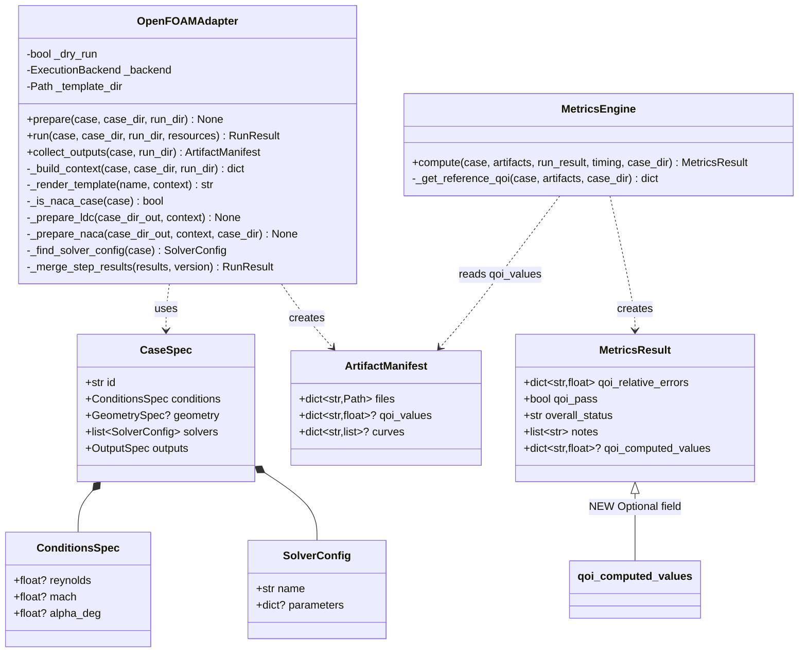
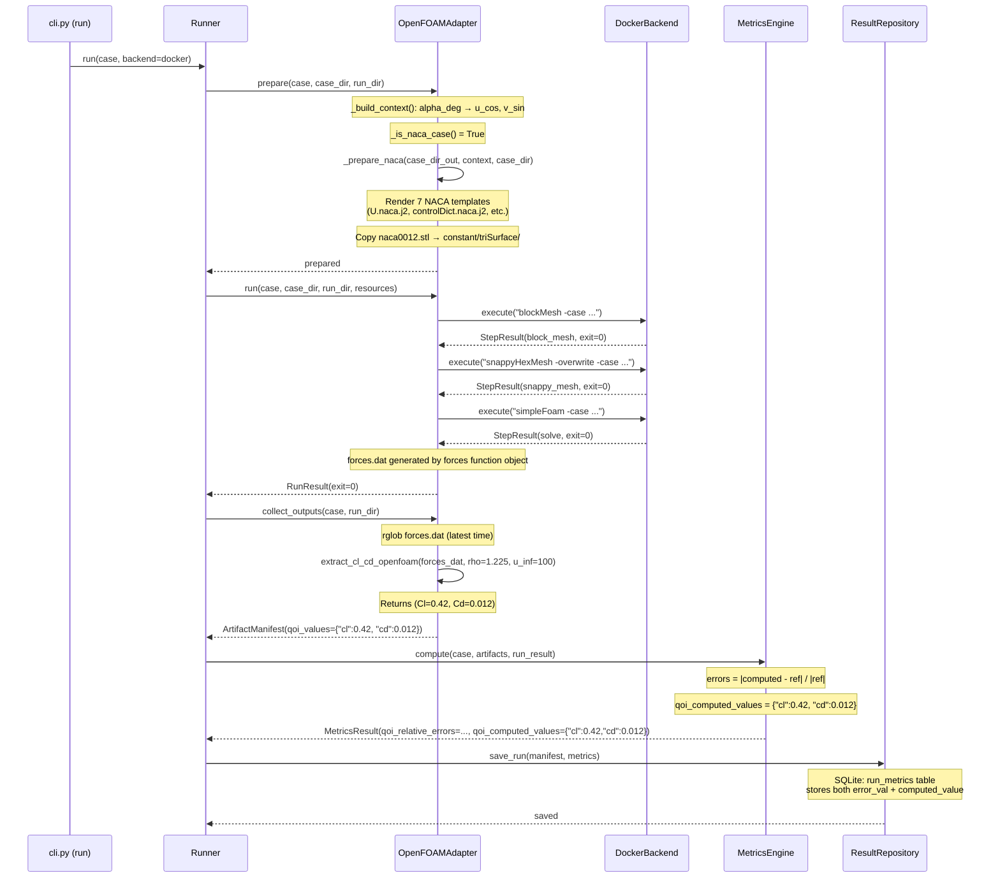
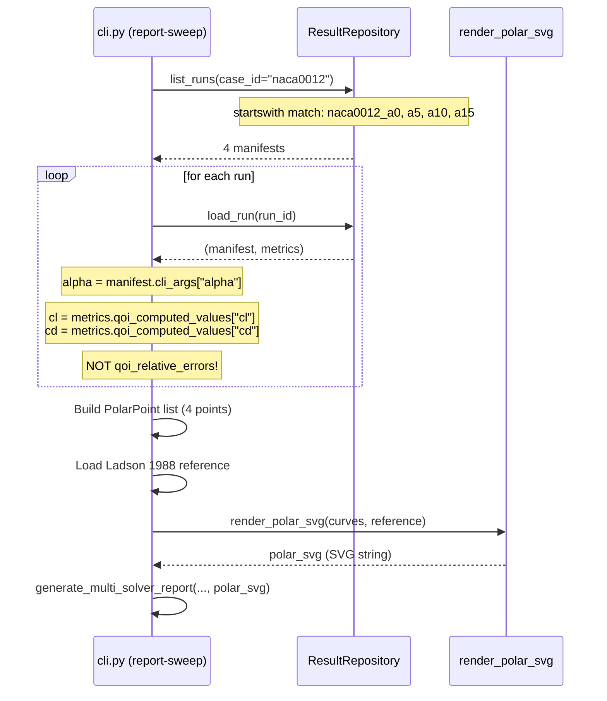

# CFD-Benchmark 架构方案 v3.0 — P3-hotfix（OpenFOAM adapter 真实 run 修复）

## 文档信息

| 项 | 内容 |
|---|---|
| 版本 | v3.0（P3-hotfix 增量） |
| 日期 | 2026-06-17 |
| 作者 | 高见远（Bob）· 架构师 |
| 基于 | PRD-v3.0-P3hotfix.md |
| 基线 | commit `3f688cf`（P2-c 已交付） |
| 工作目录 | `D:\GLM-CFD-Benchmark` |
| 性质 | Hotfix — 修复 OpenFOAM adapter，让 NACA0012 α=0/5/10/15° 在 Docker `openfoam/openfoam:v2406` 下真实跑通 |

---

## 1. 问题与方案对照表（6 项 = 5 硬伤 + 1 bug #6）

| # | 问题 | 根因（文件:行号） | 方案 | 优先级 | 铁律合规 |
|---|---|---|---|---|---|
| **H1** | `0/U` 写死 `uniform (0 0 0)` | `openfoam.py:160-165` 硬编码字符串 | 新建 `U.naca.j2` 模板，prepare() NACA 路由时渲染含 `alpha_deg` 的远场速度 | P0 | #1（新分支+新模板） |
| **H2** | `controlDict` 用 LDC 模板 | `openfoam.py:143-145` 只渲染 `controlDict.j2` | prepare() NACA 路由时渲染 `controlDict.naca.j2`（含 forces function object） | P0 | #1 |
| **H3** | `blockMeshDict`/`snappyHexMeshDict` 不渲染 | `openfoam.py` prepare() 从不渲染这两个文件 | prepare() NACA 路由时渲染 `blockMeshDict.naca.j2` + `snappyHexMeshDict.j2` 到 `system/` | P0 | #1 |
| **H4** | `naca0012.stl` 不复制到 triSurface | prepare() 无 STL 搬运逻辑 | prepare() NACA 路由时从 `case_dir/../naca0012/geometry/naca0012.stl` 复制到 `case/constant/triSurface/` | P0 | #1 |
| **H5** | `fvSchemes`/`fvSolution`/`transportProperties`/`turbulenceProperties` 仍是 LDC 模板 | `openfoam.py:146-157` 全用 LDC 模板 | 新建 4 个 NACA 专用模板，prepare() NACA 路由时渲染 | P1 | #1 |
| **B6** | report-sweep 画的是误差不是真实 Cl/Cd | `cli.py:521-522` 读 `qoi_relative_errors`；且 `collect_outputs()` 根本没调 `extract_cl_cd_openfoam()` | ① schema 加 `qoi_computed_values` Optional；② MetricsEngine 填充；③ collect_outputs 加 forces.dat 提取；④ cli.py 改读 `qoi_computed_values` | P0 | #2（只加 Optional） |

### 额外发现（架构师补充）

> **`collect_outputs()` 缺失 forces.dat 提取**：当前 `collect_outputs()`（`openfoam.py:367-400`）只提取 LDC 的 `centerline_umax`（probes），**完全没有调用 `extract_cl_cd_openfoam()`**。即使修复了 H2（forces.dat 能生成），Cl/Cd 也永远不会进入 `qoi_values`。这是 B6 的隐藏部分，必须在 collect_outputs 中新增 NACA 路由分支。

---

## 2. 实现方案（Implementation Approach）

### 2.1 核心技术挑战

1. **模板路由分发**：prepare() 需要根据 case 类型选择 LDC（旧路径）或 NACA（新路径）模板，不能破坏旧的 LDC smoke test
2. **攻角参数传递**：`alpha_deg` 需要从 `case.conditions.alpha_deg` 或 `solver.parameters["alpha_deg"]` 传递到 Jinja2 context，再渲染到 `0/U` 的远场速度向量
3. **数据流闭环**：forces.dat → extract_cl_cd_openfoam → qoi_values → MetricsEngine → qoi_computed_values → report-sweep → SVG
4. **STL 文件搬运**：snappyHexMesh 需要 `constant/triSurface/naca0012.stl`，但 case.yaml 的 geometry.source 指向 .dat

### 2.2 框架与库选择

| 库 | 用途 | 新增？ |
|---|---|---|
| Jinja2 | 模板渲染（已有） | 否 |
| NumPy | 数值计算（已有） | 否 |
| shutil | STL 文件复制（标准库） | 否 |

**结论：0 个新依赖。** 全部用现有 Jinja2 + Python 标准库实现。

### 2.3 架构模式

- **策略路由（Strategy Routing）**：prepare() 内部根据 `case.id.startswith("naca0012")` 分发到 LDC 或 NACA 模板集
- **向后兼容（Backward Compatible）**：schema 只加 Optional 字段，旧数据自动为 None
- **单一职责**：每个 .naca.j2 模板只负责一个 OpenFOAM 配置文件

---

## 3. 文件清单

### 3.1 新建文件（6 个模板 + 1 个测试）

| # | 文件路径 | 说明 |
|---|---|---|
| N1 | `src/cfdb/adapters/templates/openfoam/U.naca.j2` | NACA0012 初始速度场模板（含攻角远场速度） |
| N2 | `src/cfdb/adapters/templates/openfoam/fvSchemes.naca.j2` | simpleFoam RANS-SA 离散格式 |
| N3 | `src/cfdb/adapters/templates/openfoam/fvSolution.naca.j2` | SIMPLE 算法 + 亚松弛 |
| N4 | `src/cfdb/adapters/templates/openfoam/transportProperties.naca.j2` | NACA 运输属性（nu 从 context） |
| N5 | `src/cfdb/adapters/templates/openfoam/turbulenceProperties.naca.j2` | SA 湍流模型 |
| N6 | `tests/test_openfoam_naca_prepare.py` | NACA prepare 路由 + U.naca.j2 渲染单测 |

### 3.2 修改文件（5 个）

| # | 文件路径 | 改动范围 |
|---|---|---|
| M1 | `src/cfdb/adapters/openfoam.py` | `_build_context()` 加 alpha 推导 + `prepare()` 加 NACA 路由 + `collect_outputs()` 加 forces 提取 |
| M2 | `src/cfdb/schema.py` | `MetricsResult` 加 `qoi_computed_values` Optional 字段 |
| M3 | `src/cfdb/metrics/engine.py` | `compute()` 填充 `qoi_computed_values` |
| M4 | `src/cfdb/cli.py` | `report-sweep` 改读 `qoi_computed_values` |
| M5 | `src/cfdb/storage/sqlite_repo.py` | `_load_metrics()` 加载 `qoi_computed_values`（新增列或 JSON 存储） |

---

## 4. 数据结构与接口

### 4.1 类图（Class Diagram）



### 4.2 关键方法签名

#### M1: `OpenFOAMAdapter._build_context()` — 扩展 context

```python
def _build_context(self, case: CaseSpec, case_dir: Path, run_dir: Path) -> dict[str, Any]:
    """Build Jinja2 context. P3-hotfix: add alpha-derived velocity components."""
    # ...（现有逻辑保留）
    context = {
        "case_id": case.id,
        "solver": "openfoam",
        "mesh_level": mesh_level,
        "case_dir": case_dir.resolve().as_posix(),
        "run_dir": run_dir.resolve().as_posix(),
        "reynolds": case.conditions.reynolds or 100.0,
    }

    # P3-hotfix: NACA alpha-derived freestream velocity components
    import math
    alpha_deg = case.conditions.alpha_deg  # from case.yaml conditions
    if alpha_deg is None:
        # fallback to solver parameters
        alpha_deg = solver_config.parameters.get("alpha_deg", 0.0) if solver_config.parameters else 0.0
    alpha_rad = math.radians(alpha_deg)

    u_inf = 100.0  # default
    if solver_config.parameters and "u_inf" in solver_config.parameters:
        u_inf = float(solver_config.parameters["u_inf"])

    context["alpha_deg"] = alpha_deg
    context["alpha_rad"] = alpha_rad
    context["u_inf"] = u_inf
    context["u_cos"] = u_inf * math.cos(alpha_rad)  # Ux component
    context["v_sin"] = u_inf * math.sin(alpha_rad)  # Uy component

    # nu computation (existing logic, but for NACA use solver param if provided)
    if solver_config.parameters and "nu" in solver_config.parameters:
        context["nu"] = float(solver_config.parameters["nu"])
    else:
        re = context["reynolds"]
        context["nu"] = 0.1 / re

    # Merge remaining solver parameters
    if solver_config.parameters:
        context.update(solver_config.parameters)
    return context
```

#### M1: `OpenFOAMAdapter._is_naca_case()` — 路由判断

```python
def _is_naca_case(self, case: CaseSpec) -> bool:
    """Check if this is a NACA0012 case (triggers NACA template routing).
    
    Uses case.id prefix matching: 'naca0012', 'naca0012_a0', 'naca0012_a5', etc.
    all start with 'naca0012'.
    """
    return case.id.startswith("naca0012")
```

#### M1: `OpenFOAMAdapter.prepare()` — NACA 路由

```python
def prepare(self, case: CaseSpec, case_dir: Path, run_dir: Path) -> None:
    """Generate OpenFOAM case directory structure.
    
    P3-hotfix: routes to NACA templates when case.id.startswith('naca0012').
    """
    case_dir_out = run_dir / "case"
    context = self._build_context(case, case_dir, run_dir)

    # Create directory structure (shared)
    (case_dir_out / "system").mkdir(parents=True, exist_ok=True)
    (case_dir_out / "constant" / "polyMesh").mkdir(parents=True, exist_ok=True)
    (case_dir_out / "0").mkdir(parents=True, exist_ok=True)

    if self._is_naca_case(case):
        self._prepare_naca(case_dir_out, context, case_dir)
    else:
        self._prepare_ldc(case_dir_out, context)

    logger.debug("OpenFOAM case structure prepared at %s", case_dir_out)
```

#### M1: `OpenFOAMAdapter._prepare_naca()` — NACA 专用准备

```python
def _prepare_naca(self, case_dir_out: Path, context: dict, case_dir: Path) -> None:
    """Prepare NACA0012 case: render all NACA templates + copy STL.
    
    Renders to case_dir_out/:
      system/: controlDict, fvSchemes, fvSolution, blockMeshDict, snappyHexMeshDict
      constant/: transportProperties, turbulenceProperties, triSurface/naca0012.stl
      0/: U (with alpha), p, nuTilda
    """
    import shutil

    system = case_dir_out / "system"
    constant = case_dir_out / "constant"

    # system/ files (5)
    (system / "controlDict").write_text(
        self._render_template("controlDict.naca.j2", context), encoding="utf-8")
    (system / "fvSchemes").write_text(
        self._render_template("fvSchemes.naca.j2", context), encoding="utf-8")
    (system / "fvSolution").write_text(
        self._render_template("fvSolution.naca.j2", context), encoding="utf-8")
    (system / "blockMeshDict").write_text(
        self._render_template("blockMeshDict.naca.j2", context), encoding="utf-8")
    (system / "snappyHexMeshDict").write_text(
        self._render_template("snappyHexMeshDict.j2", context), encoding="utf-8")

    # constant/ files (2 + STL)
    (constant / "transportProperties").write_text(
        self._render_template("transportProperties.naca.j2", context), encoding="utf-8")
    (constant / "turbulenceProperties").write_text(
        self._render_template("turbulenceProperties.naca.j2", context), encoding="utf-8")

    # Copy STL geometry (H4)
    trisurface = constant / "triSurface"
    trisurface.mkdir(parents=True, exist_ok=True)
    # Resolve STL path: cases/validation/naca0012/geometry/naca0012.stl
    stl_src = case_dir / "geometry" / "naca0012.stl"
    if not stl_src.exists():
        # Fallback: parent naca0012 dir (for a5/a10/a15 cases)
        stl_src = case_dir.parent / "naca0012" / "geometry" / "naca0012.stl"
    if stl_src.exists():
        shutil.copy2(stl_src, trisurface / "naca0012.stl")
    else:
        logger.warning("naca0012.stl not found at expected locations")

    # 0/ initial fields (U with alpha, p, nuTilda for SA)
    (case_dir_out / "0" / "U").write_text(
        self._render_template("U.naca.j2", context), encoding="utf-8")
    (case_dir_out / "0" / "p").write_text(
        # p for incompressible: uniform 0
        "FoamFile\n{\n    version 2.0;\n    format ascii;\n    class volScalarField;\n    object p;\n}\n"
        "dimensions [0 2 -2 0 0 0 0];\ninternalField uniform 0;\n"
        "boundaryField\n{\n    airfoil { type zeroGradient; }\n"
        "    farfield { type freestreamPressure; value uniform 0; }\n"
        "    frontAndBack { type empty; }\n}\n",
        encoding="utf-8")
    # nuTilda for SpalartAllmaras
    (case_dir_out / "0" / "nuTilda").write_text(
        self._render_template("nuTilda.naca.j2", context)  # or inline
        if (self._template_dir / "nuTilda.naca.j2").exists()
        else "FoamFile\n{\n    version 2.0;\n    format ascii;\n    class volScalarField;\n    object nuTilda;\n}\n"
             "dimensions [0 2 -1 0 0 0 0];\n"
             f"internalField uniform {context.get('nu', 1.6667e-7)};\n"
             "boundaryField\n{\n    airfoil { type zeroGradient; }\n"
             "    farfield { type freestream; freestreamValue uniform 1.6667e-7; }\n"
             "    frontAndBack { type empty; }\n}\n",
        encoding="utf-8")
```

#### M1: `OpenFOAMAdapter._prepare_ldc()` — 原 LDC 逻辑（提取为独立方法）

```python
def _prepare_ldc(self, case_dir_out: Path, context: dict) -> None:
    """Original LDC (lid-driven cavity) prepare logic — unchanged."""
    # 这段就是现有 prepare() 的全部内容（5 个 LDC 模板 + 占位 0/U, 0/p）
    # 提取为独立方法，不改任何逻辑
    ...
```

#### M1: `OpenFOAMAdapter.collect_outputs()` — 新增 forces 提取

```python
def collect_outputs(self, case: CaseSpec, run_dir: Path) -> ArtifactManifest:
    """Scan run_dir/case/ for artifacts and extract QoI.
    
    P3-hotfix: NACA cases extract Cl/Cd from forces.dat via extract_cl_cd_openfoam().
    """
    case_dir_out = run_dir / "case"
    files: dict[str, Path] = {}
    qoi_values: dict[str, float] = {}

    if case_dir_out.exists():
        for path in sorted(case_dir_out.rglob("*")):
            if path.is_file():
                rel = path.relative_to(run_dir)
                files[rel.as_posix()] = rel

    if self._dry_run:
        return ArtifactManifest(files=files, qoi_values=None, curves=None)

    if self._is_naca_case(case):
        # P3-hotfix: extract Cl/Cd from forces.dat
        from cfdb.post.qoi_extractor import extract_cl_cd_openfoam

        # Find forces.dat (handle time dir variability — PRD R4)
        forces_candidates = sorted(
            case_dir_out.glob("postProcessing/forces/*/forces.dat"),
            key=lambda p: float(p.parent.name) if _is_float_safe(p.parent.name) else 0.0,
        )
        # Also try force.dat (Foundation spelling — PRD R1)
        if not forces_candidates:
            forces_candidates = sorted(
                case_dir_out.glob("postProcessing/forces/*/force.dat"),
                key=lambda p: float(p.parent.name) if _is_float_safe(p.parent.name) else 0.0,
            )

        if forces_candidates:
            forces_dat = forces_candidates[-1]  # latest time
            # Derive rho/u_inf from case conditions
            solver_config = self._find_solver_config(case)
            u_inf = 100.0
            if solver_config.parameters and "u_inf" in solver_config.parameters:
                u_inf = float(solver_config.parameters["u_inf"])
            rho = 1.225  # sea-level air (PRD Q2: keep default, add comment)

            result = extract_cl_cd_openfoam(forces_dat, rho=rho, u_inf=u_inf, a_ref=1.0)
            if result is not None:
                cl, cd = result
                qoi_values["cl"] = cl
                qoi_values["cd"] = cd
            else:
                logger.warning("forces.dat found but Cl/Cd extraction returned None for %s", case.id)
        else:
            logger.warning("no forces.dat found under postProcessing/forces/ for %s", case.id)
    else:
        # Original LDC probe extraction
        probes_dir = case_dir_out / "postProcessing" / "probes"
        if probes_dir.exists():
            from cfdb.post.qoi_extractor import extract_openfoam_centerline_umax
            umax = extract_openfoam_centerline_umax(probes_dir, "U")
            if umax is not None:
                qoi_values["centerline_umax"] = umax

    return ArtifactManifest(
        files=files,
        qoi_values=qoi_values if qoi_values else None,
        curves=None,
    )
```

#### M2: `MetricsResult` schema 扩展

```python
class MetricsResult(BaseModel):
    """Metric computation results."""
    model_config = ConfigDict(extra="forbid")

    qoi_relative_errors: dict[str, float] = Field(default_factory=dict)
    qoi_pass: bool = False
    overall_status: str = "unknown"
    notes: list[str] = Field(default_factory=list)

    # === P3-hotfix: computed QoI values (for report-sweep polar rendering) ===
    qoi_computed_values: dict[str, float] | None = None
    """Computed QoI values (real Cl, Cd, etc.) from the run.
    
    Unlike qoi_relative_errors (which stores |computed - ref| / |ref|),
    this stores the actual computed values for polar curve plotting.
    
    Populated by MetricsEngine.compute() from artifacts.qoi_values.
    None for dry_run / failed runs / old data (backward compatible)."""
```

#### M3: `MetricsEngine.compute()` — 填充 qoi_computed_values

```python
def compute(self, case, artifacts, run_result, timing=None, case_dir=None) -> MetricsResult:
    # ...（现有逻辑不变）

    # 在 return 之前，新增：
    # P3-hotfix: populate qoi_computed_values for polar rendering
    computed_qoi = artifacts.qoi_values or {}
    # Only include QoIs that are in case.outputs.qoi
    qoi_computed = {}
    for qoi_name in case.outputs.qoi:
        if qoi_name in computed_qoi:
            qoi_computed[qoi_name] = computed_qoi[qoi_name]

    return MetricsResult(
        qoi_relative_errors=errors,
        qoi_pass=qoi_pass,
        overall_status=status,
        notes=notes,
        qoi_computed_values=qoi_computed if qoi_computed else None,  # NEW
    )
```

#### M4: `cli.py report-sweep` — 改读真实值

```python
# cli.py ~521-526, 改为:
for m, met in zip(manifests, metrics_list):
    alpha_str = m.cli_args.get("alpha") if m.cli_args else None
    if alpha_str is None:
        continue
    try:
        alpha = float(alpha_str)
    except ValueError:
        continue
    # P3-hotfix: read computed values (real Cl/Cd), not relative errors
    cl = met.qoi_computed_values.get("cl") if met.qoi_computed_values else None
    cd = met.qoi_computed_values.get("cd") if met.qoi_computed_values else None
    if cl is not None and cd is not None:
        solver_points.setdefault(m.solver, []).append(
            PolarPoint(alpha_deg=alpha, cl=cl, cd=cd)
        )
```

#### M5: `sqlite_repo.py` — 存储/加载 qoi_computed_values

SQLite 的 `run_metrics` 表需要新增存储。有两种方案：

**方案 A（推荐，最小改动）**：在 `run_metrics` 表中新增 `computed_value REAL` 列。

```python
# save_run() 中，新增:
for qoi_name, error_val in metrics.qoi_relative_errors.items():
    computed_val = None
    if metrics.qoi_computed_values and qoi_name in metrics.qoi_computed_values:
        computed_val = metrics.qoi_computed_values[qoi_name]
    self._conn.execute(
        "INSERT INTO run_metrics (run_id, metric_name, metric_value, computed_value, tolerance, pass) "
        "VALUES (?, ?, ?, ?, ?, ?)",
        (manifest.run_id, qoi_name, error_val, computed_val, None, 1 if metrics.qoi_pass else 0),
    )

# _load_metrics() 中，新增:
cursor = self._conn.execute(
    "SELECT metric_name, metric_value, computed_value, pass FROM run_metrics WHERE run_id = ?",
    (run_id,),
)
# ...reconstruct qoi_computed_values from computed_value column
```

**方案 B（铁律 #2 最严格解读）**：不在 SQLite 加列，把 `qoi_computed_values` 序列化到 `run_metrics_meta` JSON 列或 metrics.json 辅助文件。

> **架构师建议**：方案 A。加 `computed_value REAL` 列是 ALTER TABLE ADD COLUMN（不破坏旧数据），且铁律 #2 要求的是"schema 只加 Optional"，SQLite schema 不在 Pydantic schema铁律覆盖范围内。但若 QA 对铁律 #2 严格检查数据库 schema 变更，则退回方案 B。

**注意**：JSON repo（`json_repo.py`）无需改动 — Pydantic `model_dump_json()` 自动序列化新 Optional 字段。

---

## 5. 模板内容规范

### N1: `U.naca.j2`

```jinja2
/* NACA0012 initial velocity field — freestream with angle of attack */
FoamFile
{
    version     2.0;
    format      ascii;
    class       volVectorField;
    object      U;
}

dimensions [0 1 -1 0 0 0 0];

internalField   uniform ({{ u_cos }} {{ v_sin }} 0);

boundaryField
{
    airfoil
    {
        type            noSlip;
    }
    farfield
    {
        type            freestream;
        U               uniform ({{ u_cos }} {{ v_sin }} 0);
    }
    frontAndBack
    {
        type            empty;
    }
}

// alpha_deg = {{ alpha_deg }}, u_inf = {{ u_inf }}
// u_cos = {{ u_cos }}, v_sin = {{ v_sin }}
```

**Context 变量**：`u_cos`, `v_sin`, `alpha_deg`, `u_inf`（全部由 `_build_context()` 计算）

### N2: `fvSchemes.naca.j2`

```jinja2
/* simpleFoam RANS-SA discretization schemes for NACA0012 */
FoamFile { version 2.0; format ascii; class dictionary; object fvSchemes; }

ddtSchemes
{
    default         steadyState;
}

gradSchemes
{
    default         Gauss linear;
    grad(U)         Gauss linear;
    grad(nuTilda)   Gauss linear;
}

divSchemes
{
    default         none;
    div(phi,U)      Gauss linearUpwind grad(U);
    div(phi,nuTilda) Gauss linearUpwind grad(nuTilda);
    div((nuEff*dev2(T(grad(U))))) Gauss linear;
}

laplacianSchemes
{
    default         Gauss linear corrected;
}

interpolationSchemes
{
    default         linear;
}

snGradSchemes
{
    default         corrected;
}
```

### N3: `fvSolution.naca.j2`

```jinja2
/* SIMPLE algorithm + under-relaxation for NACA0012 */
FoamFile { version 2.0; format ascii; class dictionary; object fvSolution; }

solvers
{
    p
    {
        solver          GAMG;
        tolerance       1e-06;
        relTol          0.1;
        smoother        GaussSeidel;
    }
    U
    {
        solver          smoothSolver;
        smoother        symGaussSeidel;
        tolerance       1e-08;
        relTol          0.1;
    }
    nuTilda
    {
        solver          smoothSolver;
        smoother        symGaussSeidel;
        tolerance       1e-08;
        relTol          0.1;
    }
}

SIMPLE
{
    momentumPredictor yes;
    nNonOrthogonalCorrectors 1;
    pRefCell        0;
    pRefValue       0;

    residualControl
    {
        U               1e-5;
        p               1e-5;
        nuTilda         1e-5;
    }
}

relaxationFactors
{
    equations
    {
        U               0.7;
        p               0.3;
        nuTilda         0.7;
    }
}

// Reynolds: {{ reynolds }}, nu: {{ nu }}
```

### N4: `transportProperties.naca.j2`

```jinja2
FoamFile { version 2.0; format ascii; class dictionary; object transportProperties; }

transportModel  Newtonian;

nu              [0 2 -1 0 0 0 0] {{ nu }};

// Re = {{ reynolds }}, nu = U*L/Re = {{ u_inf }}*1.0/{{ reynolds }}
```

### N5: `turbulenceProperties.naca.j2`

```jinja2
FoamFile { version 2.0; format ascii; class dictionary; object turbulenceProperties; }

simulationType  RAS;

RAS
{
    RASModel        SpalartAllmaras;
    turbulence      on;
    printCoeffs     on;
}
```

---

## 6. 程序调用流程（Sequence Diagram）

### 6.1 完整 run → SVG 数据流



### 6.2 report-sweep → SVG 渲染流程



---

## 7. 任务分解

### 7.1 所需第三方包

```
无新增依赖。
现有：jinja2（模板渲染）、numpy（已有）、pydantic（已有 schema）
标准库：math、shutil、pathlib
```

### 7.2 任务列表（按实现顺序，3 个任务）

| Task ID | 任务名 | 源文件 | 依赖 | 优先级 |
|---|---|---|---|---|
| **T01** | NACA 模板文件 + STL 搬运准备 | `U.naca.j2`, `fvSchemes.naca.j2`, `fvSolution.naca.j2`, `transportProperties.naca.j2`, `turbulenceProperties.naca.j2`（5 个新模板） | 无 | P0 |
| **T02** | OpenFOAMAdapter prepare/collect 路由 + schema 扩展 + MetricsEngine + CLI | `openfoam.py`（M1: prepare 路由 + collect_outputs forces 提取）, `schema.py`（M2: qoi_computed_values）, `engine.py`（M3: 填充）, `cli.py`（M4: 改读真实值）, `sqlite_repo.py`（M5: 存储/加载） | T01 | P0 |
| **T03** | 单测覆盖 | `tests/test_openfoam_naca_prepare.py`（N6: prepare NACA 路由 + U 渲染 + collect_outputs mock） | T02 | P0 |

> **注**：任务粒度控制在 3 个（远低于 5 个上限），按"模板 → 适配器逻辑+数据流 → 测试"分组。T02 把所有 Python 改动合在一起（5 个文件都围绕同一个"数据流闭环"目标，耦合度高）。

### 7.3 任务依赖图


---

## 8. 共享知识（跨文件约定）

### 8.1 NACA 路由判断条件

```python
# 统一使用 case.id 前缀匹配
case.id.startswith("naca0012")
# 匹配: naca0012 (=naca0012_a0), naca0012_a0, naca0012_a5, naca0012_a10, naca0012_a15
# 不匹配: ldc, cavity, backward_facing_step 等 LDC/smoke case
```

### 8.2 Context 变量约定

| 变量名 | 类型 | 来源 | 用途 |
|---|---|---|---|
| `alpha_deg` | float | `case.conditions.alpha_deg` 或 `solver.parameters["alpha_deg"]` | 攻角度数 |
| `alpha_rad` | float | `math.radians(alpha_deg)` | 弧度（模板可用） |
| `u_inf` | float | `solver.parameters["u_inf"]`（默认 100.0） | 远场速度大小 |
| `u_cos` | float | `u_inf * cos(alpha_rad)` | 远场速度 X 分量 |
| `v_sin` | float | `u_inf * sin(alpha_rad)` | 远场速度 Y 分量 |
| `nu` | float | `solver.parameters["nu"]`（NACA）或 `0.1/Re`（LDC） | 运动粘度 |
| `reynolds` | float | `case.conditions.reynolds` | 雷诺数 |

### 8.3 forces.dat 查找规则

```python
# 路径模式: postProcessing/forces/<time>/forces.dat
# <time> 随求解时间变化（如 0/, 500/, 1000/）
# 策略: glob 所有匹配，按 time 目录名数值排序，取最新
# 容错: 同时尝试 force.dat（Foundation 版拼写）
```

### 8.4 Cl/Cd 提取参数约定

```python
# extract_cl_cd_openfoam(forces_dat, rho=1.225, u_inf=100.0, a_ref=1.0)
# rho: 暂用 1.225（海平面空气），不从 case 推导（PRD Q2 决策）
# u_inf: 从 solver.parameters["u_inf"] 读取（case.yaml 里是 100.0）
# a_ref: 1.0（2D 翼型，chord=1.0 × span=1.0）
```

### 8.5 Schema 向后兼容

```python
# qoi_computed_values: dict[str, float] | None = None
# - 旧数据加载时自动为 None（Pydantic 默认值）
# - report-sweep 读 None 时 fallback 到空（不画点）
# - SQLite 旧行 computed_value 列为 NULL
```

### 8.6 文件命名规范

| 模板类型 | LDC（旧） | NACA（新） |
|---|---|---|
| controlDict | `controlDict.j2` | `controlDict.naca.j2` |
| fvSchemes | `fvSchemes.j2` | `fvSchemes.naca.j2` |
| fvSolution | `fvSolution.j2` | `fvSolution.naca.j2` |
| transportProperties | `transportProperties.j2` | `transportProperties.naca.j2` |
| turbulenceProperties | `turbulenceProperties.j2` | `turbulenceProperties.naca.j2` |
| U | （硬编码） | `U.naca.j2` |
| blockMeshDict | （不渲染） | `blockMeshDict.naca.j2`（已存在） |
| snappyHexMeshDict | （不渲染） | `snappyHexMeshDict.j2`（已存在） |

---

## 9. 待明确事项（UNCLEAR）

| # | 问题 | 当前假设 | 风险 |
|---|---|---|---|
| U1 | SQLite `run_metrics` 表加 `computed_value` 列是否算违反铁律 #2？ | 假设不算（铁律 #2 针对 Pydantic schema，非 DB schema）。若 QA 判定违规，退回方案 B（JSON 辅助文件） | 低 |
| U2 | `nuTilda.naca.j2` 是否需要独立模板文件？ | 当前方案在 `_prepare_naca()` 中内联生成 nuTilda。若工程师偏好模板化，可建独立 `.j2` | 低 |
| U3 | OpenFOAM v2406 的 `forces` function object 输出格式是否与 `extract_cl_cd_openfoam` regex 匹配？ | PRD R1 已标注风险。extractor 已有多 pattern fallback + None 容错。QA 真跑时验证 | 中 |
| U4 | `controlDict.naca.j2` 的 `fieldAverage` function object 是否会拖慢 simpleFoam 或产生额外文件？ | 保留现有模板内容不动（P2-c 已写）。若 QA 发现性能问题，可在后续移除 fieldAverage | 低 |
| U5 | `naca0012.stl` 的 STL 格式（binary/ascii）是否被 v2406 snappyHexMesh 正确读取？ | 假设文件已正确生成（`cases/validation/naca0012/geometry/naca0012.stl` 存在，298KB）。QA 真跑时验证 | 低 |

---

## 10. 铁律合规检查

| 铁律 | 合规方式 | 验证方法 |
|---|---|---|
| **#1** 不破坏旧测试 | prepare() 新增 `_prepare_naca()` 分支，旧 `_prepare_ldc()` 逻辑不变 | `pytest -k "not real_solver and not real_docker"` 全过 |
| **#2** Schema 只加 Optional | `qoi_computed_values: dict[str, float] \| None = None` | grep `class MetricsResult`，确认只加了一个 Optional 字段 |
| **#3** Protocol 不动 | `SolverAdapter` / `ExecutionBackend` / `ResultRepository` 签名不变 | grep 三个 Protocol 定义 |
| **#4** JSON/local 默认保留 | 新字段默认 None，JSON repo 自动序列化 | grep CLI 默认值 |
| **#5** real solver/Docker CI deselect | 新测试不标记 real_solver/real_docker（纯模板渲染+mock 测试） | grep pyproject.toml addopts |

---

*文档结束。工程师寇豆码按此方案实施：T01 先建模板 → T02 改 5 个 Python 文件 → T03 补测试。*
